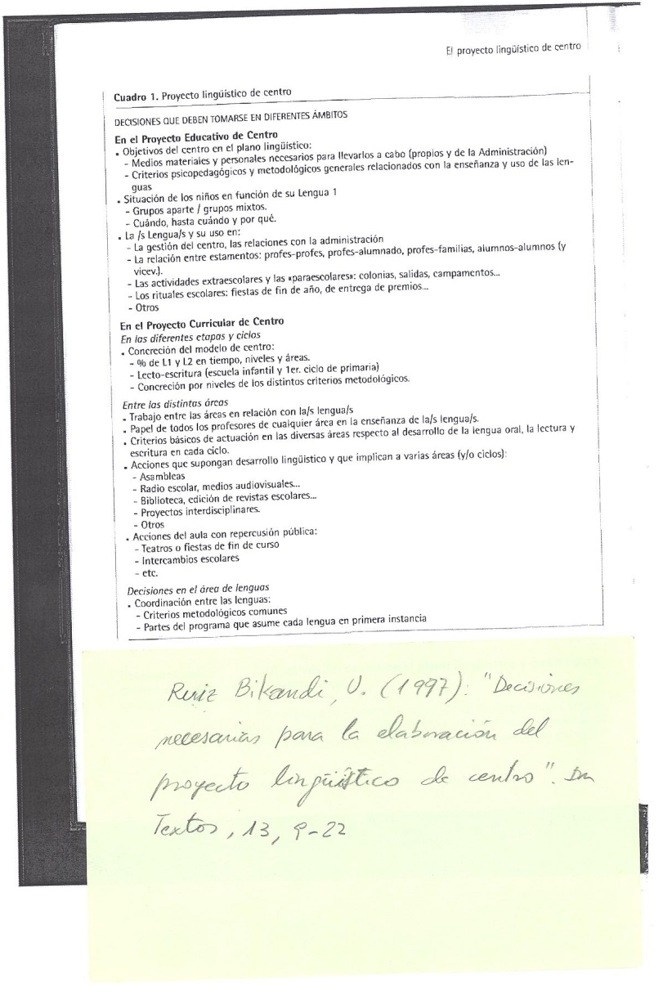

# Ikastetxean hizkuntzen kudeatzea

Azterguneak

Zer dela-eta kezka hori? 

Zergatik ari da ideia hau orain indartzen? 

Zeri erantzuten dio? 

Zer puntu erabaki behar dira edo zer alderdi hartu behar dira kontuan?

## Landa-lana/gogoeta

Galdera batzuk

+ Eskolako hizkuntzak kudeatzea esaten dugunean, zer datorkigu burura?
+ Zer hizkuntza ditugu eskolan, zer helburu bakoitzarentzat, zer aldaketa dakar horrek…? Horiei erantzun koherentea eman beharra
+ Erantzun koherentea eta globala emateko, zer alderdi zaindu behar dira? Zer galderari erantzun? 

**Eskoletan zer?**

Gaur egun ikastetxe anitzetan hainbat hizkuntza:

Ikas-helburu zehatzekoak: 

+ Euskara
+ Gaztelania
+ Atzerriko hizkuntza (gehienean, ingelesa)

Ikas-helburu zehaztugabekoak:

+ Etorri berrien hizkuntzak

Horien denen kudeatzea modu koherentean gauzatzeko, nola jardun? 

+ Bakoitzari gogoratzen zaiona eginez?
+ Borondatearen gainean arita?
+ Koordinaturik? Elkarrekin pentsatuta?

Hobe tratamendu koherente eta elkarrekin pentsaturikoa egitea, ikastetxeak bere “nortasuna” izan dezan gai honetan, bere testuingurua kontuan hartuta bereziki

Elkarrekiko jardun horren ondorioak, komeni da dokumentu batean jasotzea, koordinazio elementu gisa

**Gelatik eta eskolatik**

Zer egin ikastetxean  ditugun hizkuntzei tratamendu koherentea emateko? 

Aztertu hasierako egoera eta azken helburuak, eta pentsatu bidea; dokumentu batean bildu

Zer hartu behar du barrenean dokumentu horrek?  Zertaz hartu behar dira erabakiak?
	...

Non aurkitzen ahal dugu informazioa horretaz?

+ Zer dio curriculum dekretuak?
+ Non bestetan aurkitzen ahal dugu informazioa? Nondik hasiko gara bilatzen?

## Curriculum dekretutik     2010

2010eko dekretuaren 18. artikulua.- Ikastetxearen Hizkuntza Proiektua

> 1.- Dekretu honen esanetara, hizkuntzen irakaskuntzarekin eta erabilpenarekin lotutako alderdi guztien plangintza egingo duen agiria da hizkuntza-proiektua, ikastetxeek egindakoa, beren hezkuntza esparruan aplikatzeko. Hezkuntza-proiektuan jasotako ikaskuntza prozesuan hizkuntzak nola irakatsiko eta erabiliko diren finkatuko du hizkuntza-proiektuak, eta zehaztu egingo zer-nolako trataera izango duten hizkuntzek curriculum-proiektuan. Agiri horretan jasotako erabakiek eragin zuzena izango dute ikastetxeko beste agiri batzuetan; esaterako, barne-araudian, urteko plangintzan, barne- eta kanpo-harremanak arautuko dituzten printzipioetan, eta abarretan. Izan ere, azken horien bidez gauzatuko dira hizkuntza-proiektuan adostutako printzipioak.

### Ariketa {-} 

Identifikatu ze alde dagoen curriculum dekretutik 2016koa oinarri hartuta

Kokatu dokumentuan eta azaldu zein ebidentzia ikuusten duzun eta zuen ustez zertan oinarritzen diren aldaketok.

## Zer leku du ikastetxearen organigraman?

Hizkuntza proiektua non kokatzen da? 

Hezkuntza proiektuaren barrenean

Zer da hezkuntza proiektua? Dokumentu bat non biltzen diren…

+ heziketa-jardueraren (haien artean hizkuntzen trataeraren) ildo nagusiak: 
+ printzipioak,
+ helburu nagusiak, 
+ oinarri pedagogikoak, 
+ antolaketa-egituraren ardatz nagusiak

Zer da hizkuntza proiektua? Dokumentu bat non biltzen diren…

+ hizkuntzen trataerari buruzko printzipioen garapenak (hizkuntzen ikas-irakaskuntzaz eta erabileraz)
+ Zer harreman du ikastetxearen curriculum proiektuarekin?
  hizkuntza proiektuak pisu nabaria du, zuzenki eragiten dio curriculum proiektuari; zergatik?
  + Hizkuntzak berak eduki garrantzitsua direlako 
  + Hizkuntza(k) tresna nagusia d(ir)elako zernahi ikas-irakasteko

### Ikastoletakoari so

Adibidez: 

> Ikastolak hezkuntzarekiko eta hizkuntzekiko dituen xedea eta ikuspegiak Hezkuntza Proiektuan jasotzen direnez gero, Hizkuntz Proiektuan hartuko diren erabaki guztiak baldintzatzen ditu. Beraz, Hezkuntza Proiektua izango da edozein hizkuntz proiekturen iturburua
>
> -- EHIK, 2009: 129

### Ikastolen elkartearen oinarrizko ideia batzuk:

+ Euskalduna eta euskal kulturaren eragile
+ Eleaniztuna, euskara ardatz dela
+ Jendartean integratua
+ Hezkuntza komunitate osoaren partaidetza aktiboa
+ Berritzailea, I+G

Konparatu ingelesezko/alemanezko irakaskuntza eskaintzen duen hezkuntza-erkidego batekin [ARIKETA]

#### Kanpoko batekoa

Beste heziketa-erkidego baten hezkuntza proiektuaren zati bat (SGES):

> El Colegio pretende formar e inculcar la trascendencia de la vida humana, fomentando los valores cristianos en concordancia con el magisterio de la Iglesia Católica pero dentro del respeto a la libertad de cultos. 
>
> Procuramos que cada alumno desarrolle el máximo de sus capacidades intelectuales, insistiendo de forma especial en el desarrollo de virtudes humanas como la sinceridad, la laboriosidad, la solidaridad y el respeto por uno mismo y para con los demás y que en definitiva contribuyan a la convivencia pacífica y tolerante. 
>
> -- SGES

## Hizkuntzak kudeatzeko, ikastetxearen hizkuntza proiektua

Zer da ikastetxearen hizkuntz proiektua?

> En definitiva, el proyecto lingüístico no es otra cosa que el conjunto de acuerdos que la comunidad escolar debe adoptar para hacer posible un trabajo coherente
>
> --Ruiz Bikandi, 1997:6

Adibide bat, ikastolen hizkuntza proiektua:

>ikastolan lantzen diren hizkuntzen ikaskuntza-irakaskuntzari eta erabilerari dagozkien alderdiak biltzen dituen eta haien trataerari koherentzia ematen dion egitasmoa
>
>-- EHIK, 2009:45

Beraz, 

Egitasmoa da; zertarako?:
	Koherentzia emateko; 
	zeri?:
	Hizkuntzen ikaskuntza-irakaskuntzari eta erabilerari dagozkien alderdiei

**Zer esan nahi du horrek zehatzago?**
**Esaten den hori egiteko nondik hasi?**
**Laguntza eske, adituetara joan gaitezke**

## Hizkuntzen trataera ikastetxean: osagaiak. 

Zer lortu nahi den, eta nola lortu nahi den, hizkuntzei dagokienez.

+ Hizkuntzak: euskara, gaztelania/frantsesa, ingelesa/frantsesa, immigrazio hizkuntzak…
+ Inguru soziolinguistiko desberdinak
+ Irakasleak, ikasleak, familiak, inguruko taldeak eta instituzioak (ezaugarriak)
+ Eskolaren jardunbide askotarikoak (esku-hartze eremuak): 
  + Barne komunikazioa nola gauzatu
  + Kanpo-komunikazioa nola
  + Gela barruko jarduerak
  + Gelaz kanpokoak
  + ...

### Galdera batzuk, erantzuteko 

Aitzindari izan zen Cassany (1994) bere planteamentuetan. Hark identifikatu zituen hainbat erabaki eta interesgune, horien errealitatearen araberako planteamentuak egin behar direla nabarmendu zuen.

#### Ikastetxea: {-}

+ Zer hizkuntza(k) erabiliko d(ir)a eskolan komunikaziorako?
+ Zer hizkuntza(k) irakaskuntzarako?
+ Bigarren/hirugarren hizkuntza noiz sartu?
+ Curriculumaren diseinua zehaztu
+ Nola ebaluatu komunikazio konpetentzia?
+ Hizkuntzek elkarrekin erlaziorik?
+ Ikasleen ezaugarri soziolinguistiko desberdinei nola erantzun

#### Ikasleak eta familiak:  {-}

+ …
+ Normalizazioaren alde?
+ …

#### Irakasleak {-}

+ …
+ Normalizazioaren aurreko jarrera?
+ …

#### Auzoa/Herria/Ingurua {-}

+ Hizkuntza bakoitzaren presentzia maila?
+ Immigrazioaren eragina?
+ Inguruarekiko harremana zenbatekoa?

#### Beste {-}

+ Zer testuinguru soziolinguistikotan ari gara gure jardunbidea definitzen?
+ Zer  hizkuntza hartuko ditugu kontuan? Atzerriko hizkuntza, zein? Immigraziokoak bai?
+ Elebitasun gehigarriko testuingurua dugu? Zer hizkuntzatan? Ezer egin dezakegu ildo horretan?
+ Zer  helburu dugu hizkuntza bakoitzarentzat?  Zer maila lortu nahi da bakoitzean?
+ Hizkuntza guztientzat helburu berdinak edo desberdinak? Zergatik?
+ Atzerriko hizkuntza nola landuko dugu? Beste hizkuntzetatik bereizita? Zergatik?
+ Zer eginen dugu etorri berrien hizkuntzekin? Jaramonik ere ez? Nolabaiteko arreta?
+ Zer irakaslek dute hizkuntza lantzeko ardura? 
+ Koordinaziorik egin behar dugu edo ez? Noren artean? Zergatik?
+ Zer lotura izanen dugu elkarrekin hizkuntzaz arduratzen garenok ziklo eta maila desberdinetan?
+ Zer arreta jarri behar diogu hizkuntzari beste alorretan ari garenean? Zergatik?
+ Zer ikuspegitatik landuko ditugu hizkuntzak?  Gramatikan eta ariketa idatzietan oinarrituta?
+ Testu-hizkuntzalaritzaren ikuspuntutik ariko gara? Beste ikuspuntu batetik?
+ Hizkuntzalaritzako terminologia bera erabiliko dugu hizkuntza guztietan?
+ Nola ulertzen dugu hizkuntzen ikas-irakaskuntza? Gramatika kontrolatzea? Konpetentzia garatzea? 
+ Nola ikasten da hizkuntza? Gramatika ikasiz eta ariketak eginez? 
+ Zer eta nola ebaluatuko dugu ikaslearen maila hizkuntza-komunikaziorako konpetentzian?
+ Idatziari ala ahozkoari emanen diogu garrantzi handiena? Ahozkoa eskolan landuko dugu edo hori ikasle bakoitzaren ardura da?
+ Hizkuntza guztiak ikuspegi metodologiko berarekin landuko ditugu?
+ Hizkuntzen trataera bateratuan ariko gara? Zergatik? Noiz? Zer hizkuntzarekin?
+ Sartuko ditugu ikas-eduki batzuk atzerriko hizkuntzaren batean? Zergatik? Noiz? Ikasgai oso batean edo zatika? Zergatik? Alde eta kontrako arrazoiak agertu.

### Esparru batzuetan hartu beharreko erabaki batzuk {-}

+ Hizkuntza bakoitzari zenbat denbora eman eskolako lanetan?  Denei berdin?
+ Zergatik denbora hori eman bakoitzari? Zer lortu nahi dugu? Zer pisu du hizkuntza bakoitzak inguru soziolinguistikoan?
+ Zer hizkuntzatan irakurketa-idazketak? 
+ Bigarren hizkuntza noiz sartu?
+ Atzerriko hizkuntza noiz sartu? Zergatik?
+ Euskararen kasuan zer hizkuntz eredu? Euskalkia bai? Zergatik?  Zer ezaugarrirekin? Non zein?
+ Nola banatu curriculumeko edukiak hizkuntzen artean?
+ Zer ikas-irakatsi hizkuntza bakoitzean? Gai batzuk osorik? Gai batzuen zatiak? Proiektu eleanitzekoak?
+ Jantokian zer hizkuntza erabiliko dugu? Eta irakasleen artean? Eta inguruko erakunde eta elkarteekin? Administrazioarekin?
+ …
+ Badugu baliabiderik helburuak lortzeko? Deus ere egin dezakegu baliabideak lortzeko?

### Aditu batzuen iritziak

## Ikastetxearen hezkuntza proiektuan

Ikastetxearen helburuak hizkuntza kontuetan

+ Haiek lortzeko behar diren pertsonak eta baliabideak (ikastetxearenak eta administrazioarenak)
+ Hizkuntzen irakaskuntzarekin eta erabilerarekin erlazionaturiko irizpide psikopedagogikoak eta metodologikoak

Ikasleen egoera beren H1aren arabera

+ Talde mistoak / hizkuntzaka bereziak
+ Noiz, noiz arte eta zergatik

Hizkuntza(k) eta haien erabilera, puntu hauetan:

+ Ikastetxearen kudeatzean, administrazioarekiko harremanetan
+ Kideen eta kidegoen arteko harremanak: irakasle-irakasle, irakasle-ikasle, irakasle-familia, ikasle-ikasle ...
+ Eskolaz kanpoko jarduerak eta osagarriak (udalekuak, irteerak,...)
+ Beste eskolako “ohikoak”: ikasturte amaierako jaia, sari banatzeak…

## Ikastetxearen Curriculum Proiektuan

### Ziklo eta etapen artean

Ikastetxearen ezaugarriak zehaztu:

+ 1H eta 2H, % zenbat bakoitza?
+ Irakurketa-idazketak zein hizkuntzatan? (Haur Hezkuntza eta Lehen Hezkuntzako 1. zikloa)
+ Irizpide metodologikoak finkatzea, mailaka

### Alorren artean

Alorren arteko lankidetza, hizkuntzei buruz

Irakasle guztien zeregina hizkuntzaren irakaskuntzan

Alor guztietan aritzeko oinarrizko irizpideak ahozko hizkuntzaren garapenaz, eta ziklo bakoitzeko irakurketa-idazketez

Alor bat baino (edo ziklo bat baino) gehiago inplikatuak diren jarduerak, hizkuntza garatzeko balio dutenak:

+ Asanbladak, batzarrak
+ Eskola irratia, ikusentzunezkoak
+ Liburutegia, eskola-aldizkariak
+ Diziplinarteko proiektuak
+ Besterik

Ageriko emaitza duten gelako jardunak

+ Antzerkiak edo ikasturte amaierako jaiak
+ Eskolen arteko ikasle-trukeak…

### Hizkuntzen alorreko erabakiak

Hizkuntzen arteko koordinazioa

+ Irizpide metodologiko erkideak
+ Hizkuntza bakoitzak zer programa-zati hartzen duen bere gain

## Ikastetxearen Hizkuntza Proiektua

### IHizP kontuan hartu beharreko puntu batzuk 

Zati honen oinarritzat Serrak eta Vilak (2009) idatzitako

Egoera berria: hizkuntza gehiago geletan, 3 hizkuntza helburu, xehetasun eta ñabardura gehiago.

Orain arteko ereduak, murritz.

Egoera berriari erantzuteko, hainbateko askatasuna ikastetxe bakoitzari.

Ikastetxe bakoitzak bere egoerari, bere premiei  erantzun.

Eredu orokorra ikastetxe bakoitzak bere errealitateari egokitu.

#### Kontuan hartu beharrekoak {-}

1. Hizkuntzaren irakaskuntzaren ikuspegi instrumentala
2. Eskola- eta familia-egitasmo bat
3. Hizkuntza bakoitza sartzeko unea eta bakoitzak curriculumean izan behar duen presentzia
4. Hizkuntzen sarrera eta tratamendua programan zehar
5. Eskolatze-aldian hizkuntzek izan behar duten aurreramendua eta proportzionaltasuna
6. Atzerriko hizkuntzaren sarrera eta tratamendua
7. Ikasgelako hizkuntza-tipologia, programaren giltzetako bat

#### Hizkuntzaren irakaskuntzaren ikuspegi instrumentala {-}

Hizkuntza ikasteko modurik eraginkorrena, hizkuntza hori erabiltzea (kasu honetan, eskolako zereginetan)

Hasieratik hasi hizkuntza hori erabiltzen; esanahiaren negoziazioari garrantzi handia.

Planteamendu hauek onartu behar dira {-}

+ Hizkuntzen arteko transferentzia egiteko aukera   hizkuntza guztiak berdin tratatu
+ Hizkuntza-trebetasunak arlo guztietatik landu beharra  irakasleen artean adostasun handia behar da
+ Eskolako hizkuntzen eta ikasleen hizkuntza guztien arteko transferentziei bide ematea; hizkuntza guztiak onartu eta baloratu (jarduera  mailan ere bai, ez bakarrik hitzez)

#### Eskola- eta familia egitasmo bat {-}

+ Ahal balitz, denentzako programa bat bakarra,  oharturik eta onarturik hizkuntza- eta kultura-aniztasuna (jendarte kohesioari begira)?
+ Programaren ikuspegi globala eskaini  gurasoei (ohartzeko programa luzea dela eta tarteko helmugak tarteko direla).

#### Hizkuntza bakoitza sartzeko unea eta curriculumean izan behar duten presentzia {-}

+ Garbi zein izanen den eskola-hizkuntza
+ Noiz sartu hizkuntza bakoitza
+ Zenbateko esposizio-denbora eta intentsitatea (kontuan harturik errealitate makrosoziala eta inguru soziolinguistikoa: hizkuntza bakoitza jendartean zenbat erabiltzen den, non…)

#### Hizkuntzen sarrera eta tratamendua programan zehar {-}

+ Hizkuntza bakoitzak bere egoera: gaztelania gehiago jendartean euskara baino
+ Baina gaztelania ere landu behar da, alde guztietan, maila formalean
+ Eta zenbait tokitan, gaztelania bereziki landu ere bai

#### Eskolatze-aldian hizkuntzek izan behar duten aurreramendua eta proportzionaltasuna {-}

Hezkuntza maila bakoitzeko curriculumean hizkuntza bakoitzaren presentzia eta zeregina

Curriculumeko arlo bakoitzari hizkuntza bat esleitu, modu “finkoan”? 

+ Onurak: irakasleei, jarraipide zehatzak;  irakasle gaituak errazago erdietsiko dira
+ Kalteak: hizkuntza bakoitza eduki batzuetan “espezializatzea”; hizkuntza bakoitza gauza baterako egokia dela pentsaraztea

Malguago jokatu? Hau da, arlo bakoitzean ehuneko hainbeste hizkuntza batean eta beste bat beste batean? 

+ Onurak: hizkuntzetan ikaste paraleloak egiteko ahalbidea/arriskua txikitu;  hizkuntza batean ikasitakoak gero beste batean beste egoera batean berriz modu desberdinean agertzeko aukera
+ Arazoak:  irakasleen prestakuntza (denek dena emateko gauza dira, hiru hizkuntzetan?)

Dena dela: hizkuntza guztiek begirunea berdin jaso behar dute; denek izan behar dute gauza interesgarriak ikas-irakasteko; motibazioak garrantzi handia

#### Atzerriko hizkuntzaren sarrera eta tratamendua {-}

Maiz, atzerriko hizkuntza i(ra)kasgaia besterik ez, ez i(ra)kasbide

Eztabaidatua, eta gehiago sistema elebidunetan, non ikasleek bigarren hizkuntza bat ari diren ikasten eskolan (ordu kopurua finkoa da, eta  bati ematean beste bati kendu egiten zaio)

Lehenago sartuz gero, hobeto? Hartarako arrazoiak: 

1. Ordu gehiago, eta beraz emaitza hobeak; 
2. Zenbatez gazteago ikaslea eta hainbat errazago ikasten du

Serrak eta Vilak, ordea, uste dute hobe dela zentratzea eztabaida ea nola sartzen den atzerriko hizkuntza eta ez noiz sartzen den.

Inportantea:  atzerriko hizkuntza zer egiteko sartu? Ikasleentzat zentzua izan dezatela jarduerek (ez egitura sintaktiko batzuk menderatzea edo hiztegia ugaritzea bakarrik; gelan egin ohi diren jarduerekin planteatu behar da: horrela, zentzua aurkituko dio ikasleak, eta motibazioa eta jarrera hobeturik, emaitza hobeak espero daitezke).

Funtsean:  hizkuntzen sarrerak, presentziak, intentsitateak, sekuentziazioak eta tratamenduak planteamendu bakar bati erantzun behar diote: ikasleen hizkuntza-garapenari lagunduko dion planteamenduari.

#### Ikasgelako hizkuntza-tipologia, programaren giltzetako bat {-}

Ikasle guztiek ezaugarri berak balituzte, ederki.

Baina anitzetan ez da hala, ikasle-tipo desberdinak izaten baitira: batzuek badakite eskolako hizkuntza, beste batzuek ez. 

Orduan, irakasleak nori arreta jarri? Nori mintzatu? Horrek dakar: nola mintzatu?

Begiratu, taldeak nola eratzen diren, hasieran eta geroago ere.

Talde homogeneoen abantailak: 

+ errazagoa hizkuntza dagoen puntutik garatzea; 
+ esanahia hobeto negozia daiteke; 
+ irakasleak ez du bere hizkuntza desberdin erabili behar, pertsona bakoitzaren ezaugarriei “egokitzeko”

Talde mistoak eratuta:

+ Irakasleak erne egon behar  du, talde aurreratuenen mailan eta erritmoan ez aritzeko beti
+ Arreta handia  hizkuntza ez dakitenei
+ Ulermena kontu handiz zaindu
+ Parte hartzea ziurtatu, inor bakartuta utzi gabe

Beti ere, nolanahi, aukera eman esanahia negoziatzeko
Harremanak/interakzioak  ziurtatu eskolako hizkuntza 1H dutenen eta 2H dutenen artean

> **Edozein proiektu egiten dela ere, aldika-aldika berrikusi eta ebaluatu behar da, eta modu dinamikoan doitu, behar diren aldaketak eginez.**

## Gogoeta

Zer ikusi dugu? Zertaz egin dugu gogoeta?

1. ikastetxean zer hizkuntza ditugun
2. ikastetxeko hizkuntzei/pertsonei nolako trataera emanen diegun
3. ikastetxearen markoan definitu behar litzateke hori dena, modu koordinatuan, jakinean eta adostuan
4. zer osagai hartu beharko liratekeen kontuan
5. aditu batzuen iritziak aztertu ditugu
6. ohartu gara garrantzitsua dela ikastetxeko hizkuntza guztiez gogoeta egitea eta guztiei tratamendu koherentea ematea

Honaino iritsita egin dezagun gogoeta, ezagutzen dugun egoera batean aplikatzeko:

1. Ikastetxe baten edo batzuen egoera aztertu: zer testuinguru, zer hizkuntza, zer pertsona, zer jarrera, zer baliabide…
2. Goian eginiko galderen arabera, zer bide egin daitekeen aztertu, zer arazo izan daitezkeen aurreikusi
3. Zer plantea dezakegu? Zer proposatu? Zergatik hori eta ez beste zerbait? Zer baliabide dugu?

**Funtsean: hizkuntza guztiak nola tratatuko ditugun zehaztu beharko genuke**

## Bibliografia eta erreferentziak (3. kap)

Egile batzuk (1997). Monografia: *El proyecto lingüístico de centro*. In Textos, 13, 1997ko uztaila.  
Sierra, J. M.& Vila. I. (2009): "...". In Ruiz Bikandi, U. (2009): *Bigarren hizkuntzaren didaktika Haur eta Lehen Hezkuntzan*. Bilbo: EHUAZN  
http://centros.educacion.navarra.es/eibz/baliabideak/eleaniztasuna/index2.htm  
EHIK (2009): Ikastolen hizkuntz proiektua. Zamudio: EHIK  
http://proyectolinguistico.webnode.es/  
http://www.xtec.cat/lic/intro/documenta/guia_elaboracio_PLC.pdf  
