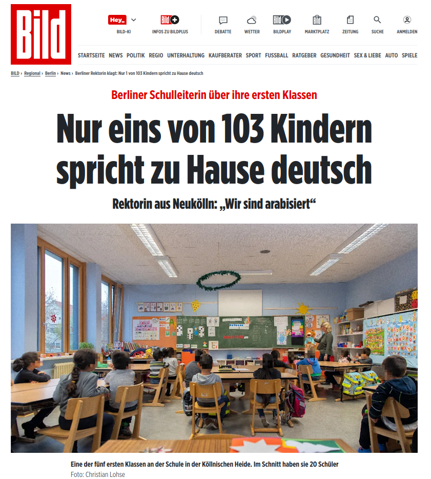

Ikuskera posibleak bat baino gehiago

-   Herrialdea

-   Hezkuntza Sistema

-   Ikastetxeak

-   Gelak

-   Norbanakoak

-   ... eta familiak

------------------------------------------------------------------------

::: callout-note
## EAEko hezkuntza sistema familientzat azaldua

-   EAEko hezkuntza sistema. [Familientzako informazioa](EAEko%20hezkuntza%20sistema.%20Familientzako%20informazioa)
:::

## EEMBn

Ikuspegi eleaniztunak...

> ...gizabanakoak hizkuntza baten kultur ingurunean duen hizkuntz esperientzia zabaldu ahala, hasi familia-hizkuntzatik eta gizarte-hizkuntzaraino, oro har, eta beste herri batzuetako hizkuntzetaraino gero (izan eskolan edo unibertsitatean ikasiak, edo zuzeneko esperientziaren bidez ikasiak), hizkuntza horiek eta kultura horiek ez ditu adimeneko gune berezietan gordetzen; aldiz, komunikazio-gaitasun bat garatzen du, hizkuntz arloko ezagutza eta esperientzia guztien bidez eta hizkuntzen arteko harremanaren eta elkarreraginaren bidez. (EEMB, [**2001**]{.underline}, 1.3 atala)
>
> -- @europakokontseiluaHizkuntzenIkaskuntzaIrakaskuntza2005

------------------------------------------------------------------------

![Gaitasun eleaniztuna eta kulturaniztuna (Europako Kontseilua, [**2022**]{.underline})](../HDIB-2026/images/clipboard-525234506.png)

✍️ 4. atala ezagutu eta aztertu *EEMBaren deskriptore-eskala argigarriak: Gaitasun eleaniztuna eta kulturaniztuna.*

## Konpetentziez... 🇪🇺

-   Europako Kontseilua. ([**2018**]{.underline}). Recomendación del Consejo, de 22 de mayo de 2018, relativa a las competencias clave para el aprendizaje permanente Texto pertinente a efectos del EEE. *Diario Oficial de la Unión Europea*, *c189*, 1–13. <https://eur-lex.europa.eu/legal-content/ES/TXT/PDF/?uri=CELEX:32018H0604(01)>

COMPETENCIAS CLAVE PARA EL APRENDIZAJE PERMANENTE UN MARCO DE REFERENCIA EUROPEO

------------------------------------------------------------------------

El marco de referencia establece las ocho competencias clave siguientes:

— competencia en lectoescritura;

**— competencia multilingüe;**

— competencia matemática y competencia en ciencia, tecnología e ingeniería;

— competencia digital;

— competencia personal, social y de aprender a aprender;

— competencia ciudadana;

— competencia emprendedora;

— competencia en conciencia y expresión culturales.

## Hizkuntzen ikaskuntzaz 🇪🇺

-   Europako Kontseilua. (**2019**). Recomendación del Consejo, de 22 de mayo de 2019, relativa a un enfoque global de la enseñanza y el aprendizaje de idiomas. *Diario Oficial de la Unión Europea*, *C 189*, 15–22. or. <https://eur-lex.europa.eu/legal-content/ES/TXT/PDF/?uri=CELEX:32019H0605(02)>

## 

> \(16\) La sensibilización lingüística en las escuelas podría incluir la sensibilización y comprensión de la competencia en lectoescritura y de la competencia multilingüe de todos los alumnos, incluidas las competencias en lenguas que no se enseñan en la escuela. Las escuelas pueden distinguir entre los diferentes niveles de competencia multilin güe necesarios dependiendo del contexto y el objetivo y según las circunstancias, necesidades, capacidades e intereses de cada alumno.
>
> Europako Kontseilua. (2019).

## Eleaniztasunaren garrantziaz 🇪🇺

-   Europako Kontseilua (Arg.). (2022). *L’ importance de l’éducation plurilingue et interculturelle pour une culture de la démocratie: recommandation CM/Re (2022)1 adoptée par le Comité des Ministres du Conseil de l’Europe le 2 février 2022 et exposé des motifs*. Conseil de l’Europe.

## 

> Reconnaissant que les compétences plurilingues et interculturelles contribuent à une éducation équitable et inclusive, à la réussite scolaire, à la participation à une culture de la démocratie et à l’intégration sociale ;
>
> Reconnaissant que l’éducation plurilingue et interculturelle favorise également l’inclusion éducative et sociale des apprenants migrants et marginalisés ;
>
> Reconnaissant que l’environnement numérique offre des moyens sans précédent aux personnes de s’exprimer à l’aide de langues différentes et crée de nouvelles possibilités de renforcer l’apprentissage des langues, **de soutenir et de promouvoir des langues non inscrites dans le curriculum,** autant d’éléments sous-tendant une culture de la démocratie, qui permettent aux institutions démocratiques de fonctionner correctement,

## 

> 1.  Recommande aux gouvernements des États membres :
>
>     ...
>
>     b.  d’encourager les principaux, les directrices, les directeurs et les chefs d’établissement scolaire à mettre en œuvre des politiques et pratiques à l’échelle des établissements scolaires qui accueillent et valorisent la diversité linguistique et culturelle, **favorisent l’apprentissage des langues et le développement de répertoires plurilingues, encouragent les apprentissages interculturels** et préparent les élèves et les étudiants à participer à une culture de la démocratie ;
>
>     ...
>
>     -- Europako Kontseilua (Arg.). (2022)

## 📖 LOMCEtik

*konpetentzia eleaniztuna* Non dago eta zer da?

## 🤔 teoriaz 👩‍🏫 pedagogiaz

-   CUP (Cummins, gogoan?)\

-   

    

    

## Zer ikusten da inguruan?

-   EAEn Matrikulatzea edo hezkuntza jarduera A eredukoa

-   Ipar EHn ELCO lehen orain EILE ere ez

-   Hiru europa

## 🇸🇪 🇳🇴 🇫🇮 *Mother Tongue Instruction (MTI)*

## 🇩🇪 🇨🇭 *Herkunftssprachlicher Unterricht (HSU)*

## 

[Artikulua](https://www.bild.de/regional/berlin/berlin-aktuell/berliner-rektorin-klagt-nur-1-von-103-kindern-spricht-zu-hause-deutsch-58543002.bild.html)

## 

## 🇵🇹🇪🇸🇮🇹(🇫🇷)

## 🇬🇧🇮🇪

## Beste batzuk

Language Friendly School taldearen webgunea: [https://languagefriendlyschool.org](https://languagefriendlyschool.org/)

# In ala ex?

## Inklusioaz

1.  Hezkuntza eskubidea eta berdintasuna

2.  Ikaskuntza eta garapen kognitiboa

3.  Motibazioa eta autoestimua

4.  Familia-inplikazioa

5.  Ondare kulturala eta gizarte-kohesioa

## Exklusioaz (edo zalantzati)

1.  Eskola nazioa eraikitzeko gunea
2.  Denbora galtzea/distrakzioa
3.  Froga enpiriko erabatekoen falta 🇨🇭

## 

Frisiako HHko [jardunbide bat](https://www.futurelearn.com/info/courses/multilingual-practices/0/steps/22654)

##  {background-color="darkred"}

::: callout-warning
## Ariketa ikasgelan

Aipatu arren, curriculum diseinutik aparte geratzen diren hainbat hizkuntza "ez-curricular" ere bada. Horrekin zer gertatzen den, arauak zer dioen, zein toki izan lezakeen eta zein ematen zaion eskolan eta gizartean.

Horri erantzuteko zenbait weborri eta dokumentu erabili behar dira, aurreko klaseetako dokumentuez eta apunteez gain.

<small>Achotegui Loizate, J. (2000). Los duelos de la migración: una aproximación psicopatológica y psicosocial. *Medicina y cultura: Estudios entre la antropología y la medicina, 2000, ISBN 84-7290-152-1, págs. 83-100*, 83–100. or. <https://dialnet.unirioja.es/servlet/articulo?codigo=619729>\
Hezkuntza Saila. (2017). Eleaniztasuna. Zer da? In *Euskadi.eus*. <https://www.euskadi.eus/elebitasuna-hezkuntza-eleaniztasunaren-baitan/web01-a3helebi/eu/>\
Hezkuntza Saila. (2019). EAEko hezkuntza sistema. Familientzako informazioa. In *Euskadi.eus*. <https://www.euskadi.eus/euskal-hezkuntza-sistema-familiei-informazioa/web01-a2hikast/eu/>\
Larrea, K., Etxebarria, A., Romero, A., Gaminde, I. eta Garai, U. (2013). *Hizkuntza etorkinak: Azterketa eta erabilera didaktikoa*. UPV/EHU. Europako Kontseilua. (2022). *Hizkuntzen Europako Erreferentzia Marko Bateratua: ikaskuntza, irakaskuntza, ebaluazioa - Liburu osagarria*. HABE. <https://doi.org/10.54512/EEMBLO-2022></small>

Zuok eskola bat zarete, zer eta nola egin behar litzateke zuon ustez ikastetxean? Zergatik?
:::

##  {background-color="darkred"}

::: callout-warning
## Etxerako ariketa

Nola eta non: Framapad webgunean sartu eta sortu bertan dokumentu bat, bertan idatzi beharko duzu (eta hurrengo klase batean erabili beharko duzu).

Claustroaren aurrean irakurri beharreko dokumentu bat sortu beharko duzu. Dokumentu horretan atzerritik etorritakoen hizkuntzaz zer egin behar zenuketen adierazi eta justifikatu behar duzu, besteak zure iritzia ulertu eta sustengatu nahirik.

|                | Politikak | Ezagutzak | Zientzia |
|----------------|-----------|-----------|----------|
| **Gizartea**   |           |           |          |
| **Ikastetxea** |           |           |          |
| **Gela**       |           |           |          |
| **Norbanakoa** |           |           |          |

: Pentsatzekoak
:::
