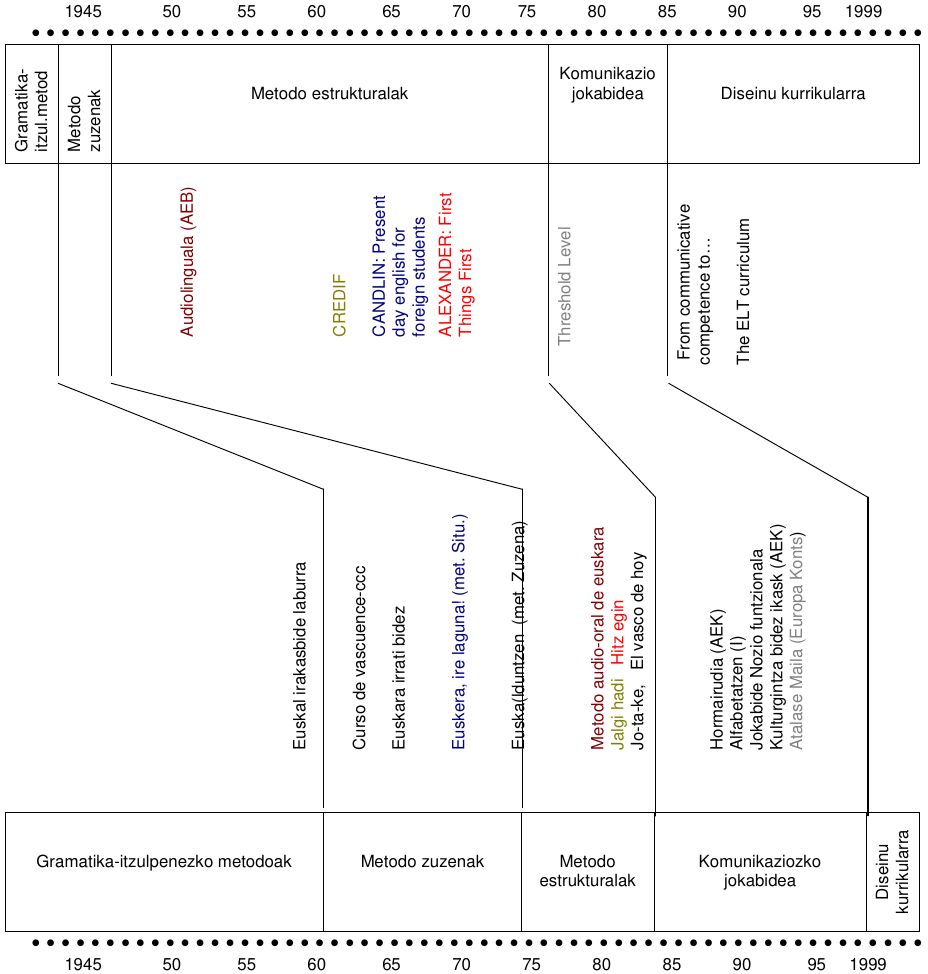

# 

### Hasiera {style='color:lightgrey;'}

##

| H1 nola ikasi duzu berbetan eta idazten? | H2 Nola ikasi duzu berbetan eta idazten? | 
|:--|:--|
| · | · |
| · | · |
| · | · |
| · | · |

## Hainbat kontzeptu

#### Hizkuntza eskuratzea Vs hizkuntza ikastea

#### Bigarren Hizkuntza Vs Atzerriko Hizkuntza

## Metodoen osagaiak<br><small>Richard eta Rogers (1986)</small>

>- #### Ikuspuntua

>- #### Jardunbidea

>- #### Diseinua

## Metodologiaren aldaketaren zergatiak

> F. Castro (1994): Egindako ikerketa guztiak gorabehera eta azaldutako teoria guztiak gorabehera, oraindik inork ez daki zehatz-mehatz nola ikasten den hizkuntza bat 

##

Metodoak eta planteamenduak arrazoi anitzak eraginda bilakatzen dira:

>+ IKUSPUNTUAren aldaketa:  
    · Ikaskuntzaren teoriak
    · Hizkuntzaren kontzeptua
    · Didaktikaren alorreko berrikuntzak

>+ DISEINUAren aldaketa:  
    · Programetan egindako aldaketak
    · Ikasketa plan berriak
    · Orientabide metodologikoak

>+ JARDUNBIDEAren aldaketa:  
    · Ikasleen eta ikastetxearen errealitatea
    · Ikasleen eta irakasleen rolak
    · Politika eta gizartearen eragina

# 

### bilakaera {style='color:lightgrey;'}

## XV. XVII. mendeen bitartean.

+ Gramatika <--> Idazteko ereduak
+ Erretorika <--> Berba egiteko ereduak

#### Erabiltzen zirenak

Gramatika · Glosarioa · Elkarrizketak · Irakurgaiak <small>itzulpenak, katiximak eta ereduak.</small>

#### Euskararen irakaskuntzaz:

Sasoi horretan agertu ziren lehenengo gramatika eta hiztegiak.

## XVIII.a eta XIX.a {data-background="../liburua/assets/06/Gramera_berria_grixin.png"}

_Gramatika itzulpenezko metodoa_

<small>Hizkuntza modernoen irakaskuntza:gramatika arauemailea</small>

+ Gramatika arauak: dedukzio bidez
+ Hitzen zerrenda elebidunak: buruz
+ Itzulpenak: garrantzia hartzen hasi


## XIX.aren amaiera

_Metodo zuzena_

+ Ahozko interakzioa
+ Gramatikaren azterketa urri edo hutsa
+ Xede hizkuntzaz edukiak lantzen dira

Hizkuntzaren eta literaturaren irakaskuntza = Hizkuntza arauak era induktiboaz ikastea + Literaturaren irakaskuntza

## XX.aren hasiera

_Metodo zuzena_ + _Gramatika itzulpenezko metodoa_

Tarte honetan hizkuntzalaritzan hauek sortzen dira:

+ Estrukturalismoa (Saussoure, 1916)
+ Konduktismoa (Watson, 1913)
+ Garapen Hurbileko Eremua (Vigotsky, 1931)

Hizkuntza eta literaturaren irakaskuntza = Gramatika arauemailearen irakaskuntza + Historizismoa

## 1950tik aurrera

_Metodo estrukturalista-konduktistak_

Hizkuntza ikastea = garatu beharreko ohitura multzoa


**USA**: _Metodo audiolinguala_

**Erresuma Batua**: _Metodo situazionala_

**Frantzia**: _Ikus-entzunezko metodo estruktural-globala_

>- #### Hizkuntzalaritzan

>+ Skinner
>+ Chomsky
>+ Piaget

>- #### eta Espainian...

## 60.etik aurrera

Psikologia kognitiboa + gramatika sortzailea -> _kode kognitibaren planteamentua_

> Ikasleak hizkuntza eraikitzen du

>- #### Psikologian eta hizkuntzalaritzan:

>+ _Psikologia humanista_ 
>+ Ikuskera konstruktibista gehiago garatu: <small>Ausubel, Brunner</small>
>+ Pragmatikaren garapena
>+ Soziolinguistikaren garapena

>- #### eta Espainian...

## 70.etik aurrera:

Kode kognitiboaren bilakaera: giro egoki eta lasaian oinarritu

+ Erantzun Fisiko Osoa
+ Sugestopedia
+ Taldeko Hizkuntza Irakaskuntza
+ Bide isila

>- Komunikazio Gaitasuna (Hymes, 1971)

>- Planteamendu nozio-funtzionala 

>- #### Hizkuntzalaritzan eta politikan:

>+ _testua_ komunikazio unitatetzat
>+ Atalase Maila

>- #### eta Espainian...

## 80. hamarkadaren erditik gora

>- #### Planteamendu komunikatiboaren garapena:

>- #### Zientzian

>- #### eta Espainian... LOGSE!

## XXI. mendean

>- #### Europar Kontseiluak (2002) Europako Erreferentzi Markoa.

>- #### Eleaniztasuna helburutzat hartzen hasi

>- #### GizKomunikazio Gaitasuna = Oinarrizko Gaitasuna 

#

```{r historia02, echo=FALSE, out.width='70%'}



```

Larrea eta Maia (2010)


# 

### Planteamendu komunikatiboa {style='color:lightgrey;'}

## Metodo tradizionalen kontra

+ Helburuen ardatza eduki lexiko-gramatikalak dira, eta ez komunikazio gaitasuna sustatzea
+ Metodo tradizionalaren eskola eredua:
  + Oinarri deduktiboa: gaiak azaldu ondoren, arauak ikasten dira.
  + Ariketek eta praktikak finkatzen dute arau horien ikasketa
  + Buruz ikastea: itzulpenetatik abiatuta 
+ Ez dago ikasle-irakasleen arteko interakzio komunikatiborik
+ Akatsak ez dira onartzen 
+ Ikaslearen ama-hizkuntzan gauzatzen zen irakaskuntza

## Metodo audiolingualaren kontra

60ko hamarkadaren erdialdean AEBek teoria estrukturalistak baztertzen hasi zen

+ Estrukturalistak teoria behavioristetan edo konduktistetan oinarritu ziren:
  + L2/AH bat ikastea ohitura multzo bat eskuratzea baino ez zen
  + Hizkuntzen egiturak errepikatu behar ziren behin eta berriz, hizkuntzak ikasteko
  + Esaldi isolatu zuzenak baino ez ziren lantzen eta eraikitzen, baino komunikazioa ez zen gauzatzen.

## Programa nozio-funtzionalak

Programaren osagaiak osatzeko elementu hauek kontuan hartuko dira:

1. Irakatsiko diren esanahiak 
2. Esanahiak sustatuko dituzten hizkuntza-formak
3. Ikasleek xede-hizkuntzan komunika daitezen,  edukirik baliagarrienak
4. Hizkuntzaren edukia planifikatuko da igorleak adierazi nahi dituen esanahien arabera

## WILKINSen programa nozio-funtzionala (1972/1976)

Metodo komunikatiboaren oinarria Europako Kontseiluak egin zuen

Helburua: hiztunen komunikazio gaitasuna garatzea

Galdera honi erantzuten dio: _Zer adierazten / komunikatzen dute hiztunek hizkuntzaren bidez ?_

Gutxieneko jakintzak ezartzen ditu:

+ Kategoria nozionalak:  
  hizkuntzaren bidez adierazitako kontzeptuak (denbora, kantitatea, maiztasuna...)
+ Kategoria funtzionalak:   
  hizkuntzaren bidez egiten dena, hiztunen arteko interakzioak: norbait/zerbait aurkeztea, zerbait eskaintzea, ukatzea, baieztatzea, eskatzea, informatzea, kexatzea...
  
## Atalase maila – Nivel umbral - Threshold Level

+ 1975ean Van Ek-ek sortu zuen L2 ikasteko Programa Nozio-Funtzionalaren 1. bertsioa:  
  Atalase maila – Nivel umbral - Threshold Level
+ 1979an Peter Slagter-ek gaztelaniazko bertsioa egin zuen
+ 1988an Alan King-ek euskarazko bertsioa egin zuen
+ 1990ean Van Ek-ek eta Trim-ek Atalase Mailaren 2. bertsioa egin zuten:
  1. Estrategia diskurtsiboak
  2. Osagarri sozio-kulturalaren definizioa
  3. Komunikazioa konpentsatzeko estrategiak
  4. Ikasteko estrategiak: “ikasten ikastea”
  5. Funtzio bi gehiago:
    a. Diskurtsoaren antolamendua
    b. Komunikazioaren kontrola

# 

### Adibidea {style='color:lightgrey;'}

##

**10. unitatea**: Informazioa eskatu eta eman

| Perpaus deklaratzailea (aditza+) ahal | Tokia: hemen, hor, han|
|--|--|
| Galde perpausa | Hiria, kalea, enparantza |
| Izenordeak | |
| Galdetzaileak| |

##

| Funtzioa | Hizkuntza adierazleak |
|:---|:---|
| Helbide bat non den galdetu | - _Mesedez, nola joan naiteke_ ... _kalera_ / ..._-ko metrora_ / ... _hondartzara?_ |
| Helbide batera iristeko jarraibideak eman | _Hartu lehenengo bidegurutzean eskumara_ / _bigarren kalean joan_ ... / _kale berean_ ... |

#

### Hastapenak {style='color:lightgrey;'}

Komunikazioa        
  : pertsonen arteko komunikazioa errazten duten jarduerek hizkuntzaren ikasketa sustatzen dute

Ataza  
  : Egiazko munduari dagokion ataza bat egiteak ikasketa sustatzen du

Esanguratsua  
  : Hizkuntza esanguratsua eta benetakoa erabili behar dute ikasleek ikasketa gerta dadin

> Ikasketa esanguratsua, egiazko komunikazioan eta atazetan oinarritua

#

### Ezaugarriak {style='color:lightgrey;'}

<small>

1. Eskolako irakaskuntzak badu zerikusirik hizkuntzaren erabilerarekin eta ez hizkuntzaren jakintzarekin
2. Hizkuntzak eguneroko bizimoduaren komunikazio-egoera errealetan erabiltzeko ikasten dira
3. Ikasleak/hiztunak oinarrizko trebetasunak garatu behar ditu: ulermenezkoak (irakurri, entzun) eta adierazkorrak (hitz egin, idatzi)
4. Egoera errealetan hizkuntza erabiltzeak ikasketa eraginkorragoa egiten du
5. Ikaslea da ikaste-prozesuaren ardatza
6. Irakaslea ez da ikasketaren erdigunea, eta toki hori ikasleari utzi behar dio ikasketa autonomoagoa egin dezan
7. Ikaslearen beharrizanak, asmoak eta ikasteko modu anitzak kontuan hartu behar dira, bai eta ikaslearen esperientziak beste hizkuntzen ikasketetan
8. Material irekiak erabili behar dira: helburuen arabera behar dena gehituz, kenduz edo egokituz
9. Oreka bat bilatu behar da zuzentasun gramatikalaren eta komunikazio eraginkorraren artean
10. Dena den, gramatika komunikazioaren zerbitzuan dago (eta ez alderantziz)

</small>

#

### Aldeak {style='color:lightgrey;'}

<small>

| Estrukturala                                                 | Komunikatiboa                                                |
| ------------------------------------------------------------ | ------------------------------------------------------------ |
| Formari eta egiturei garrantzi handiago ematen die esanahiari baino | Esanahia lehenesten da                                       |
| Egitura jakinetan oinarritutako elkarrizketakburuz ikasten dira | Elkarrizketek komunikazio funtzioak islatzen dituzte         |
| Hizkuntzaren pasarteak testuingururik gabe aurkezten dira    | Elkarrizketen testuingurua abiapuntua da                     |
| Hizkuntza bat ikastea egiturak, hitzak eta soinuak ikastea da | Hizkuntza bat ikastea hizkuntza horretan komunikatzen ikastea da |
| Errepikapenak mota desberdinak teknika nagusiak dira         | Ariketa errepikagarriak noizbehinka erabiltzen dira eta ikasleari lagun diezaiokeen edozein teknika eta baliabide onartzen da |
| Azalpen gramatikalak saihesten dira                          | Azalpen gramatikala onartzen da                              |
| Ikaslearen H1/Ama Hizkuntza galarazita dago                  | Ikaslearen H1/Ama Hizkuntza erabil daiteke justifikatuta badago |
| Itzulpena galarazita dago                                    | Itzulpena onartzen da, justifikatuta badago                  |
| Ahozko hizkuntza lehenesten da; irakurmenaeta idazmenaren kaltetan | Lau trebetasunak lehen egunetik erabiltzen dira              |
| Helburua: Hizkuntza gaitasuna                                | Helburua: Komunikazio gaitasuna (hizkuntzaren sistema modu egoki eta eraginkorrean erabiltzea) |
| Ikas unitateen hurrenkerak hizkuntzaren konplexutasuna du oinarri | Ikas unitateen oinarriak aukeratzen dira ikasleen interesa piztearren : edukiak, funtzioak esanahiak |
| Irakasleak ikasleak kontrolatzen ditu                        | Irakasleak ikasleei laguntzen die: taldeka, binaka...        |
| Hizkuntza "ohitura" bat da eta erroreak zuzendu behar dira   | Saiakuntza/erroreen bidez hizkuntza eraiki daiteke           |
| Ikasleek hizkuntzaren sistemarekin interakzioa dute, beren-beregi prestatutako materialen bidez | Ikasleek euren artean interakzioa dute (hasieratik ikasleen arteko komunikatzeko ahaleginak bultzatzen dira) |

</small>

#

### Estrukturalistei kritikak {style='color:lightgrey;'}

<small>

+ Metodo horiek arreta handiagoa jartzen dute forman (hizkuntzaren egituran) hizkuntzaren erabileran baino
+ Konduktismoaren bidetik, hizkuntzak ikastea ohitura linguistiko batzuk hartzea baino ez da
+ Ariketa mekanikoak eginez, egitura gramatikalak eta hiztegia barneratzea nahi dute
+ Metodo situazionalean ere, egoerak ez dira lehenesten egituren aldean
+ Lehengo kritikak metodo hauen erabiltzaileetatik etorri ziren, espero ziren emaitzak lortzen ez zituztelako: eskolan ikasitakoa nekez erabil zezaketen eskolatik kanpoko komunikazio-egoera jakinetan
+ Kontradikzioa: alde batetik, ahozkotasunean egiazko hizkuntza eta egoeraren testuinguruaren garrantzia aldarrikatzen dute; baina beste aldetik, gramatikaren egitura formalek ezinbesteko garrantzia dute, horiek baitira metodo hauen benetako ardatza
+ Erabiltzen diren baliabideen teknikoa baino ez da irakaslea
+ Ikus-entzunezko metodoetatik sortutako hastapen batzuek eragina izan dute AH/H2 irakasteko gaur egungo moduetan

</small>

#

### Komunikatiboari kritikak {style='color:lightgrey;'}

<small>

+ Eskuliburu batzuk ahozko hizkuntza landu dute batez ere, bestelako komunikazio motak alde batera utzirik
+ Gramatikaren edukiari behar besteko garrantzirik ez dio eman, hizkuntzaren erabilera komunikatiboa baino ez baitute azpimarratzen ("komunikatibitis": hizkuntzaren bertsio okerra eta partziala)
+ Askoren ustez planteamendu hori ezin da erabili hezkuntzaren maila eta adin guztietan
+ Konpetentzia komunikatiboa zail da ebaluatzen
+ Planteamendu hau nekez erabili ahal dute irakasleek, horien 1. hizkuntza ez bada irakasten dutena.
+ Jardunbide eta teknika batzuk metodo  estrukturaletatik (audiolinguala, situazionala) hartu eta erabili dituzte: Oroimenean oinarritutako ikaskuntza gertatu da sarri askotan: ereduak buruz ikasiz edo errepikapenen bidez.
+ Beti ez dute lortu komunikazio erreala eta benetako (fikzioan aritu baitira).
+ Eduki kulturala batzuetan zeharka baino ez dira landu eta ez dira txertatu era egokian

</small>

# 

### Eskola praktika {style='color:red;'}

## A. 

Irakurri Larrea (2007) testua eta erantzun testuaren izenburuko galderari:

_Zein da hizkuntzak irakasteko metodorik onena?_

## B. 

Erantzun honako galdera hauei:

1. Interferentzia egiten du lehen hizkuntzak?
2. Eta ikasgelan lehen hizkuntza erabiltzea, zer?
3. BHE lehen hizkuntzaren eskurapena bezalakoa da?
4. Ez dute zereginik imitazioak eta errepikapenak eskurapenean?
5. Orduan drillek ez dute ezertan laguntzen?
6. Ohitura txarrak hartzen al dituzte ikasleek zuzentzen ez bazaie?
7. Laguntzen al du ikasleei arauak emateak? (nik horrela ikasi nuen)
8. Orduan, aldatzen du ezer irakasteak edo ez irakasteak?
9. Gaitzagoak dira hizkuntza batzuk beste batzuk baino?
10. Zerk bihurtzen ditu egitura batzuk ikasteko erraz eta beste batzuk zail?
11. Azkenean, ez da dena motibazioa BHEn?
12. Badauka adinak eraginik hizkuntzaren eskurapenean?
13. Maila desberdinetako ikasleek ez dituzte behar gauza desberdinak ikasten jarraitzeko?
14. Eta norbanakoaren ezaugarriak zer? Kontuan hartu beharko nituzke ikasteko estiloak?
15. Zein da irakasteko eta ikasteko metodorik onena?
  
## C. 

Alderatu zure erantzunak eta VanPattenak : "Ohiko galderak Van Patten"

# Lanerako testuak

[1](../assets/MetodorikOnena.pdf) eta [2](../assets/Ohiko_galderak_Van_Patten.pdf)

# Erreferentziak

Larrea eta Maia (2010) _Zein da hizkuntzak irakasteko metodorik onena?_ [dokumentua]

Richard eta Rogers (1986)

Van Paten, B. (2007) Ohiko galderak _in_ Van Paten (2007) _INPUTetik OUPOUTera. Bigarren Hizkuntzaren eskurapena: irakasleentzako liburua_ (135-169) Donostia: HABE