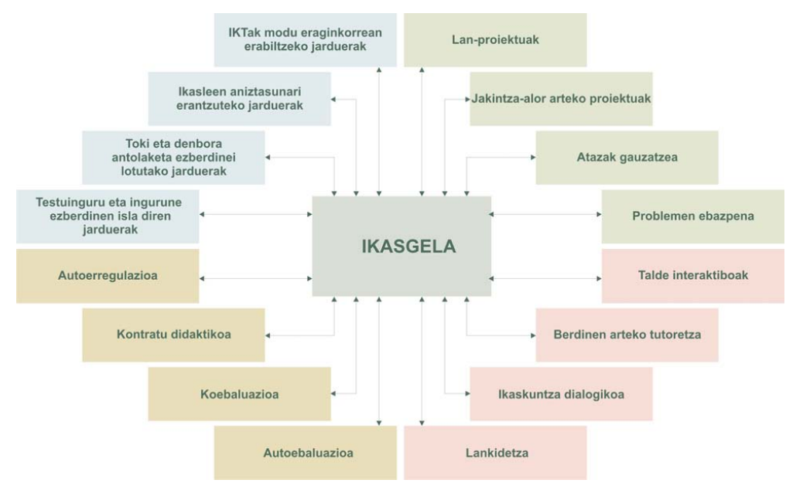
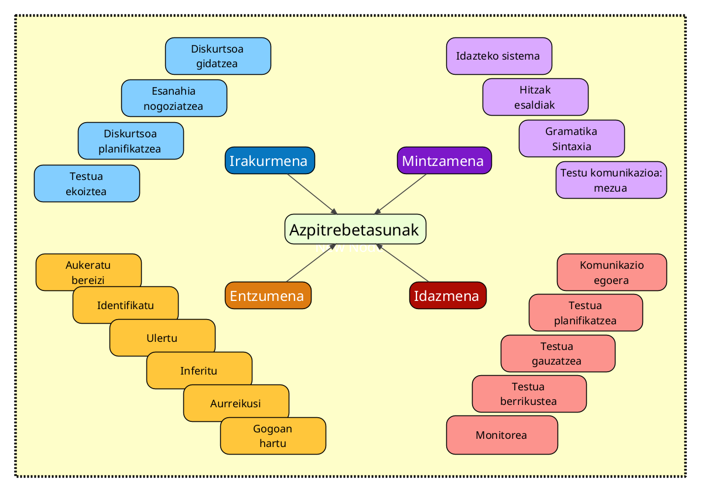

# 

### Hausnarbidea {style='color:lightgrey;'}

## 

+ Umeek eta helduek modu berean ikasten dute. 
+ Umeak helduak baino askoz hobeak dira bigarren hizkuntzak ikasten
+ Arrakastarekin lotura handiagoa dute estrategiek eta ikasteko teknikek adinak baino.
+ Helduei iruditzen zaie beste hizkuntza bat ikasten badute, beren kultura galduko dutela.
+ Helduak erabiltzen duen hizkera umearena baino konplikatuagoa da, horregatik zailago egiten zaie beste hizkuntza bat ikastea.
+ Edozeinek ikas dezake bigarren hizkuntza bat.

## 

+ Badira batzuk hizkuntzetarako dohaina dutenak.
+ Frantsesez hitz egin ahal izateko garrantzi handikoa da frantsesdunen kultura ezagutzea.
+ Hizkuntza arrotz bat dakienarentzat errazago da beste bat ikastea.
+ Hizkuntza bat baino gehiago hitz egiten dutenak azkarragoak dira.
+ Hizkuntza batzuk ikasterrazagoak dira beste batzuk baino.
+ Hizkuntza bat ikasten ari zarelarik garrantzitsuena hiztegia duzu.
+ Nire ustez, andaluziarrek ez dute ongi hitz egiten gaztelaniaz.

# 

### Gaitasun estrategikoa(*k*?) {style='color:lightgrey;'}

## Zer eta zertarako?

## Ikasgelako jarduna

## Ikastunaren jardunak

## Nola egiten dute ikastunek hori guztiori?

## __Komunikazioa estrategiak__ erabilita:

1. Zerbait saihesteko edo murrizteko estrategiak
2. Zerbait lortzeko edo konpentsatzeko
estrategiak
3. Zerbait atzeratzeko edo denbora irabazteko
estrategiak
4. Automonitoretzeko estrategiak
5. Interakzio-estrategiak

## __Ikas estrategiak__ erabilita:

*Zeharkakoak*

6. Estrategia metakognitiboak
7. Estrategia afektiboak
8. Estrategia sozialak

## __Ikas estrategiak__ erabilita:

*Zuzenak*

9. Oroimen-estrategiak
10. Estrategia kognitiboak
11. Konpentsatzeko estrategiak

[+](../apunteak/assets/11/ESTRATEGIAK.pdf)

#

### Ikasle "ona" zer ote den

## 1. Ikasle onak **jarrera aktiboa** du ikaskuntzaren aurrean

   + Inplikatu egiten da bere ikaskuntzan
   + Ikasteko aukerak bilatu eta aprobetxatu egiten ditu
   + Lana planifikatu egiten du
   + Hizkuntza erabili egiten du hainbat eratan
   
## 2. Ikasle ona ohartzen da xede-hizkuntza **sistema bat** dela, berak aurkitu behar duena:

   + Zentzudun da bere H1-en edo dakien beste hizkuntza baten aurrean, eta konparazioak egiten ditu;
   + Xede-hizkuntza analizatzen du eta ondorioak ateratzen ditu;
   + Badaki aurrez ezagutzen duena eta elementu berriak elkarri lotzen.
   
## 3. Ikasle onak ezagutzen du **hizkuntza komunikatzeko tresna** dela:

   + Hizkuntza berezko egoeran erabiltzeko aukerak bilatzen ditu
   + Komunikazio-ekintzen esanahia eta xedea bilatzen saiatzen da
   + Enuntziatuen esanahia asmatzeko (edo inferitzeko) testuingurua, egoera eta keinuak baliatzen ditu.
   + Oreka-estrategiak erabiltzen ditu: parafrasea, keinuak, beste hizkuntza batetik hartutako hitzak.
   
## 4. Ikasle onak kontuan hartzen du H2 ikastearen **alderdi afektiboa**:
   + Tolerantzi eta irekitasun-jarrera du xede-hizkuntzaren aurrean
   + Eta baita bere solaskideen alderako enpatia ere.
   + Ziurtasunik eza, zalantza, frustrazio edo galduta ibiltzeko sentipena onartzen ditu.
   + Ez dio beldurrik barregarri geratzeari
   
## 5. Ikasle ona bere **performantziari adi-adi** egongo zaio:
   + Kezkatzen da hizkuntz kodeaz, sentibera da horren erabilera onarekiko
   + Informazioa jasotzen du berezko solaskideengandik, horiek imitatzen saiatzen da.
   + Bere burua zuzentzen du
   + Bere performantzia neurtu egiten du

## Beraz... hi nolako hizkuntza-ikastuna haiz?

# Eskola praktika: *Ikasle onarentzat aholkuak eta ikas estrategiak* {data-background=#000055 }

## {data-background=#000055 }

Egizu ikasle onaren dekalogoa. Horretarako erabil ezazu orain arte ikusitako testuak eta bibliografia. Dekalogo horrek honako eskema honi erantzun behar dio:

+ Estrategiaren izena
+ Azalpena
+ Hobetzeko iradokizunak edo estrategiaren arrazoiak

---

**Adibidez**

<small>

>  **X. estrategia**: *Ez izan hutsegiteei beldurrik*
>
> Normala da hutsegiteak egitea. Baliagarri izango dituzu okerrak zeure ikaskuntza hobetzeko erabiliz gero.
>
> Iradokizunak:
>
> + Hitz egiteko ez egon zain den a zuzen esateko gauza izan arte edo irakurtzeko dena ulertu ahal izan arte.
> Arriskatu! Praktikatu!
> + Saiatu "errorea" eta "hutsegitea" bereizten
> + Saiatu zeure okerren jatorria aurkitzen
> + Ziurtatu irakaslearen zuzenketak zer esan nahi duen.
> + Saiatu zeure okerren garrantzi erlatiboa neurtzen .

</small>
