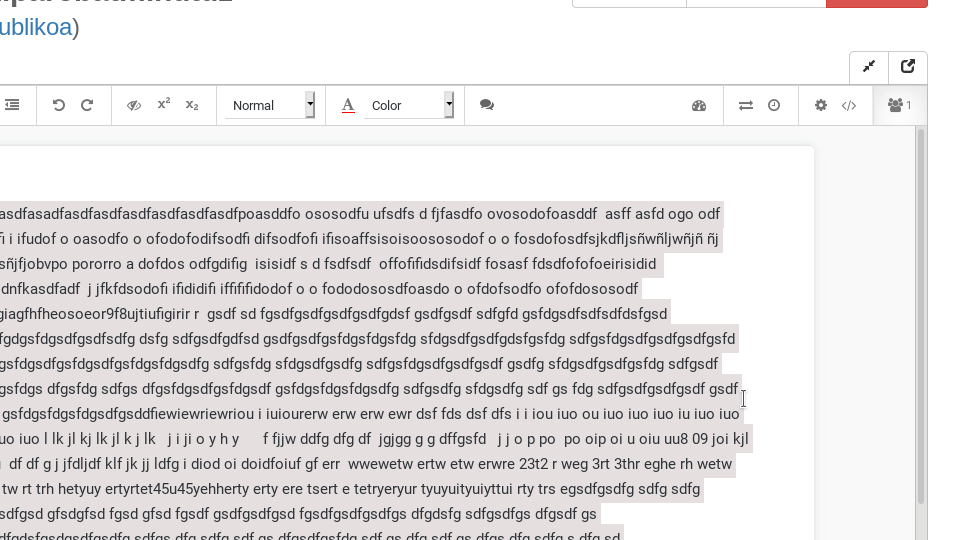
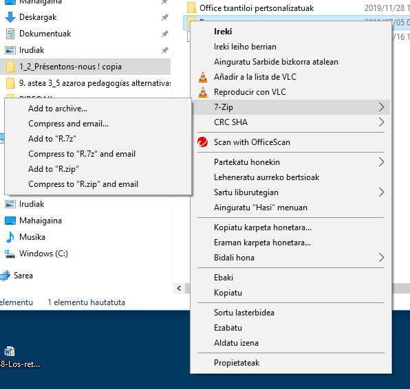
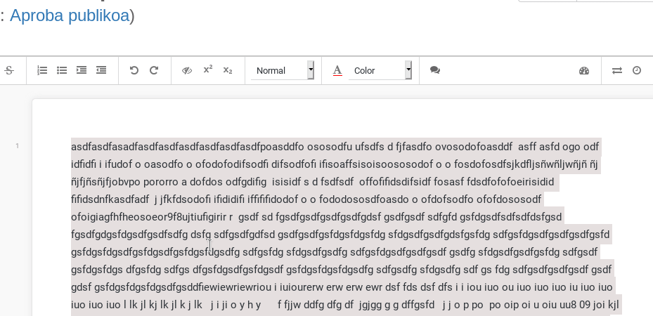

```{r setup, echo=FALSE, message=FALSE}
require(emo)
```


gaurkoan:

>- Zer egin protfolioarekin?
>- Zelan egin behar den azterketa?
>- Irakaslearen eta ikasgaiaren ebaluazio kualitatiboa?

# 

### Portfolioa

## Irakasleari bertsio bitan eman

**Digitala**:  
Zelan jaitsi Etherpadetik, zelan konprimatu... zergatik galderok...

**Paperezkoa**:  
Beste horrenbeste

## Digitala

> Ordenagailuan karpeta bakar batean antolatu.
>
> Dokumentu batek `0-Aurkibidea` izango du izena eta hor zerrendatuko dituzue beste dokumentuak eta zein lani dagozkion.
>
> Karpeta hori zip-eatu behar duzue eta zip fitxategi hori ikasgaiko buzoira igo.

## 



## 

 

## 


## Paperean

Bakarrik zuek idatzitako tarteak (esate baterako, hizkuntz portfolioak-eta ez)

#

### Azterketaz

## Zelan egin beharko den

>- Irakaslearen ebaluazio kualitatiboa egin behar den bezalaxe

#

### Irakaslearen ebaluazio kualitatiboa

## Zelan

>- Dokumentu bat sortu beharko duzue.
>- Aukerazko toki batzuen zerrenda egongo da.
>- Dokumentua izendatzeko arauak: *Ez espaziorik, ez punturik, ez azentu edo eñerik, ezta beheko marrarik ere*.
>- Segidan niri pasatu helbidea [fitxa](https://framaforms.org/ebaluazio-kualitatiboa-1607713559) beteta.
>- Galdetegia kopiatu eta itsatsi.
>- BONUS: nola kendu kolorea?

##



#

### Azterketa (II)

## Zelakoa `r emo::ji('question')`

## Zelan prestatu

`r emo::ji('thinking')`

(`r emo::ji('tea')` / `r emo::ji('beer')`)+`r emo::ji('talk')`*`r emo::ji('folder')`

`r emo::ji('pen')`

## Zelan egingo den

# Galdararik?


