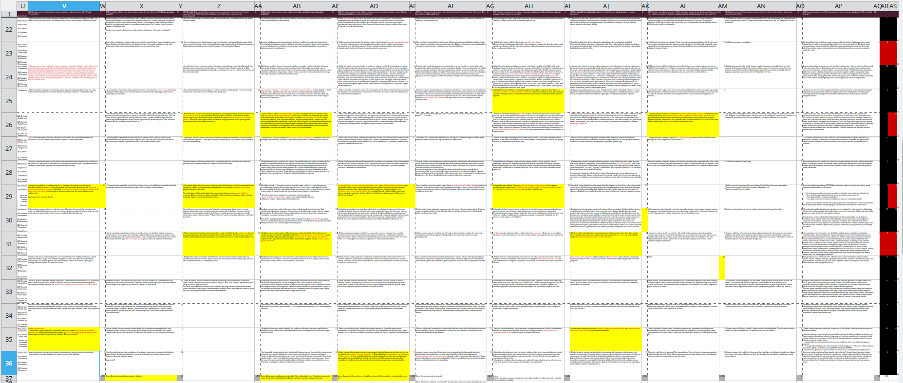

# Gaur oratzekoak

. . .

1️⃣ Ebaluatu irakaslea eta ikasgaia

2️⃣ Ebaluagaiez hitz egin: portfolioa, azterketa.

3️⃣ Portfolioa: elementuak eta zelan entregatu.

4️⃣ Portfolioa: denborak

5️⃣ Azterketa ebaluagai eta horretarako prestakuntza

## 1️⃣ Ebaluatu irakaslea eta ikasgaia

. . .

Sartu egelan eta hor bete idatzizko ebaluazioak

## 2️⃣ Ebaluagaiez hitz egin: portfolioa eta azterketa

## 3️⃣ Portfolioa: egitura eta entregarako bidea

. . .

☕/🍺 + 🗣️

. . .

### oharrak

Portfoliak **sarrera** eta **hiru atal** izango ditu[\*](../diapoak/Azken_klasea.html).

------------------------------------------------------------------------

**Sarrera**

-   ikasgaiaren balorazio orokorra

-   ikasleak zehaztuko du bere lanbiderako **zein ikaskuntza** eskuratu duen **zein lan eginaz**.

------------------------------------------------------------------------

**Atalak**

1.  Hezkuntza ingurua, hizkuntzen agerrera eta curriculuma
2.  Ikastetxearen antolakuntza, ikaskuntzak eta hizkuntzen ikaskuntza
3.  Gelako praktikaren antolakuntza eta hizkuntza

. . .

**Atal bakoitzak izango du bere sarrera**, lanen zerrenda eta lanen azalpen pedagogikoa

------------------------------------------------------------------------

**Lanak eurak**

Ordenan honela:

-   Lanaren aurkezpena (paragrafo bat gehienez)

-   Lana bera

-   Lanaren balorazioa (paragrafo bat gehienez)

------------------------------------------------------------------------

Bertsio bi, bata digitala 🖥️ eta bestea paperean 📜, **biak derrigorrezkoak**.

. . .

Bertsio digitala: Zeregina egongo da egelan.\
🤔 Noizko?

. . .

Paperezko bertsioa urtarrilaren 9rako, beranduenik

## 4️⃣ Denborak

Portfolioa aurten entregatu behar da.

------------------------------------------------------------------------

### Proposamena

Portfolioa: `2025-12-31` amaituta eta entregatuta egelan

## 5️⃣ Azterketaz

. . .

☕/🍺 + 🗣️

. . .

📚 + 💻

. . .

*X* galdera; 8≤*X*≤11

. . .

Euskara ere zaindu:

------------------------------------------------------------------------

# Galderak eta kontuak
