:::::: callout-tip
### Kalifikazio errubrikan (tutorea)

::::: columns
::: {.column width="45%"}
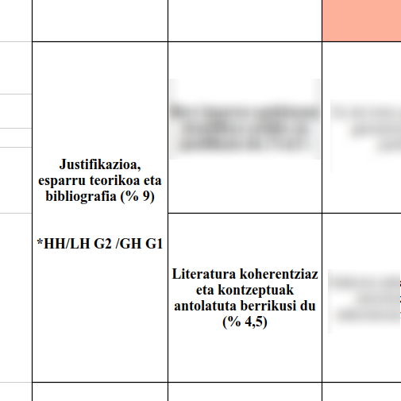{width="432"}
:::

::: {.column width="45%"}
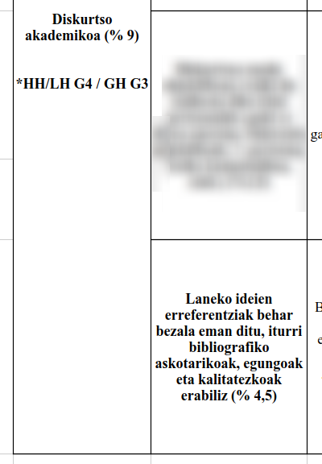{width="300"}
:::
:::::
::::::

::: footer
hasierako oharrak
:::

------------------------------------------------------------------------

:::::: callout-tip
### Kalifikazio errubrikan (Epaimahaia)

::::: columns
::: {.column width="45%"}
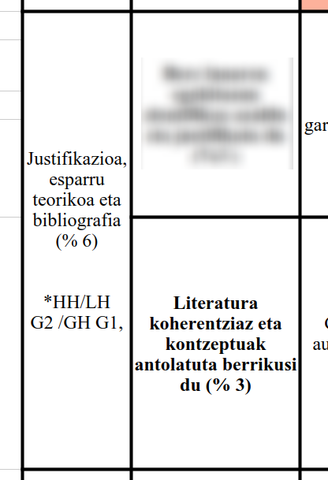{width="300"}
:::

::: {.column width="45%"}
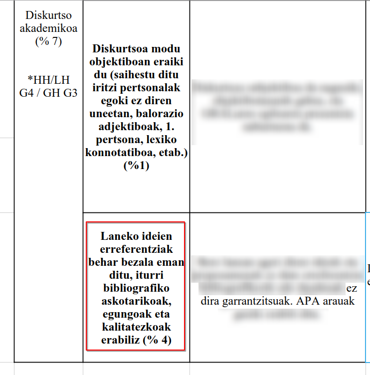{width="426"}
:::
:::::
::::::

::: footer
hasierako oharrak
:::

------------------------------------------------------------------------

::: callout-note
Zure lanean ideia guztiek iturria identifikatuta behar dute.
:::

## Adibide ona {background-image="images/BE_Lanaren_hasierako_ikuskera-Xanti.png" background-color="white"}

## Adibide ez hain ona {background-image="images/BE_adibide_txarra.png" background-color="white" footer="false"}

# Sarrera {background-color="lightgray"}

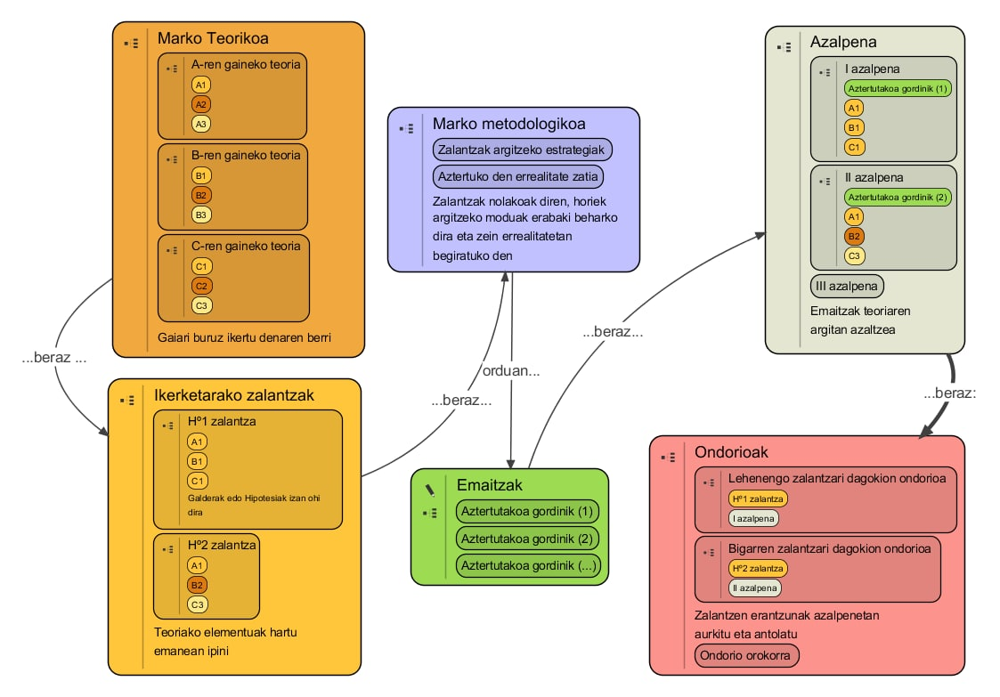

## Jakingarri batzuk {.center}

### Bibliografia [Vs Erreferentziak]{.fragment}

------------------------------------------------------------------------

### Baliabide onak non

::: fragment
Perplexity 🧒 [😶]{.fragment}

ChatGPT 🦥[🍔🥤🎮 🤔]{.fragment}
:::

::: fragment
Google Scholar🧑‍🔬[🥳📡♻️ 🤔]{.fragment}

Dialnet [🇪🇸 🤔]{.fragment}

Inguma [🇲🇰                      😶]{.fragment}
:::

::: fragment
Scielo 🇲🇽🇨🇴🇨🇱🇧🇷🇦🇷 [🤔]{.fragment}

WoS [⬅️🏅🔝]{.fragment}

Scopus [⬅️⬅️🏅🏅🔝]{.fragment}
:::

------------------------------------------------------------------------

### Behin identifikatutakoan

🏴‍☠️ [ISBN / DOI lortu eta gorde 🔍]{.fragment}

##  {background-image="images/BE_Crow_Silhouette_32381551487.jpg"}

::: footer
Crow Silhouette, Jennifer C. (Wikimedia)
:::

# Prozesua

1.  Ikerketa galdera
2.  Bilaketa estrategia
3.  Egokitzapena
4.  Beste toki batzuetarako egokitzea

## 1 Ikerketa galdera / zalantza... motorra...

> **Hizkuntza-paisaiak** nola eragiten du **Haur Hezkuntzako** ikasgela eta ikastetxeetan?

## 2 Bilaketa estrategia

> (("Hizkuntza paisaia" OR "eskola paisaia") AND "Haur Hezkuntza")

::: fragment
(eta ikasi bilatzaile estandarrak erabilita bilaketak fintzen)
:::

## 3 Egokitzapena

``` text
(("Hizkuntza paisaia" OR "eskola paisaia" OR "Linguistic landscape" OR "LL") AND ("Haur Hezkuntza" OR "early childhood" OR "preshcool"))
```

<small>

::: fragment
**AND**: gehitu `"Hizkuntza paisaia" AND "Haur Hezkuntza"`

**OR**: bata ala bestea `"Haur Hezkuntza" OR HH`

**NOT**: kendu `"Haur Hezkuntza" NOT "formakuntza"`

**"`literalki`"**: Hori horrela eta ez bestela `"Haur Hezkuntza"`

**\***: Moztu `maestr*` hori eta `maestro OR maestra OR maestros OR maestras` berdinak

**?**: Komodina `alumn?s` hori eta `alumnos OR alumnas` berdinak

**(`taldekatzeak`)**: Taldekatze logikoak\
`(("LH" OR "Lehen Hezkuntza") AND ("HH" OR "Haur Hezkuntza")) OR "Haur eta Lehen Hezkuntza"` ⬅️ Bata eta bestea `"LH" OR "Lehen Hezkuntza" AND "HH" OR "Haur Hezkuntza"` ⬅️ Auskalo! </small>
:::

## 4 Beste toki batzuetarako egokitzea

### GoogleScholar

``` text
("hizkuntza paisaia" OR "eskola paisaia" OR "linguistic landscape") ("haur hezkuntza" OR "early childhood" OR preschool)
```

<small>4470 emaitza</small>

``` text
allintitle:"linguistic landscape" preschool
```

<small>Emaitza bakarra</small>

:::: fragment
::: callout-note
### Oharra

Egokitzapenok egiteko oso erabilgarriak DeepSeek, ChatGPT... LLMak
:::
::::

## 🧠 Zehaztapena 🎯 Vs Zabalpena 🪏 {.center}

Zelako bahaea darabilzun zure erabakia [(eta ardura)]{.fragment} da.

::: fragment
### 🤚Alborapenak (*bias*)

- Hizkuntza
- Soziala
- Ideologikoak
- Iturrien kalitatea
- Ikerketaren diseinuak eragindakoak
- ...
:::

## Erreferentzia kudeatzaileak

::: callout-tip
### Gogoratu!

Kudeatu behar duzue zelanbait nonbait zer aipatu behar duzuen non. Eta zelan egin noizbait erabaki behar
:::

::: fragment
### Zotero

PDF / epub / web / ...\
Bertatik datuak ateratzeko bideak\
Bertako datuak kudeatzeko aukerak\
Bertan datuak lantzeko bideak
:::

::: fragment
### zbib.org
:::

------------------------------------------------------------------------

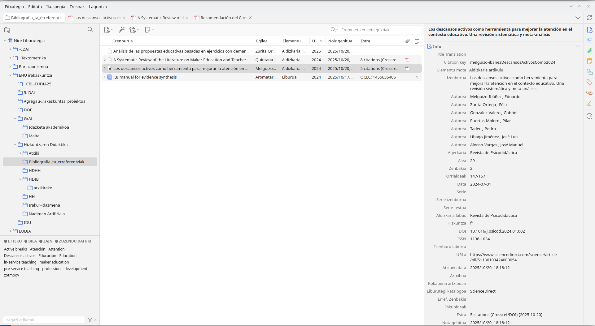

##  {background-image="images/paste-5.png" background-opacity="0.4"}

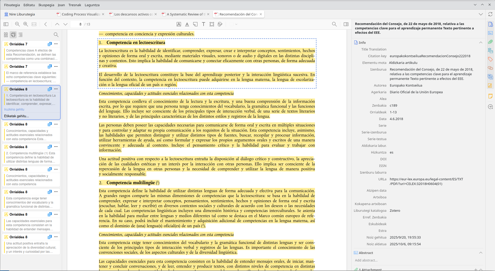

> <small>“1. Competencia en lectoescritura La lectoescritura es la habilidad de identificar, comprender, expresar, crear e interpretar conceptos, sentimientos, hechos y opiniones de forma oral y escrita, mediante materiales visuales, sonoros o de audio y digitales en las distintas discipli nas y contextos. Esto implica la habilidad de comunicarse y conectar eficazmente con otras personas, de forma adecuada y creativa. El desarrollo de la lectoescritura constituye la base del aprendizaje posterior y la interacción lingüística sucesiva. En función del contexto, la competencia en lectoescritura puede adquirirse en la lengua materna, la lengua de escolariza ción o la lengua oficial de un país o región.” (Europako Kontseilua, 2018, p. 8)</small>

------------------------------------------------------------------------

##  {background-image="images/BE_image-Zotero(errusieraz).png"}

# ⌚? {background-color="#ccc"}

💻👀

# Lan on baten 🦶 batzuk <br><small>👃daukanak arin igarriak</small>

------------------------------------------------------------------------

:::::: columns
::: column
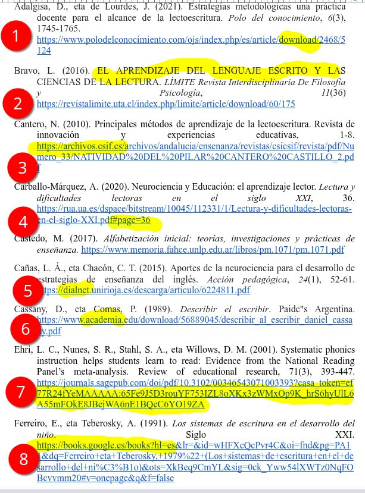
:::

:::: column
::: fragment
<small>1️⃣ helbidean "download" dio; beraz, ez da izango artikuluarena berena. Begiratu aldizkarian zelan dioen aipatzeko

2️⃣ Aldizkari batekoa ematen du, baina dena dago letra larriz... begiratu behar dugu aldizkarian

3️⃣ Aldizkari batekoa ematen du (letra etzana izenburuan falta). Begiratu aldizkarian

4️⃣ Unibertsitate batekoa ematen du, DOI edo HANDLE izango du. "Page..." idatzi du horrela eman diolako Googlek

5️⃣ Dialnet. Dialneteko estekarik ez, originalak aurkitu behar dira.

6️⃣ Academia. Ezin da sartu logeatu barik. Ez da ipini behar estekarik (ez Academia, ez Researchgate ez...)

7️⃣ Artikulua. URL luzeegia. Begiratu artikuluan bertan, SAGEkoa denez, DOI izango du

8️⃣ Liburua. GoogleBooks-eko estekarik ez</small>
:::
::::
::::::

##  {background-color="darkred"}

::: callout-warning
### Ariketa... nahi badozu

Aztertu zure gaia

1.  Idatzi ikerketa galdera
2.  Itzuli bilaketa estrategia batera
3.  Itzuli data base baterako
4.  Aztertu emaitzak (kuantitatiboki eta kualitatiboki)
:::

# ⚙️⚙️⚙️ erreminta batzuk

::: callout-note
Argitaratutako artikulu (serio) guztietan agertzen da gaur-gaurkoz, eskuz egindako bilaketak hobeak direla sistema automatizatuek egindakoak baino ...baina pentsatzen lagungarri erabil ditzakegunez:
:::

## "Adimen" Artifizialak gidatuak

- Consensus
- Elicit
- Scispace
- ResearchRabit
- ConnectedPapers
- ...

# Berrikuspen bibliografiko lanak

<small>**PRISMA** eredua

Quintana-Ordorika, A., Garay-Ruiz, U., & Portillo-Berasaluce, J. (2024). A Systematic Review of the Literature on Maker Education and Teacher Training. *Education Sciences, 14*(12), 1310. <https://doi.org/10.3390/educsci14121310>

Melguizo-Ibáñez, E., Zurita-Ortega, F., González-Valero, G., Puertas-Molero, P., Tadeu, P., Ubago-Jiménez, J. L., & Alonso-Vargas, J. M. (2024). Los descansos activos como herramienta para mejorar la atención en el contexto educativo. Una revisión sistemática y meta-análisis. *Revista de Psicodidáctica*, *29*(2), 147–157. <https://doi.org/10.1016/j.psicod.2024.01.002></small>

## PRISMA 2009

::::: columns
::: column
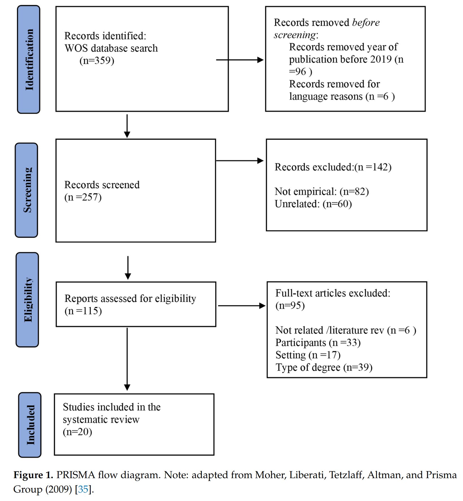
:::

::: column
<small>RQ1. How has maker education been introduced in teacher training?\
RQ2. What is the gap that exists in the literature on maker education in teacher training?\
RQ3. What are the characteristics and main objectives of training and professional development programs related to maker education?\
\
...\
A search was conducted using the keywords “makerspace” and “education”, with duplicates removed using Zotero 6.0.26 software. (Quintana-Ordorika et al., 2024)\
</small>
:::
:::::

## PRISMA 2020

::::: columns
::: {.column width="70%"}
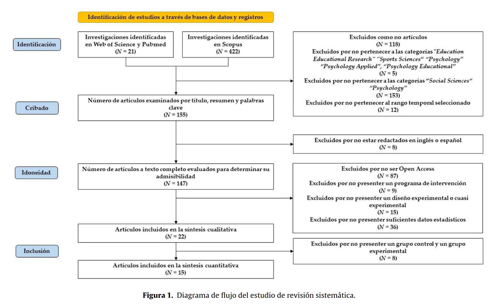
:::

::: {.column width="30%"}
<small>

|  |  |  |  |
|------------------|------------------|------------------|------------------|
| Base de datos | Tipo de búsqueda | Estrategia de búsqueda | Número de artículos |
| Web of Science | Búsqueda básica | “Activity Breaks” (All Fields) and “Cognition” (All Fields) and “Education\*” (All Fields) | 14 |
| Scopus | Búsqueda básica | (ALL (“Activity Breaks”) AND ALL (”Cognition“) AND ALL (“Education\*”)) | 422 |
| Pubmed | Búsqueda avanzada | ((“Activity Breaks”) AND (“Cognition”)) AND (“Education\*”) | 7 |

(Melguizo-Ibáñez et al., 2024) </small>
:::
:::::

## GrAL batean

<small>Laster ADDIn: Xanti Korta (2025)</small>

::::: columns
::: column
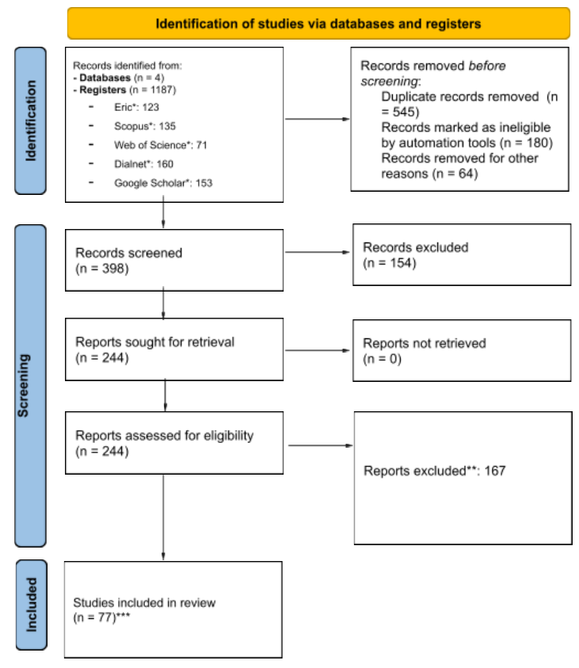
:::

::: column
<small>

|  |  |  |
|------------------------|------------------------|------------------------|
| Hizkuntza | Termino nagusiak | Bilaketa-adibideak |
| Euskaraz | Hizkuntza-paisaia, haur-hezkuntza, eleaniztasun | (“hizkuntza-paisaia” OR “eskola paisaia”) AND “haur hezkuntza” |
| Gaztelaniaz | Paisaje lingüístico, educación infantil, multilinguismo | “paisaje lingüístico" AND (“educación infantil” OR “preescolar”) |
| Ingelesez | Linguistic landscape, early childhood, schoolscape | (“Linguistic landscape” OR “LL”) AND (“early childhood” OR “preschool”) |

</small>
:::
:::::

## Bibliografia

<small>

### Prisma & co.

Page, M. J., McKenzie, J. E., Bossuyt, P. M., Boutron, I., Hoffmann, T. C., Mulrow, C. D., Shamseer, L., Tetzlaff, J. M., Akl, E. A., Brennan, S. E., Chou, R., Glanville, J., Grimshaw, J. M., Hróbjartsson, A., Lalu, M. M., Li, T., Loder, E. W., Mayo-Wilson, E., McDonald, S., … Moher, D. (2021/). The PRISMA 2020 statement: An updated guideline for reporting systematic reviews. *BMJ*, *372*, n71. <https://doi.org/10.1136/bmj.n71>

Yepes-Nuñez, J. J., Gerard Urrútia, Romero-García, M., & Alonso-Fernández, S. (2021/). Declaración PRISMA 2020: Una guía actualizada para la publicación de revisiones sistemáticas. *Revista Española de Cardiología*, *74*(9), 790–799. <https://doi.org/10.1016/j.recesp.2021.06.016>

### Metodologia oro har

Aromataris, E., Lockwood, C., Porritt, K., Pilla, B., & Jordan, Z. (Arg.). (2024/). *JBI manual for evidence synthesis* (2024 edition). JBI.

</small>

# Goiari eutsi 💪👩‍🎓 {background-color="lightgrey" footer="false"}

laster GrAL bat defendatu eta irakasle titulatu!