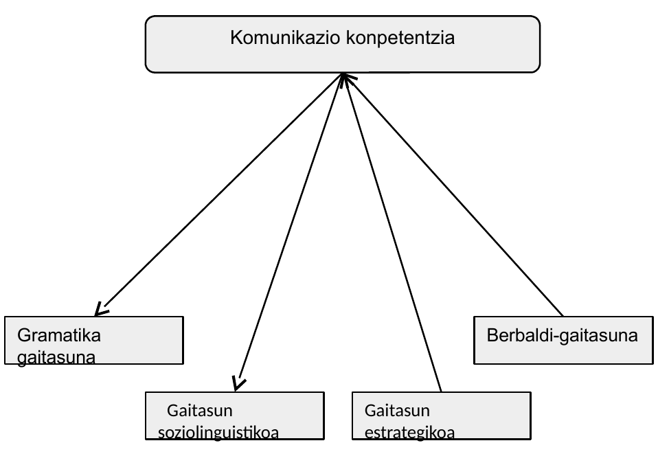

# Hezkuntzaren lau zutabeak

[](diapoak/01-Diapo.html)

Galdera batzuk egin eta galdera horien erantzunen bitartez saiatuko gara aurrera egiten gaian:

## Galdera batzuk

Hezkuntzaren lau pilareak esaten dugunean zertaz ari gara?  
Nondik dator ideia hori?  
Zein dira lau pilare horiek?  
Zeri egiten diote erreferentzia?  
Hezkuntzaren zer kontzepzio edo ideia dakarte?  
Zer jarreratatik aldentzen dira?  
Zer dute berrikuntza? 

**Oinarrizko konpetentziez**

Zer da konpetentzia?  
Definizioren bat eman dezakegu?  
Konparatu definizio batzuk  
Konpetentzia lortzea eta gai bateko edukiak ikastea gauza bera da?  
Zer dira oinarrizko konpetentziak?   
Zein dira oinarrizko konpetentziak Europan? Espainian? EAEn? Konpetentzia horiek nonahi berdinak dira? Nork erabakitzen ditu?  
Nork lortzekoak dira konpetentziak? Nork lortu behar dituzte konpetentziak? Norentzat dira? Zergatik?  
Zein dira konpetentzia garrantzitsuenak?  
Konpetentziek zer dakarte berri, lehengo kontzepzio batzuen aldean?  
Hezkuntzaren munduan ari garenok, non aurki dezakegu informazioa eskolan landu behar ditugun konpetentzia horiei buruz? Zer dokumentutan? Zer erakundek izanen du honen berri?  

#### Hizkuntza-komunikaziorako konpetentziaz:

Zer da? Zertarako da? Zer landu behar da konpetentzia hori lantzeko? Zer hizkuntzaren bidez gauzatzen da konpetentzia hori EAEn? Zer mailataraino garatu behar da konpetentzia hori hizkuntza bakoitzean? Konpetentzia hori osorik hartu behar da nahitaez edo baditu azpi-osagaiak? Non bila dezakegu informazioa kontu horretaz? 

Konpetentzia dena kolpetik lortzen da edo baditu mailak? Konpetentzia behin betikoa da? Zer mailatan betetzen da konpetentzia? Egin konparazio bat talde-kideen artean hizkuntza-konpetentziari buruz. Edo gurasoen konpetentziarekin konparatu.

```
Landa-lana edo gogoeta (adibide bat jartzen da hemen, baina beste zerbaitek ere balio dezake, jakina)
Egin azterketa bat nork bere buruari. Egin gogoeta zer mailatan garatua dugun geure hizkuntza-komunikaziorako konpetentzia. Konparatu gure konpetentzia hizkuntza desberdinetan. 
Aurreko hori egiteko, zeri begiratuko diogu gure/besteen konpetentzia ebaluatzeko? Nola ebaluatuko dugu konpetentzia hori? Dena osorik hartuta? Zatika?
```

### Galdera batzuk  gaurko munduaz eta hezkuntza-munduaren erantzunaz

Gaurko mundua eta gure gurasoena edota aiton-amonena: zer alde azpimarratuko genuke?  
Hezkuntzak zertan oinarrituta erantzun nahi dio gaurko munduari? Zeren arabera?  
Zer oinarri teorikoren gainean eraikitzen da erantzun hori?   
Zein dira planteamendu berri honen bilakaerako mugarri garrantzitsu batzuk? (Delors, DeSeCo eta Europako Kontseiluaren oinarrizko gaitasunak)

```
**Ariketa**
Zenbat jende ezagutzen dugu "zuzenean" eta zenbat bestela?
Zenbat lagun dugu kanpoan ikasten edo lanean? 
Zenbat hizkuntza erabiltzen dugu aste batean zehar? 
Gertatu zaigu hirugarren hizkuntza erabili behar izatea? Izan dugu kontaktu zuzenik edo birtualik 3. hizkuntzaren batekin? Zeinekin? Zer dela eta? Zertarako?
4.nik? 5.ik? ...
Ezagutzen dugu kanpotik etorririko jenderik? 
Noraino eramaten gaitu gaur WhatsApp, Instagram, Facebook... erabiltzeak?
Zer dira, ezagutzen ez duen batentzat azalduta?
```

## Gaurko mundua: globalizazioa

Mundua nolakoa dugun? 

**Konplexua**: mugikortasun fisikoa eta soziala; mailak ez –hain- gogorki finkatuak eta bereziak; denak nahasian, espazio berak konpartitzen; azken batean, munduaren dimentsio osoa “ikusten dugu”…

**Aldakorra, borborka**: migrazio mugimenduak, aurrerapen teknologikoak, IKT…

*Globalizatua* (denok denen berri, eraginak nabariago, herri globala, Internet…)

Orain, interakzioa handiagoa mundu mailan:  elkarrekin aztertuko dugu egoera?

Munduaren konplexutasun horretan, gidalerro batzuk: Delors Txostena UNESCOrentzat (1996) 

- Oinarrizko gaitasunak
- Europako Kontseiluak gomendatuak
- EAEn, Espainian, Nafarroan formulatuak
- Hizkuntza-komunikaziorako gaitasuna

> Globalization refers to the increasingly global relationships of culture, people and economic activity. Most often, it refers to economics: the global distribution of the production of goods and services, through reduction of barriers to international trade such as tariffs, export fees, and import quotas. (…)The term can also refer to the transnational circulation of ideas, languages, and popular culture. (Wikipedia)

Globalizazioaren alderdiak
Iturria: Appadurai, 1990; in Block, 2010)

| Dimentsioa            | Zer mugitzen da? | Adibideak                                                    |
| --------------------- | ---------------- | ------------------------------------------------------------ |
| Jende-dimentsioa      | Jendea           | Migrazioak, iheslari politikoak, deserriratuak, turismoa     |
| Teknologikoa          | Teknologia       | Jakintza teknikoa, osagai fisikoak                           |
| Finantzarioa          | Dirua            | Diru-espekulazioa, nazio-funtsen toki-aldatzeak              |
| Hedabideak/Mass media | Informazioa      | Egunkariak, aldizkariak, satelite-bidezko TBa, webguneak, posta elektronikoa… |
| Ideiena               | Ideiak           | Jende-eskubideak, ingurumenaren defentsa, terrorismoari beldurra... |


Zer da globalizazioa? Delors txostena (UNESCO, 1996): Hezkuntza: altxor ezkutua . XXI. mendeko hezkuntzaz 

XXI. mendea tentsio batzuen erdian garatzen da eta haien artean bilatu behar da irtenbidea. Hona zein diren tentsio nabarmen batzuk:

**Mundialaren eta lokalaren arteko tentsioa**: munduko biztanle bihurtzeko prozesua ezari-ezarian egitea bai, baina nork bere erroak eta zainak galdu gabe; hurbileneko erkidegoetatik zabalagoetara igaroz, haietan parte hartuz.  

**Unibertsalaren eta tokikoaren artekoa**: kultura globalizatzen ari da baina ez du dena hartzen. Pertsona bakoitza bakarra da eta bokazioa du bere etorkizuna bilatzeko eta bere barrengo ahalmen guztiak garatzeko. Baina beste aldetik bere tradizioetan eta bere kulturan duen aberastasuna ere zaindu behar da, bestela aberastasun hori behin betiko hondatzeko arriskua baita.  

**Tradizioaren eta modernitatearen artekoa**: egokitu bai, baina bere buruari uko egin gabe; nork bere autonomia eraiki bai baina besteen askatasunarekin eta garapenarekin harreman dialektikoan, aitzinamendu zientifikoaren menpeko bihurtu gabe. Informazioko teknologia berriek dakarten desafioari erantzun egokia aurkitu behar zaio.  

**Epe luzearen eta epe laburraren arteko tentsioa**: joankorra-iheskorra (efimeroa) da nagusi gaur egun, istantekotasuna da goi-goian, irudi eta informazio iheskor asko izateak berehalakoan zentratzera eramaten gaitu, erantzunak berehala nahi ditugu. Baina arazo askok estrategia patxadatsua, adostua eta negoziatua eskatzen dute; esate baterako, hezkuntza politikek.  

**Nahitaezko lehiaren eta aukera-berdintasunaren gaineko kezk**a. Lehiaren presioak ahantzarazten dio buruzagi askori jende bakoitzak aukerak behar dituela garatzeko. Lehia bizigarriak batera gertatu behar du lankidetza indargarriarekin eta lotzeko balio duen elkartasunarekin.  

**Jakintzaren hazkuntza izugarriaren eta jendeak hura asimilatzeko duen gaitasun mugatuaren arteko tentsioa**. Ikas-irakasgaiak hautatu beharko dira, oinarrizko hezkuntza egoki baten funtsezko osagaiak zainduta (irakasteko hobeki bizitzen jakintzaren bidez, esperimentazioaren  bidez eta kultura pertsonal bat osatzearen bidez).   

**Espiritualaren eta materialaren arteko tentsioa**, betikoa dena. Munduak ideialen eta baloreen beharra du.


Gizartean zalantzak sortzen dira, erantzunak behar dituztenak:

+ Nola jardun eraginkorki jendarte konplexu horretan?
+ Holako jendarte batean zer prestakuntza behar du herritar orok?

Testuinguru horretan: Delors txostena (1996) (Nazioarteko Batzordea XXI. menderako Hezkuntzaz) 

+ Hezkuntzari garrantzi handia (“Hezkuntza edo beharrezko utopia”)
+ Toki-erkidegotik mundu-jendartera
+ Jendarte-kohesioa eta partaidetza demokratikoa
+ Heziketa bizi guztian zehar
+ Nazioarteko lankidetza herrixka globalean
+ Pertsonaren hezibidean lau garabide edo ardatz

## Historia apur bat

Gaiari kolpetzeko historian kokatu beharra dago, horrela, aurrez ikusitakoari gaurko markoak nola erantzun nahi dion ulertzen errazagoa izan liteke

### Delors Txostena 

Hezkuntzaren lau zutabeak: http://148.202.105.241/biblioteca/bitstream/20050101/946/1/Los_cuatro_pilares_de_la_educacion.pdf 

ikasten ikastea  
	: lifelong learning; dimentsio anitzeko hezkuntza

egiten ikastea  
	: jakintza aplikatua, jendartean ekiteko

elkarrekin bizitzen ikastea		
	: lankidetzarako eta gatazkak konpontzeko gaitasunak…

izaten jakitea  
	: balioak, jarrerak


```
**ariketa**
Pentsatu hizkuntzak non duen zeregika ardatz horietan, baldin eta badu
```

**Galdera batzuk** gaurko munduaz eta hezkuntza-munduaren erantzunaz:

- Zer da curriculuma gaitasunen arabera antolatzea?
- Zer dira oinarrizko gaitasunak?
- Nola zehaztu dira gaitasun horiek gure inguruan?
- Zer da hizkuntza-komunikaziorako gaitasuna?

- Aipaturiko mundu konplexu horretan jarduteko, nola prestatu jendea? Nola antolatu hezkuntza?
- Mundu konplexu horretan jarduteko oinarrizko gaitasun batzuen jabe izan behar du pertsona orok
- Zenbat eta zein dira oinarrizko gaitasun horiek?

### Konpetentziaren definizio batzuk:

Jakintza, trebetasunak eta jarrerak modu praktikoan integratzeko gaitasuna, arazoak konpontzeko eta egoki erantzuteko hainbat testuinguru eta egoera askotarikoetan. Bestela esan, jakintza teorikoa eta praktikoa integratzea eta aplikatzea testuinguru akademikoz kanpoko egoeratan.

> Europako Hizkuntzen erreferentzia marko bateratuan:  Competences are the sum of knowledge, skills and characteristics that allow a person to perform actions.  (Konpetentziak dira norbanakoaren jakintzen, trebetasunen eta ezaugarrien batura, pertsonari ahalbide ematen diotenak jarduerak gauzatzeko. 
> --(JMren itzulpena) (in http://www.coe.int/t/dg4/linguistic/Source/Framework_EN.pdf)
> 


> Gaitasuna da testuingurura egokitutako ezagutzen, trebetasunen eta jarreren multzo bat 
> 
> -- Europako Parlamentuaren ebazpena (2006)


> Konpetentzia edukitzea da eraginkor aritzea testuinguru jakin batean.
> 
> Konpetentzia da gaitasuna edo trebetasuna zereginak burutzeko edo egoera desberdinei aurre egiteko, modu eraginkorrean, testuinguru jakin batean. Eta horretarako jarrerak, trebetasunak eta jakintzak mugitu behar dira, aldi berean eta elkarrekin erlazionaturik. 
>
> -- Zabalak eta Arnauk (2007)

Konpetentziak “diseinatzeko”, hautatzeko, saio batzuk izan ziren. Horietako bat, DeSeCo izenez ezagutzen dena:

### DeSeCo (Definition and Selection of  Key Competencies):

> What Competencies Do We Need for a Successful Life and a Well-Functioning Society?
> Why are competencies so important today? Globalizazioak eta modernizazioak gero eta mundu desberdinagoa eta konektatuagoa sortzen dute; horrek, adibidez, behartzen gaitu informazio asko kudeatzera, eta horretarako teknologia berrietan prestakuntzaren bat eskatzen du; ekonomiaren hazkundea hura jasateko moduarekin konbinatu behar da. Pertsonak, jendarte konplexu horretan, trebetasun zehatzak baino zerbait gehiago behar du ongi jarduteko. Kohesio soziala eta jasateko moduko garapena larriki lotuak dira jendarte guztiko jende guztiaren konpetentziekin; konpetentziak ulertu behar dira jakintzaren, trebetasunen eta jarrera eta balioen batura gisa.
> -- OECD Education Ministers

Konpetentzien hiru dimentsio edo “kategoria handi”: 

+ Baliabideak interaktiboki erabiltzeko gaitasuna (ad. hizkuntzak, teknologiak)
+ Talde heterogeneoetan hartu-emanean jardutea
+ Nor bere gain ibiltzeko gaitasuna (autonomo jardutea)

DeSeCo txostenak baldintza batzuk ezarri zituen oinarrizko gaitasun/konpetentzia horien definizioan:

a) pertsonarentzat eta jendartearentzat baliozkoak diren emaitzak erdiesten lagundu behar dute.
b) lagundu behar diote pertsonari erantzuten aurrean aurki ditzakeen hainbat testuingurutako eskakizunei.
c) jende ororentzat balio behar dute, ez bakarrik espezialistentzat.

### Europako kontseiluaren proposamena

Europako Kontseiluaren oinarrizko zortzi konpetentziak (key competences): marko honek zortzi konpetentzia definitzen ditu eta deskribatzen du zein diren oinarrizko jakintzak, trebetasunak eta jarrerak haietako bakoitzari lotuak. Oinarrizko konpetentziak hauek dira:

1. komunikazioa ama-hizkuntzan (*communication in the mother tongue*)
1. Komunikazioa atzerriko hizkuntzetan (*communication in foreign languages*)
1. Konpetentzia matematikoa eta oinarrizko konpetentziak zientzian eta teknologian (*mathematical competence and basic competences in science and technology*) 
1. Konpetentzia digitala (*digital competence*)
1. Ikasten ikastea (*learning to learn*) 
1. Jendarteko eta herritar  konpetentziak (*social and civic competences*)
1. Ekinzaletasuna eta ekimena (*sense of initiative and entrepreneurship*)
1. Kultur oharmena eta adierazpena (*cultural awareness and expression*)

Oinarrizko konpetentzia hauek elkarren menpekoak dira eta enfasia egin behar da kasu bakoitzean pentsamendu kritikoan, sormenean, arazo konpontzean, arrisku balioestean, erabakimenean, eta sentimenduen kudeatze eraiki-zalean.


### Oinarrizko konpetentziak handik hona (ariketa)

| Oinarrizko gaitasunen egoera                                 |                                                              |          |      |
| ------------------------------------------------------------ | ------------------------------------------------------------ | -------- | ---- |
| Europako Kontseilua                                          | Espainia                                                     | Nafarroa | EAE  |
| communication in the mother tongue                           | 1. Competencia en comunicación lingüística                   |          |      |
| communication in foreign languages                           | 2. Competencia matemática                                    |          |      |
| mathematical competence and basic competences in science and technology | 3. Competencia en el conocimiento y la interacción con el mundo físico |          |      |
| digital competence                                           | 4. Tratamiento de la información y competencia digital       |          |      |
| learning to learn                                            | 5. Competencia social y ciudadana                            |          |      |
| social and civic competences                                 | 6. Competencia cultural y artística                          |          |      |
| sense of initiative and entrepreneurship                     | 7. Competencia para aprender a aprender;                     |          |      |
| cultural awareness and expression                            | 8. Autonomía e iniciativa personal.                          |          |      |
| http://europa.eu/legislation_summaries/education_training_youth/lifelong_learning/c11090_en.htm | http://www.boe.es/boe/dias/2006/12/08/pdfs/A43053-43102.pdf  |          |      |

Oinarrizko gaitasunetatik bat hizkuntzen bidez gauzatzen da, bai Europako kontseiluan eta bai hemen ere.  
Hemen, izena: Hizkuntza-komunikaziorako gaitasuna/konpetentzia
Oso ideia zabala. Zehaztapena behar du, hura ulertzera hurbiltzeko, eta haren ikas-irakaskuntza antolatzeko
Zein azpigaitasun ditu konpetentzia horrek? Iritzi desberdinak


## Communicative competence... eta familia




### Hizkuntzen Europako Erreferentzi Marko Bateratua

https://www.habe.euskadi.eus/s23-4728/eu/contenidos/informacion/oinarrizko_kontzeptuak/eu_9716/adjuntos/erreferentzi_markoa.pdf

### Zalantzak:

Zer inporta zaigu zer osagai dituen hizkuntza-komunikaziorako gaitasunak?

Eta osagai horietaz gogoeta egiteak zertarako balio digu?

Gure eskolako lanean badu horrek zerikusirik?


Non aurki dezakegu informazioa hizkuntza-komunikaziorako gaitasunaren izaeran sakontzeko?

Zer erakundek izan dezake horren berri?   

Administrazioak, Gobernuen zerbitzu pedagogikoek …

Zer dokumentutan aurki genezake hori?  

Curriculum dekretuetan, Hezkuntza Sail(ar)en web orrietan…


### Zehaztapenak: 

Osagaiak osagai, nola zehaztuko genuke zer den hizkuntza-komunikaziorako gaitasuna?
Hona Oinarrizko Curriculum Diseinutik harturiko azalpena (2010eko curriculuma)

>  4.– Hizkuntza-komunikaziorako gaitasuna.
>
> Gaitasun honen funtsa hizkuntza erabiltzea da, ahozkoa zein idatzizkoa, bai errealitatea adierazi, interpretatu eta hura ulertzeko egindakoa, bai jakintza eraikitzeko eta komunikatzeko egindakoa, bai eta pentsamoldea, emozioak eta jarrerak antolatu eta norberak erregulatzeko egindakoa ere. 
>
> Gaitasun honi dagozkion jakintzek, trebetasunek eta jarrerek bide ematen dute pentsamenduak, emozioak, bizipenak eta iritziak adierazteko, elkarrizketan aritzeko eta iritzi kritikoak eta etikoak osatzeko, ideiak sortzeko, jakintza egituratzeko, diskurtsoari eta norberaren ekintzei eta egitekoei koherentzia eta kohesioa emateko, erabakiak hartzeko eta ahozko nahiz idatzizko entzunaldiez, irakurraldiez nahiz mintzaldiez gozatzeko. Horrek guztiak, gainera, autoestimua eta norberarenganako konfiantza handitzen laguntzen du.
>
> Komunikatzeko eta elkarrizketan aritzeko, harreman eta lotura eraikitzaileak sortu behar dira pertsonekin eta ingurunearekin; orobat, kultura berrietara gerturatzea eskatzen du jarduera horrek, eta, kultura horiek ezagutu ahala, handitu egiten da kultura horiekiko ardura eta errespetua. Nabarmena da, horrenbestez, bizikidetzarako eta gatazkak konpontzeko ahalmenarekin erabat loturik dagoela hizkuntza-komunikaziorako gaitasuna.
>
>  Entzuteko, azalpenak emateko eta elkarrizketan aritzeko gai izanda, hitzezko harreman nagusien jabe egiten gara, era bateko eta besteko komunikazio-egoeretan sortutako ahozko mezuak adierazteko eta ulertzeko gaitasuna eskuratzen dugu, eta komunikazioa testuinguru bakoitzera egokitzeko ahalmena geureganatzen dugu. Hala, komunikazio-egoera bakoitzerako egokiak diren ahozko testuak sortzeko, behar bezala eta eraginkortasunez erabili behar dira hizkuntzakoak diren eta ez diren kodeak eta trebetasunak, eta komunikaziorako harremanek egoera bakoitzean bete beharreko arauak.
>
> Irakurriz eta idatziz, indartu egiten dira informazioa bilatzeko, biltzeko eta prozesatzeko trebetasunak; hala, jarduera horiek lagundu egiten dute askotariko asmo komunikatibo edo sorkuntzakoak dituzten testuak behar bezala ulertzen, sortzen eta erabiltzen. Irakurketak erraztu egiten du idatzizko hizkuntza erabiltzeko kodea interpretatzeko eta ulertzeko prozesua, eta, gainera, plazer-, jakituria-eta fantasia-iturri da, eta beste ingurune, hizkuntza eta kultura batzuk ezagutzeko aukera ematen du. Horrek denak, komunikaziorako gaitasuna mantentzen eta hobetzen laguntzen du. 
>
> Hizkuntza-komunikazioko ekintzetako (elkarrizketa, irakurketa, idazketa, etab.) xedeak eta helburuak hautatzeko eta aplikatzeko trebetasuna zuzenean dago lotuta gaitasun honen alderdi nagusiekin; esaterako, norberaren errepresentazio mentalak egitearekin, errealitatea interpretatu eta ulertzearekin eta norberaren jakintzak eta ekintzak koherentziaz antolatu eta erregulatzearekin
>
> Mezuak ulertzea eta komunikatzen jakitea jakintza praktikoak dira, baina hizkuntzari eta haren erabilera-arauei buruzko ezagutza erreflexiboa eduki behar dute oinarrian, eta horrek berariaz eskatzen du hizkuntza behaketarako eta azterketarako objektutzat hartzen jakitea. Era askotariko gizarte-eta kultura-testuinguruetako komunikazio-egoerei egokiak zaizkien diskurtsoak adierazteko eta interpretatzeko, beharrezkoa da hizkuntza-sistemaren funtzionamendu-arauak eta hizkuntza-interakzio egokiak izateko estrategiak ezagutzea eta behar bezala aplikatzea. 
>
> Gaitasun hori eskuratzeko, hauek ezagutu behar dira: hizkuntzarekin lotutako gizarte-ohiturak, hizkuntzaren kultura-balio eta -alderdiak, eta hizkuntzak testuinguruaren eta komunikazio-asmoaren arabera har ditzakeen aldaerak. Ahalmen hauek ere izan behar dira: beste pertsona batzuen egoeran jartzeko ahalmen enpatikoa; norberarenak ez bezalako iritziak sentikortasunez eta ikuspegi kritikoz irakurtzeko, entzuteko, aztertzeko eta aintzat hartzeko ahalmena; norberaren ideiak eta emozioak funtsean eta formaz egoki adierazteko ahalmena, eta kritika eraikitzaileak onartzeko eta egiteko ahalmena.
>
> Atzerriko hizkuntzen komunikazio-gaitasunari dagozkion jakintza eta formalizazioa –batik bat, idatzizkoa– bestelako maila batean kokatzen dira, eta hizkuntza horietakoren batean komunikatzeko ahalmena izatea eskatzen dute. Hizkuntza horiek jakinda, aberastu egiten dira gizarte-harremanak eta norberak berezkoak ez dituen testuinguruetan mugitzeko ahalmena eskuratzen da. Atzerriko ikasleen atzerri-hizkuntzen kasuan ere, hizkuntza horiei eutsita, bultzatu eta aberastu egiten da hizkuntza anitzeko inguruneen dibertsitatea. Horrekin batera, jokabide horiek eskura jartzen dituzte informazio-, komunikazio-eta ikasketa-iturri ugari eta askotarikoak. 
>
> Laburbilduz, derrigorrezko eskolaldiaren amaieran hizkuntzarako gaitasuna behar bezala eskuratua izateko, ahozko eta idatzizko hizkuntza menderatu behar da era bateko eta besteko testuinguruetan, eta atzerriko, gutxienez, hizkuntza baten erabilera funtzionala izan.

### Hizkuntza-komunikaziorako gaitasunaren beste definizio bat

 

>  Hizkuntza-komunikaziorako gaitasuna hizkuntza erabiltzeko trebetasuna da, hau da, kontzeptuak, sentimenduak, gertakariak eta iritziak ahozko eta idatzizko diskurtsoen bidez adierazi eta interpretatzekoa eta gizarte- zein kultura-ingurune guztietan linguistikoki elkarreragitekoa.
>
>  -- Eusko Jaurlaritza: *Hizkuntza-komunikaziorako Gaitasuna. Bigarren Hezkuntza* 

Definizioak definizio, badira definitutakoa lanketa eremura eramateko orduan adostutako kontzeptu batzuk:

`Dimentsioa -> Azpigaitasunak -> Ebaluazio adierazleak`

Horrela, komunikazio gaitasunean batzuk aztertzen dira segidan


## Komunikazio konpetentzia gaurko ikuskeran

Komunikazio Gaitasunean 5 dimentsio bereizten dira: 

- ahozkoaren ulermena

- idatziaren ulermena
- mintzamena
- idazmena
- ahozko elkarrekintza

Dimentsio bakoitza neurtzeko, ikasketa-emaitza batzuk formulatzen dira (ikus hurrengo diapositibetan)

Ikasketa-emaitza bakoitzean, hiru betetze-maila bereizten dira (ebaluazio diagnostikoan):

- Hasierako maila (A)
- Erdi maila (B)
- Maila aurreratua (C)

### Hizkuntza-komunikaziorako gaitasunaren dimentsioen osagaiak/azpigaitasunak

> Hizkuntza-komunikaziorako konpetentzia bloke handi batzuetan egituratu da, DIMENTSIO deituak. Dimentsio horietako bakoitza AZPIKONPETENTZIA batzuetan zertzen da, eta azpikonpetentzia bakoitzerako ikasleak jakin eta egiten jakin behar duena azaltzen duten EBALUAZIO-ADIERAZLE batzuk xedatu dira.
>
> -- Eusko Jaurlaritza-Hezkuntza Saila-ISEI/IVEI: *Ebaluazio diagnostikoa. Hizkuntza-komunikaziorako konpetentzia. Marko teorikoa*. Vitoria-Gasteiz: EJAZN

#### Dimentsioak

Hizkuntza-komunikaziorako konpetentzia DIMENTSIO hauetan egituratuta dago:. 

+ Ahozkoaren ulermena edo entzumena
+ Idatziaren ulermena edo irakurmena
+ Mintzamena
+ Idazmena
+ Ahozko elkarrekintza

Dimentsio horien azpigaitasunak hemen ikus ditakegu

- 
  DIMENTSIOA: AHOZKOAREN ULERMENA
  - Ahozko testuen zentzu orokorra identifikatzea
  - Ahozko testuen helburua antzematea
  - Ahozko testuetan, proposatutako helburuei begira garrantzia duten informazioak hautatzea
  - Ahozko testuen edukia kritikoki interpretatzea
  - Ahozko testu-mota desberdinak hobeto ulertzeko estrategiak erabiltzea
- DIMENTSIOA: IDATZIAREN ULERMENA
  - Idatzizko testuen zentzu orokorra identifikatzea
  - Idatzizko testuen helburua antzematea
  - Idatzizko testuetan, proposatutako helburuei begira garrantzia duten informazioak hautatzea
  - Idatzizko testuen edukia kritikoki interpretatzea
  - Idatzizko testu-mota desberdinak hobeto ulertzeko estrategiak erabiltzea
- DIMENTSIOA: MINTZAMENA
  - Komunikazio-egoeraren ezaugarriak aintzat hartzea
  - Ekoizpen-prozesua planifikatzea
  - Adierazi beharrekoa egoki eta zuzen adieraztea
  - Kontroleko eta egokitzapeneko estrategiak erabiltzea
- DIMENTSIOA: IDAZMENA
  - Komunikazio-egoeraren ezaugarriak kontuan izatea
  - Ekoizpen-prozesua planifikatzea
  - Adierazi beharrekoa egoki eta zuzen adieraztea
  - Kontroleko eta egokitzapeneko estrategiak erabiltzea
- DIMENTSIOA: AHOZKO ELKARREKINTZA^[beherago garatuago ikus daiteke]
  - Komunikazio-trukeetan modu aktibo eta egokian parte hartzea
  - Arau soziokomunikatiboak errespetatzea
  - Komunikazioari eusteko eta beraren eraginkortasuna areagotzeko estrategiak erabiltzea

#### Agerbideak:

Adierazleak dira dimentsio horien garapenak ustez erakutsi behar duen modua. 

- AHOZKOAREN ULERMENA 

- IDATZIAREN ULERMENA 
- MINTZAMENA: 
  - Ikasketaren emaitzak:
    - Komunikazio-egoeraren ezaugarriak aintzat hartzea 
    - Ekoizpen-prozesua planifikatzea
    - Adierazi beharrekoa egoki eta zuzen adieraztea 
    - Kontroleko eta egokitzapeneko estrategiak erabiltzea 
- IDAZMENA 
- **AHOZKO ELKARREKINTZA**: 
  - **Ikasketaren emaitzak**:
    - **Komunikazio-trukeetan modu aktibo eta egokian parte hartzea** 
      - Komunikazio-egoeraren ezaugarriak kontuan izaten ditu. 
      - Naturaltasunez esku hartzen du eta aktiboki entzuten du. 
      - Informazioa eta azalpenak modu ordenatuan ematen ditu. 
      - Ikuspegi pertsonal bat azaltzen du. 
      - Bere esku-hartzeari buruzko galderei modu egokian erantzuten die. 
      - Besteen esku-hartzeen inguruan iruzkin eta galdera egokiak egiten ditu. 
      - Egoerari begira erregistro egokia erabiltzen du. 
      - Elkarrekintzan zehar hizkuntza-aldaera egokitzen du. 
    - **Arau soziokomunikatiboak errespetatzea** 
      - Hizkuntza-moldeak errespetatzen ditu. 
      - Besteen esku-hartzeak errespetatzen ditu. 
      - Diskriminaziozko esaerak erabiltzea saihesten du. 
      - Hitz egiteko txandak errespetatzen ditu. 
      - Denboraren erabilera kontrolatzen du. 
      - Adei-legea errespetatzen du
    - Komunikazioari eusteko eta haren eraginkortasuna areagotzeko estrategiak erabiltzea

##### Adierazleak eta lortze-mailak:

>  (19) Ikaskuntzarako eta gizarte-harremanetarako (hau da, ikasgelan, ikastetxean eta ingurunean eguneroko bizitzan ohikoak diren) komunikazio-trukeetan modu aktibo eta egokian parte hartzea.

Adierazleak: 

- Naturaltasunez esku hartzen du eta aktiboki entzuten du. 
- Komunikazio-egoeraren ezaugarriak kontuan izaten ditu. 
- Informazioa eta azalpenak modu ordenatu eta egokian ematen ditu.

2. Arau soziokomunikatiboak errespetatzea.
3. Komunikazioari eusteko eta haren eraginkortasuna areagotzeko estrategiak erabiltzea. 


| Hasierako maila                                              | Erdi maila                                                   | Maila aurreratua                                             |
| ------------------------------------------------------------ | ------------------------------------------------------------ | ------------------------------------------------------------ |
| + Komunikazio-trukean arreta zailtasunez mantentzen du.<br> + Bere komunikazio-trukeetan inhibizioa agertzen du.<br> + Lagunduta, komunikazio-egoeraren ezaugarriak kontuan izaten ditu. | + Komunikazio-trukean arreta mantentzen du.  <br> + Naturaltasunez, komunikazio-trukeak hasten eta mantentzen ditu.  <br> + Komunikazio-egoeraren ezaugarriak kontuan izaten ditu.  <br> + Solaskidearen aurrean erantzuna modu nahiko eraginkorrean egokitzen du.<br> + Hizkuntza-aldaera modu nahiko eraginkorrean egokitzen du elkarrekintzara. | + Komunikazio-trukean arreta mantentzen eta esku hartzen du.<br> +  Naturaltasunez eta modu eraginkorrean, komunikazio-trukeak hasten eta mantentzen ditu.<br> +  Komunikazio-egoeraren ezaugarrietara modu eraginkorrean egokitzen da.<br> +  Erregistro egokia erabiltzen du.<br> +  Solaskidearen aurrean erantzuna egokitzen du.<br> +  Hizkuntza-aldaera elkarrekintzara egokitzen du. |

> (20).- Ikasgelan, ikastetxean eta ingurunean eguneroko bizitzan ohikoak diren komunikazio-trukeetan arau soziokomunikatiboak errespetatzea. 

Adierazleak: 

- Hizkuntza-moldeak errespetatzen ditu. 
- Besteen esku-hartzeak errespetatzen ditu. 
- Hitz egiteko txandak errespetatzen ditu. 
- Adei-legea kontuan izaten du. 
- Diskriminaziozko esaerak saihesten ditu.

| Hasierako maila                                              | Erdi maila                                                   | Maila aurreratua                                             |
| ------------------------------------------------------------ | ------------------------------------------------------------ | ------------------------------------------------------------ |
| + Komunikazio-trukean errespetuzko jarrera zailtasunez mantentzen du.<br> +  Komunikazio-trukean ahotsaren tonua eta bolumena zailtasunez kontrolatzen ditu. <br> + Jarrera eta keinuak zailtasunez kontrolatzen ditu.<br> +  Lagunduta, hitz egiteko txandak errespetatzen ditu. | + Komunikazio-trukean errespetuzko jarrera mantentzen du.<br> +  Komunikazio-trukean ahotsaren tonua eta bolumena noizean behin kontrolatzen ditu. <br> +  Jarrera eta keinuak noizean behin kontrolatzen ditu. <br> + Hitz egiteko txandak ia beti errespetatzen ditu. <br> + Noizean behin komunikazio-trukea hasteko eta bukatzeko hizkuntza-formula egokiak erabiltzen ditu.<br> +  Diskriminaziozko esaera batzuk antzematen eta zuzentzen ditu. | + Komunikazio-trukean lankidetza eta errespetuzko jarrera ageri du.<br> +  Komunikazio-trukean ahotsaren tonua eta bolumena kontrolatzen ditu.<br> +  Hitz egiteko txandak errespetatzen ditu.<br> +  Adei-legea errespetatzen du.  Jarrera eta keinuak kontrolatzen ditu.<br> +  Komunikazio-trukea hasteko eta bukatzeko hizkuntza-formula egokiak erabiltzen ditu. <br> + Diskriminaziozko esaerak erabiltzea saihesten du. |

>  (21) Ikasgelan, ikastetxean eta ingurunean eguneroko bizitzan ohikoak diren komunikazio-trukeetan komunikazioari eusteko estrategiak erabiltzea 

**Adierazleak**: 

+ Komunikazioari eusteko konpentsazio-estrategiak erabiltzen ditu.

| Hasierako maila                                              | Erdi maila                                                   | Maila aurreratua                                             |
| ------------------------------------------------------------ | ------------------------------------------------------------ | ------------------------------------------------------------ |
| +Ulermen-arazoak gainditzeko, bere komunikazio-trukeetan galdera soilen bat egiten du.<br> +  Elkarrekintzan zailtasunak gainditzeko, ahozkoak ez diren baliabideak erabiltzen ditu.<br> +  Komunikazio-trukean, bere esku-hartzeak arazoekin txertatzen ditu. | + Ulermen-arazoak gainditzeko, bere komunikazio-trukeetan galdera soilak egiten ditu.<br> +  Elkarrekintzan zailtasunak gainditzeko, ahozko baliabideak eta ahozkoak ez direnak erabiltzen ditu. <br> + Mezuaren edukiari buruzko bere hipotesietakoren bat egiaztatu eta berresteko galdera desegokiak egiten ditu. <br> + Komunikazio-trukean, bere esku-hartzeak modu nahiko eraginkorrean txertatzen ditu. | + Ulermen-arazoak gainditzeko, bere komunikazio-trukeetan galderak egiten ditu. <br> + Elkarrekintzan zailtasunak gainditzeko, ahozko baliabideak eta ahozkoak ez direnak erabiltzen ditu. <br> + Mezuaren edukiari buruzko bere hipotesiak egiaztatu eta berresteko galdera egokiak egiten ditu. <br> + Komunikazio-trukean, bere esku-hartzeak egoki txertatzen ditu. |

Beheko horietatik zein ikusi/aztertu/ulertu ditugu?
-munduaren ezaugarriak: aldakorra, konplexua, elkarrekin lotura handia, IKTak…
-mundu konplexu eta aldakorrari erantzuteko saioa: Delors txostena (tentsioak, hezkuntzaren beharrezko utopia, bizi guztia ikasten, hezkuntzaren lau pilareak)
-bizi guztiko hezkuntza, gaitasun batzuen bidez adierazia: oinarrizko gaitasunak
-oinarrizko gaitasunak zer diren eta nola formulatu diren esparru desberdinetan (Europan, estatuan, …)
-hizkuntza-komunikaziorako konpetentzia, oinarrizko gaitasun bat
-gaitasun horren azpigaitasun batzuk (testuak aztertzeko orduan kontuan hartzeko mailen oinarria)
-gaitasun hori nola formulatzen den EAEko curriculum dekretuan
-gaitasun horiek ebaluatzeko, xehetasun batzuk

## Beste galdera batzuk  Hizkuntza-komunikaziorako gaitasunaz Euskal Herrian

+ Nola edo zertan  gauzatzen da hizkuntza-komunikaziorako gaitasun hori Euskal Herrian? 
  + Eta Valladoliden?
  + Bada alderik?
+ Zenbat hizkuntza ikasi nahi ditugu? 
  + Zenbaterainoko mailan?
+ Zenbat hizkuntza ditugu ikasgeletan? 
  + Zer egin behar dugu haiekin? 
+ Zer espero da eskolak eginen duela komunikazio-gaitasun aski den dinako bat erdiesteko? 
  + Norantz doa hezkuntza sistema? 
  + Zer ekimen dira abian?
+ Zer dira hizkuntz aniztasuna eta eleaniztasuna?

