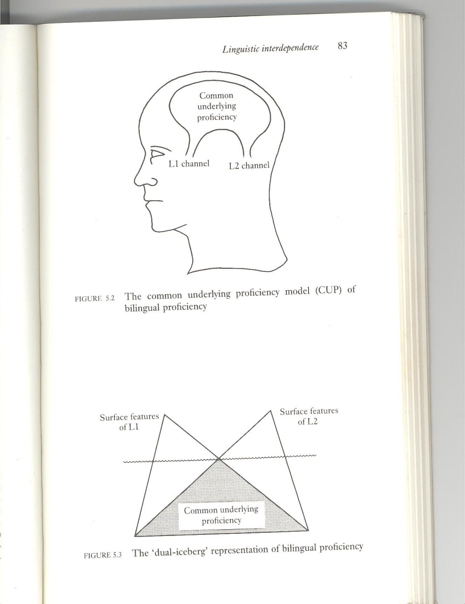

# Hizkuntzen trataera bateratua

`r if (knitr::is_html_output()) ' '`

**Galderak**, gaian erantzuna aurkitu behar diegu:

- Zer da hizkuntzen trataera bateratua?
- Zertarako da? Zer helburu du?
- Zer hizkuntzari eragiten die ikuspegi honek?
- Zergatik aipatzen da orain kontzeptu hori? Zerk eraginda indartu da orain?
- Zer oinarriren gainean eraikitzen da ikuspegi edo jardunbide hori?

Antolatzeko galdera sorta honek gogoetarako balio behar du:

- Zer hizkuntza-egoera aurkitzen dugu gure jendartean gaur egun? Zer testuinguru dugu?
- Zer nahi du jendarteak hizkuntzen alorrean?
- Zer nahi dugu eskolak egitea hizkuntzen alorrean? Zer hizkuntz helburu ezartzen zaizkio eskolari gaur egun?
- Nola egin dezakegu hori? Nola erdietsiko ditugu helburu horiek?
- Zer oinarri ditugu horretarako? Nondik atera ditzakegu informazioa eta jarduteko irizpideak?
	-hizkuntzalaritza 
	-soziolinguistika
	-psikolinguistika
	-hizkuntzen didaktika
- Zer onura ateratzea espero dugu?

## Eskolaren egoeraren analisia

Hizkuntza-helburuak, hiru/lau hizkuntzatan (eskola-aldi guztia kontuan hartuta)

Aniztasuna:  Hori izan da lehenengo zatia. Laster bigarrrena.

+ 3 (edo lau) hizkuntza: zein helburu ezarri bakoitzarentzat?
	* dialektoak (euskararen kasuan) nola tratatu?
	* immigrazio hizkuntzak nola tratatu?

Egoera berria, joera berriak: 

+ Hizkuntzen Trataera Bateratua 
+ Hizkuntza eta Edukiak Batera Ikastea

### Aniztasuna

3 (edo lau) hizkuntza: zein helburu ezarri bakoitzarentzat? (neurri batean desberdinak)

+ dialektoak (euskararen kasuan) nola tratatu?  
	Euskalkia lantzea, gehigarri bat? Luxu bat?
	
Inguru euskalkidunean: 

+ Euskalkia lantzea, belaunaldien arteko transmisioa indartzeko  (etxeko eta eskolako hizkuntza)
+ Euskalkia lantzea, euskara hobeki ikasteko (etxekoa, kalekoa, eskolakoa: elkarren osagarri)
+ Euskalkia lantzea, komunikazio maila "finagoak" lortzeko (erregistroak)

Immigrazio hizkuntzak nola tratatu?

+	Arreta jarri? Jaramonik ez? 
+	adibidez: zer da "harrera plana"?

### Jardunbide bat: Hizkuntzen trataera bateratua

Aniztasun  handiagoa, helburuak ere gehiago; nola jardun eskolan, emaitzak hobetzen saiatzeko?

> Hizkuntzen Trataera Bateratuaren helburua da programazio bakar bat egitea ikastetxe batean ikas-irakasten diren hizkuntzentzat, haientzat denentzat helburu eta metodologia berak izanik, ebaluazio irizpide konpartituak izanik eta ikas-edukiak, berriz, hizkuntza guztien artean banatuak, eta hala ikasleek errentagarritasuna atera diezaioten beren hizkuntza-ikaskuntzei eta ahalik eta gehiena gara dezaten beren komunikazio konpetentzia eleaniztuna
> --Teresa Ruiz (2010: 165), (JMren itzulpena)
> 

Beraz:

**Programazio bakarra** ikastetxean ikas-irakasten diren hizkuntza guztientzat (euskara-gaztelania-ingelesa-frantsesa)

**Helburu bera**: ez nahitaez gaitasun maila bera, baizik eta komunikazio konpetentzia garatzea, hizkuntza-trebetasunak eskuratzea

**Metodologia bera**: ez dadila hizkuntza bat ikasi gramatikako ariketen bidez eta bestea ikuspegi komunikatiboaren bitartez

**Ebaluatzeko** orduan, **norabide berean** jardunez (ez batean gramatikako jakintzak galdetu eta bestean mintzatzeko gaitasuna, adibidez)

**Edukiak** denen artean **banatuak**: transferentziaren kontzeptua baliatuta (kontzeptu batzuk hizkuntza batean ikasita bestean ez dira berriz ere ikasi behar) 

### Ariketatxua {-}

Egin zerrenda bat, zein diren elementu erkideok (transferigarriak)

## Oinarriak

Aniztasun  handiagoa, helburuak ere gehiago; nola jardun eskolan, emaitzak hobetzen saiatzeko? 

Jardunbide bat: **Hizkuntzen trataera bateratua**

Eta horri bidea emateko ezagutza eremu hauetan oinarritu behar da:

- Hizkuntzalaritza 
- Soziolinguistika
- Psikolinguistika
- Hizkuntzen didaktika

### Hizkuntzalaritza

Korronte desberdinak daude eta eskolarako zein litzatekeen eraginkorrena ebatsi behar da. 

**Ikuspegi pragmatikoa**: hizkuntza nola erabiltzen den. Adibideak:

> Itxiko duzu leiho hori?
> 

> egongo zara isilik?
> 

> Esadazu bidea Leioara joateko!
> 

> mesedez, Leioara joateko bidea...?
> 

> mesedez, esango didazu Leioara joateko bidea nondik den?
> 

> mesedez, esango  zenidake zer bide hartu beharko nukeen Leioara joateko?
> 

> mesedez, esan  zeniezadake zer bide hartu beharko nukeen Leioara joateko?
 
**Diskurtso- eta testu-hizkuntzalaritza**: eskolako lana antolatzeko ikuspegia (curriculuma)

+ Testu-motak
+ Erabilesparruak  
  Testu-motak X erabilesparrua = testu-generoak  
  
  Testuaren ezaugarriak (perpausetik "gorago" joateko modua):  
  + zuzentasuna, 
  + egokitasuna, 
  + koherentzia, 
  + Kohesioa

Testu-hizkuntzalaritzan abiatzeko oinarrizko sinesmenaz:

> Any native speaker of a language will in principle be able to make a distinction between a poem and a hand-book of mathematics, between an article in the newspaper and a questionnaire. This implies that he has the initial ability to differentiate the universe of texts and to recognize different types of texts. We shall claim [...] that this fundamental ability is part of linguistic competence. We shall argue at the same time that this competence must be a textual competence. 
> 
> -- Adam (1992)

> Edozein jatorrizko hiztun printzipioz on izanen da desberdintzeko zer den poema bat eta zer matematikako esku-liburu bat, zer artikulu bat egunkarian eta zer galdetegi bat. Horrek inplikatzen du hiztunak baduela oinarrizko abildadea bereizteko testuen unibertsoa eta ezagutzeko testu-mota desberdinak. Guk erranen dugu [...] funtsezko abildade hori hizkuntza-konpetentziaren zati dela. Orobat erranen dugu konpetentzia hori testu-konpetentzia bat bide dela. 
> 
> --JMren itzulpena
> 

### Soziolinguistika

**Gogoratu**  oinarrizko ezaugarriok:
+ **Hizkuntz ukipena**, gaztelania eta euskara ofizialak dira EAEn: ikas-helburu ber-berak bientzat.
+ Hasierako **egoera** desorekatua da, **diglosikoa**: 
Zeinek behar du laguntza gehiago edo handiagoa? 
+ **Elebitasuna funtzionala izateko**, gehigarria izan behar luke, baina zalantza eta eztabaidagune da nola lortu behar den elebitasun gehigarriko testuingurua.
+ **Globalizazioak** azaltzen du gure gaurko munduaren ezaugarri nagusia: 
	+ lingua franca bat(zu)en beharra dagoen aztertzen da. Ingelesa?
	+ Mundu mailako desberdintasunak, immigrazioa: hizkuntza gehiago jendartean, eta beraz, eskolan ere bai.

### Hizkuntz helburuak

Prozesua antolatzeko erreferentzia: eskola-aldi guztia

Euskara eta gaztelania  
  : hizkuntza ofizialak EAEn eta Nafarroako zati batean (orain aldabidean)  
  : helburua, komunikazio gaitasun maila bat (bi hizkuntzetan ber-bera)

Frantsesa  
  : Iparraldean hizkuntza nagusia izateaz gain, nazioarteko komunikaziorako hizkuntza ere bada.  
  : Helburua, komunikazio gaitasun maila bat (desberdina Hegoaldean eta Iparraldean)

Ingelesa  
  : nazioarteko komunikaziorako.  
  : helburua, komunikazio gaitasun maila bat (EAEn, hizkuntza ofizialetan baino apalagoa)
  
### Didaktika

Hizkuntzak nola landu behar diren: **hizkuntz(ar)en bidez gauzak egitea**, jendartean jardutea, konpetentziak garatzea hizkuntzaren ikuspegi instrumentala lantzea

Eskolan jardutea: (oinarrizko) konpetentziak garatzea eskolako edukiak ikastea –matematika, natur zientziak, gizarte zientziak, hizkuntzak, artea, ..-, jardueretan trebatzea, balioak jasotzea

Hizkuntzak **komunikazio-helburua**rekin erabiltzea eskolan. Komunikazioan oinarrituriko ikuspegia, ikasleen ekinaren bidez. Hizkuntzak erabiliz ikasten dira (ikaslearen aktibotasuna)

### Psikolinguistika

Elebidunaren/eleaniztunaren burmuinaz

+ Hizkuntzen trataera bateratuan kontuan hartzeko batzuk: 
	* Nola irudika ditzakegu hizkuntza-gaitasunak eleaniztunaren burmuinean?
	* Ikasle batek hizkuntza batean ikasita, eskolan hizkuntza bat erabilita, zabal ote dezake beste hizkuntza batean duen konpetentzia?
	* Hizkuntza batean gaitasuna garatzeko, nahitaez hizkuntza horretan ari behar da eskolan?  
	  *Adibidez*: gaztelaniazko gaitasun komunikatiboa hobetzeko nahitaez gaztelaniaz ari behar da eskolan?  
	  *Bestela esanda*: eskolan euskara lantzen dugunean ez dugu gaztelaniazko konpetentzia lantzen?  
	  *Eta alderantziz*: gaztelania lantzen dugunean ezin dugu aurrera egin euskarazko komunikazio-gaitasunean?  
	  Hizkuntza bateko komunikazio-gaitasunaren garapena "gelditu" egiten da beste hizkuntza bat erabiltzen/lantzen dugunean?  
	  *Edo bestela, galdera osotara aldatuta*: gaztelanian eta euskaran komunikazio-gaitasun ona eta berdina lortzeko, bi hizkuntzei denbora bera eskaini behar zaie eskolan?

Galderak (erantzuna aurkitu beharrak):

Psikolinguistika: elebidunaren burmuinaz

Nola ditugu hizkuntzak burmuinean elebidunok? Bada burmuinean harremanik "hizkuntzetan ditugun konpetentzien artean"? 

Hizkuntza batean ikas daiteke eta ikasirikoa bestean baliatu, erabili? Edo hizkuntza bakoitzean ikasi behar da dena, hasieratik amaiera arte? (eta beraz, esposizio kontua da guztien gainetik den faktore nagusia edo bakarra?)

Elebidun batek bi hizkuntzetako gaitasunak buruan elkarretatik guztiz banatuta edukitzen ditu? Hala eduki behar ditu?

Nola irudika dezakegu elebidunaren/eleaniztunaren burmuina? Nola haren hizkuntza-komunikaziorako gaitasunak bi hizkuntzetan?

Zer da hizkuntza-komunikaziorako konpetentziaren elementuak transferitzea? Zer da transferentzia?

Zer transferi dezake hiztun elebidunak dakien hizkuntza batetik bestera? 

Elebidunak/eleaniztunak ba al du gaitasunik balio dionik komunikatzeko berak dakizkien hizkuntza guztietan?  Edo gaitasunak "hizkuntzaka" antolatuak dira? Hau da: gaitasun hauek euskaraz, beste horiek gaztelaniaz, beste haiek ingelesez, elkarretatik bereiziak eta aparte?

Zer gaitasunek balio diote elebidunari/eleaniztunari, dakizkien hizkuntza guztietan?

Zeri esaten zaio Azpiko Gaitasun Erkidea (Common Underlying Proficiency/Competencia Subyacente Común)?

Zer kontzepturen "kontra" eraikitzen da azken hori? Zer uste "eraisten" du kontzeptu horrek?

Grosjean (1989): "Elebiduna ez da bi elebakar pertsona baten barruan"

#### SUP vs CUP: Separate Underlying Proficiency vs Commom Underlying Proficiency.

#### Common underlying proficiency and linguistic interdependence principle.

#### Eleanitzaren konpetentzien irudikapena

## Hizkuntzen Trataera Bateratua

Ikuspegi elebakarra: Hizkuntza bakoitza "bere aldetik" garatu behar da, elkarri ahalik eta eraginik txikiena egin diezaiotela.

Ikuspegi eleaniztuna (indartzen): hizkuntza-konpetentzia batzuek beste hizkuntzetan aurreratzeko ere balio dute, hau da, konpetentziaren elementu batzuk "bakarrak" dira, hiztunaren hizkuntza guztietarako balio dute.

Cummins: "azpiko konpetentzia bakarra" vs "azpiko konpetentzia bana" (CUP vs SUP)

Hizkuntza bakoitzaren berezitasunak landu behar dira, baina pertsona elebiduna ez da bi pertsona elebakarren batura

:**?**  
	: Hiztun elebidunak edo bigarren hizkuntza ikasten ari denak hizkuntzen arteko konparazioak egitea kaltegarria da?
	
### Azterka: Azpiko konpetentzia bakarra

Cummins: "Azpiko konpetentzia bakarra"

Zer gaitasunek balio diote elebidunari/eleaniztunari hizkuntza bat baino gehiagotan?

Galdera batzuk, gogoeta arrazoitua egiteko:

Udaletxe batean aurkezten den administrazio-eskari idatzi batek zer osagai "estruktural" izanen ditu gaztelaniaz?

Irakasle eskola honetako idazkaritzan aurkezten den eskari batek zer oinarrizko osagai izanen ditu gaztelaniaz?
Eskari mota berak zer egitura-osagai izango ditu euskaraz?

Gure aitite-amamek bazekiten eskari bat egiten udaletxean idatziz? Bazekiten zer osagai "estruktural" izaten dituzten  horrelako idatziek?

Denok dakigu zer den bertsolaritza. Zer da errima? Gaztelaniaz egin daiteke bertsorik? Gaztelaniaz errimarik bada? Errimaren kontzeptua zer hizkuntzatan ikasi behar du hiztunak eskolan? Zer irakaslek esplikatu behar dio ikasleari zer den errima?

Adibide-galdera batzuk,  pentsatzeko:
Pertsona batek gaitasun handia baldin badu hizkuntza batean udaletxean eskari ofizial bat idatziz egiteko, izan ote daiteke oso txarra eskari mota bera egiteko beste hizkuntza batean? Esan arrazoiak.
Pertsona bat eztabaidan edo debatean ona baldin bada hizkuntza batean, beste batean txar-txarra izan daiteke? Arrazoitu erantzuna.  
Pertsona horrek bi hizkuntzatan debateetarako gaitasun maila berdina izateko, zer ikasi behar du? Arrazonamenduak egiten, argudioak bilatzen, konparazioak egiten hizkuntza bakoitzean ikasi behar du?
Nik ideiarik ez badut egunkarian iritzi artikulu bat nola egin hizkuntza batean, beste batean ona izan naiteke lan horretan? Arrazoitu erantzuna.

#### Jo dezagun egoera hau: {-}

90 urteko amona xahar batek gaitasun handia du euskaraz ñabardura anitzekin eta jario handiarekin eta hizkuntzaren arauak ederki betean hitz egiteko, bere lanbideari eta inguruari buruz, bere bizitzako kontuei buruz. Hizkuntza ederki erabiltzen duela esan daiteke. Beraz, nola uler daiteke hain hiztun onak ez jakitea eskari bat idatziz aurkezten udaletxean? 

Edo beste alde batetik ikusita: Euskara kaxkarragoa, motelagoa, traketsagoa egiten duen abokatu batek, izan ote dezake gaitasun handiagoa eskari bat "modu egokian" aurkezteko? 

Abokatu horrek nola ikasi du eskariak idatziz egiteaz dakiena? Eskariak euskaraz egiteko ikastaro bat egin du? Egin gogoeta eta arrazoitu erantzuna.

### Gaitasunez

Hizkuntza eraginkortasunez erabiltzeko orduan, hainbat "gaitasun" baliatzen ditugu.
Gaitasun batzuk hizkuntza bakoitzean ikasi behar dira (hizkuntza horren ezaugarri "bereziki linguistikoak", agerikoak).

Beste gaitasun batzuk ere badira jokoan, eta ez dira hizkuntza bakoitzerako bereiz ikasten.

Gaitasun horiek "hizkuntzen artekoak" izan daitezke...

- - - 

Orduan, zein dira hizkuntza bakoitzean ikasi beharrekoak eta zein "hizkuntzen artekotzat" jo daitezkeenak? 

Garrantzitsua da horiek desberdintzea, eskolako lana horren arabera antolatzeko...

### Adibideren bat (Pascual-Granell, V. 2006)

#### Hizkuntz arteko konpetentzia erkideak  

1. **Kontzeptu-jakintza**. Hitzek esan nahi dutena: "demokrazia", "ekonomia", legebiltzarra/parlamento, ... kontzeptua behin ikasirik aski da.  
	**Kontuz kontzeptuak desberdin banatzen direnean** hizkuntza bakoitzean:  
		+ neba+anaia=  hermano;  
		+ ahizpa+arreba=hermana.  
		+ Koloreak: lur gorria, gaileta gorrituak. 
	Batzuetan, birkontzeptualizazioa gerta daiteke.  
2. **Munduaren ezagutza**. Hemen sartzen ditu jakintza metalinguistikoak, gramatikako terminoak, testu-hizkuntzalaritzaz eta (hizkuntzari buruzko pentsamendua garatzekoak)
3. **Oharmen metalinguistikoa**: hizkuntza tratatzen denean ez komunikatzeko, irudikatzeko edo jarduera arautzeko, baizik eta objektu gisa behatzeko eta analizatzeko, munduko beste edozein elementu bezala. Bidea ematen du arrazionalki aztertzeko kode linguistiko bakoitzaren egiturak eta ezaugarriak (hitzak zenbatzea, esaldi bat zuzena den edo ez,  testu bat zatitan jartzea, hutsak detektatzea...)
4. **Kontestu-euskarririk gabeko hizkuntza-erabilera** (edo "idazteko hizkera"): erreferentzia egiten zaienean testuinguruan ez diren objektuei edo objektu abstraktuei, edo mintzaideek konpartitzen ez duten informazioa agertzen denean. Horrelakoetan hizkuntza-baliabideak arreta handiagoarekin bereizi edo aztertu behar dira (lexiko bereziagoa, ahoskera garbiagoa, sintaxi estandarragoa), testuinguruak ez baitu laguntzen. Eskolan bereziki baliatzen den hizkera.
5. **Testu-generoei buruzko jakintza**: itxura, egitura, funtzioa, baliabide erretorikoak eta hizkera berezitua (gutuna, berria, ipuina, iragarkia, web orria, jarraibide liburua, elaberria, saiakera, mitin politikoa, bertso saioa...). Inguru kultural batean normalean antzekoak izaten dira egitura horiek (desberdintasunak izan badaitezke ere).
6. **Trebetasun kognitiboak**: identifikatu/ezagutu, erlazionatu, sailkatu, loturak ezarri, konparatu, hurrenez hurren jarri, gogoratu, arazoak konpondu, ... edo analizatu, sintetizatu, ebaluatu...
7. **Irakur-estrategiak**: testuaren edukiaz hipotesiak egitea eta egiaztatzea; munduari buruzko jakintza baliatzea testuaren esanahia eraikitzeko; labur-biltzea eta antolatzea edukirik garrantzitsuena; testuaren edukiaz eta formaz ebaluazioak eta epaiak egitea, egilearen asmoak edo nork bere asmoak ebaluatu eta epaitzea...
8. **Idatz-estrategiak**:  kontuan hartzea mezuaren edukia baina baita komunikazio-asmoak, hartzailearekiko harremana, etc.  Trebetasun batzuk behar dira hartarako: testua testuinguratzea, planifikatzea, testuratzea, ebaluatzea, berrikusi eta zuzentzea...
9. **Trebetasun kognitibo-linguistikoak**: jakintza arloetako ezagutzak eskuratzeko, ekoizteko eta transmititzeko baliatzen direnak: argudiatzea, definitzea, demostratzea, deskribatzea, azaltzea, justifikatzea, laburtzea...
10. **Informazioa prozesatzeko estrategiak**: informazioa aurkitzea, organizatzea, elaboratzea eta komunikatzea; eta ikasteko eta intelektualki lan egiteko teknikak (azpimarratzea, laburpenak egitea, fitxak egitea, eskemak, koadro laburgarriak, notak hartzea, memorizazioa eta edukiak berrikustea...)
11. **Hizkuntza eta kultura bakoitzari buruzko irudikapenak**: haien egoeraz, haien balio funtzionalaz, haien prestigioaz ... (motibazioarekin lotua).

Ezaugarri erkidea dute trebetasun eta jakite guzti horiek, erkideak dira-eta. Ez dira hizkuntza bakoitzean independenteki garatu behar, garapen bakar eta bateratua dute-eta. 

Hor dugu hizkuntza-hezkuntza bateratuaren oinarri koherenterako oinarria, hizkuntza bakoitzean garatu beharreko gaitasun eta ezagutzei ez-ikusi egin gabe.

## Hizkuntzen berezitasunak 

Horiek bakarka landu eta ikasten dira

Hainbat jakintza, prozedura eta jarrera hizkuntza batean edo bestean  jaso daitezke, baina hizkuntzak desberdinak dira eta desberdintasun horiek banaka ikasi behar dira.
Milaka adibideren artean: 

|  | eus | esp |
|--|-----|-----|
|Azentua non?| 7 | 7|
| | 8 | 8 |
| | ...dugu.. | ...hemos... |
|Ahozkera | *hartza* | *Danacol funtziona*  |
|Lexikoa  | ama, amatxu | madre, mamá, mami |
| Izenordainak | *Ni* | *Yo* |
| Gramatika	| 1.pers | 1. pers|
| Soziolinguistika | Nori *hi*, nori *zu* | Nori *tú*, nori *usted* |
| e | ta | bar |

## Administrazioa

### Administrazioaren jarduna

Hizkuntzen trataera bateratuaz zer dio curriculum dekretuak? (2010ekoak)

> **Lehen Hezkuntzako ikasleak, hein batean, eleanitzak direnez, hizkuntza-irakasleak beharturik daude, planteatutako hezkuntza-helburuei eutsita, beren irakaskuntza-metodoak aztertzera eta egokitzera, eta, batik bat, hizkuntzak era integratuan lantzera.** Hizkuntzak era integratuan irakastea, **ebidentzia hauen ondorioa** da: batetik, ikasle elebidunak edo eleanitzak etengabe **eskura ditu hainbat hizkuntza** eta haien bidez ikasitakoa, eta hori guztia bere jakintzaren eta emozioen parte da.  
> **Bestalde**, hizkuntzak ikastea **transferigarria** da, eta hiztunen inguruan hizkuntza bat baino gehiago daude aldi berean. **Beraz, hizkuntza bakoitzaren ezaugarri propioak landu behar dira batetik, eta, bestetik, batera landu hizkuntza guztiek dituzten alderdi komunak; betiere, hizkuntza bakoitza ongi erabiltzen saiatuz**. 
> 
> Baina **hizkuntzak irakastearen ardura ez dagokie hizkuntzen irakasleei soilik**: eskola osoa dago inplikatua prozesu horretan. Beraz, **arlo guztietako irakasleek lagundu behar dute talde-lan horretan**, eta bide hori jorratuz bermatu ikasleak gai direla zentzuz ulertzeko eta taxuz adierazteko jakintzaren edozein arlo. Halaber, ahal dela elkarrizketaren bidez eraikiko da jakintza, eta garatuko dira ezagutza eta hizkuntza-trebetasun nagusiak. 
> 
> -- Hezkuntza, Unibertsitate eta Ikerketa Saila. 2010

Ikus, halaber: http://www.navarra.es/home_eu/Actualidad/BON/Boletines/2010/37/Anuncio-15/

Eta 2016ko dekretuak zer dio? **Aurkitu eta 2010ekoarekin konparatu**

### Administrazioaren jarrera

Berritzegune Nagusiaren orrian: Orientabide didaktikoak. Euskara eta Literatura (Bigarren Hezkuntza) 

> Bestalde, Oinarrizko Hezkuntzaren beste helburu nagusietako bat ikasle eleanitzak lortzea da. Horrek hizkuntza-irakasleak Hizkuntzen Trataera Bateratua planteatzera behartzen ditu. Izan ere, hizkuntzak modu bateratuan irakastea arrazoi hauen ondorio da: batetik, hiztun elebidunak edo eleanitzak dakizkien hizkuntzen bidez hornitzen ditu ezagutzak eta emozioak; bestetik, hizkuntza ikaskuntzak transferitu egiten dira, eta, hirugarrenik, hainbat hizkuntza egon ohi dira aldi berean hiztunek parte hartzen duten hizkuntzaren erabilera-eremuetan. Egiaztapen horien arabera, beraz, hizkuntza bakoitzak dituen ezaugarri bereziak landu behar dira, eta bateragarriak eta transferigarriak direnak hizkuntza guztien artean banatu.
> 
> Hizkuntzen curriculum bateratua planteatzeak hizkuntzak ikasteari eta irakasteari lotutako printzipio hauek onartzea dakar:
> 
> + Erabilera: hizkuntzak gizartean erabiliz ikasten dira, eta komunikazio-premia pragmatikoek bideratzen eta laguntzen dute kodea behar bezala ikasten.
> + Ikuspegi komunikatiboa: askotariko komunikazio-trukeetan, ikasleen parte-hartze eraginkorra ahalbidetuko duen komunikazio-gune pribilegiatua izan behar du ikasgelak.
> + Hizkuntzekiko eta hiztunekiko jarrera baikorra: hizkuntzek gizarte-harremanetan eta norbanakoaren emozioen garapenean duten garrantzia aintzat hartu behar da.
> + Inklusioa: ikasle guztiei hizkuntza-gaitasun eleanitza garatzeko aukera eman behar zaie, jatorrizko hizkuntza edozein dutela ere.
> 
> Hartara, behar-beharrezkoa da, alde batetik, ikasleentzat esanguratsuak diren eta helburu zehatza duten komunikazio-proiektuak proposatzea, ikaskuntza-prozesua gauzatzeko, eta, bestetik, horri lotutako ikuspegi metodologikoa –ikuspegi komunikatiboa-ezartzea eta indartzea. Ikuspegi horren arabera, testua da oinarrizko komunikazio-unitatea –testuak hainbat tipo eta generotan sailkatzen dira–, eta ikaskuntza helburu komunikatibo zehatz bat lortzera bideratutako sekuentzia didaktikoen bidez egituratzen da Sekuentzietan, jakite hutsa baino garrantzitsuagoa da egiten jakitea. Ikuspegi hori garatzen da orientabide didaktiko hauetan.
> 
> Hizkuntzen curriculuma: http://www.hezkuntza.ejgv.euskadi.net/r43-2459/eu/contenidos/informacion/dif10_curriculum_berria/eu_5495/adjuntos/curriculum_2010/basica_refundido_2010/1_04_lmh_e.pdf
> 
> 

Honen osagarri, ikus zer dioen 2016ko dekretuak eta konparatu 2010ekoarekin.

## Eskolan zer den Hizkuntzen Trataera Bateratu hori

Teresa Ruiz (2010: 165):

> Hizkuntzen Trataera Bateratuaren helburua da programazio bakar bat egitea ikastetxe batean ikas-irakasten diren hizkuntzentzat, haientzat denentzat helburu eta metodologia berak izanik, ebaluazio irizpide konpartituak izanik eta ikas-edukiak, berriz, hizkuntza guztien artean banatuak, eta hala ikasleek errentagarritasuna atera diezaioten beren hizkuntza-ikaskuntzei eta ahalik eta gehiena gara dezaten beren komunikazio konpetentzia eleaniztuna
> 
> -- Ruiz, Teresa (2010) (JMren itzulpena)
> 

Beraz:

**Programazio bakar bat** ikastetxean ikas-irakasten diren hizkuntza guztientzat (euskara-gaztelania-ingelesa-frantsesa)

**Helburu bera**: ez nahitaez gaitasun maila bera, baizik eta komunikazio konpetentzia garatzea, hizkuntza-trebetasunak eskuratzea

**Metodologia bera**: ez dadila hizkuntza bat ikasi gramatikako ariketen bidez eta bestea ikuspegi komunikatiboaren bitartez

**Ebaluatzeko** orduan, **norabide berean** jardunez (ez batean gramatikako jakintzak galdetu eta bestean mintzatzeko gaitasuna, adibidez) 

**Edukiak denen artean banatuak**: transferentziaren kontzeptua baliatuta (kontzeptu batzuk hizkuntza batean ikasita bestean ez dira berriz ere ikasi behar) 

  

### Irakasleen artean koordinazio mailak:

Lehen maila: esan beste irakasleari zer egingo dudan nik nire gelan:  

- edukiak zein izanen diren nire emanaldietan 
- terminologia bateratu
	
Bigarren maila: hizkuntza guztietako irakasleek programazioa elkarrekin egin eta adostu 

- helburuak, 
- edukiak, 
- metodoak, 
- prozedurak

Bai hizkuntzak ikas-irakasteko eta bai ebaluatzeko ere

### Orientabide edo norabide batzuk, kontuan izatekoak {-}

Hizkuntzak erabiliaz ikasten dira: ikuspegi komunikatiboa (hizkuntza, harekin gauzak egiteko)

Eskolan zer egiten da? 

Eskolako zereginak: matematika, harremanak, hizkuntzak, natur zientziak, gatazkak, lankidetza, jarrerak, balioak, jendarte zientziak, artea... (azken batean curriculum arloak eta konpetentziak)

Jakintzak eraiki behar dira arlo bakoitzean, eta hori hizkuntz(ar)en bidez egiten da neurri handi batean

Jakintzak  jasotzeko/eraikitzeko, zenbat  hizkuntza ditugu eskolan? Hizkuntza bakoitzaren bidez zer eraikitze-lanetan ariko gara? Hizkuntza bakoitzaren bidez zer ikasiko dugu?

## Zergatik hizkuntzen trataera bateratua?

Eskolan hizkuntza batzuk ditugu, eta hiztunentzat denetan gisa bertsuko ikas-helburuak: hizkuntza-komunikaziorako gaitasuna garatzea denetan, maila batean edo bestean

Beraz, komeni da metodologia bera hizkuntza guztietarako. 

Zein?  
Komunikazioan oinarritua, ez gramatika ikastean edo esan-jakintza jasotzean/"irenstean"

Eskolako denbora mugatua:  
ongi probestu beharra (irakasleen artean komunikaziorik ez bada, errepikatzeko edota kontradikzioetan erortzeko arriskua...)

Komunikazio konpetentzia bat bakarra dugu, eta  erabiltzen ditugun hizkuntza guztien bidez agertzen dugu; guztien artean gure hizkuntz errepertorioa garatzen dugu.

Gaitasunaren osagai batzuek hizkuntza "guztietarako" balio dute:    
transferitzen ahal dira.

Jakintza batzuk, prozedura batzuk, jarrera batzuk hizkuntza batetik bestera transferi daitezke; beraz, haien ikasketa bana dezakegu eskolako hizkuntza guztien artean  

Helburu handiagoak:    
nola antolatu lana denbora berean helburu handiagoak lortzeko?  

Beste hurbilketa metodologiko batzuk probatuta  

Oinarri teoriko egoki batzuen gainean (CUP, transferentzia...)

## Erreferentziak

Adam, Jean-Michel (1992)* Les textes: types et prototypes. Récit, description, argumentation, explication et dialogue*. Lausanne: Éditions Nathan

Hezkuntza, Unibertsitate eta Ikerketa Saila. (2010). *Haur hezkuntzarako, lehen eta bigarren hezkuntzarako eta batxilergorako dekretu currikularrak Euskal Autonomia Erkidegoan*. Vitoria-Gasteiz: EJAZN

Pascual Granell, Vicent  (2006). *El tractament de les llengües en un model  d’educació plurilingüe per al sistema educatiu valencià.* València: Generalitat Valenciana –Conselleria de Cultura, Educació i Esport.

Teresa Ruiz (2010):  "El tractament integrat de les llengües. Construir una programació conjunta". In Guasch, O. (koord.) 2010. *El  tractament integrat de les llengües*. Barcelona: Graó.
