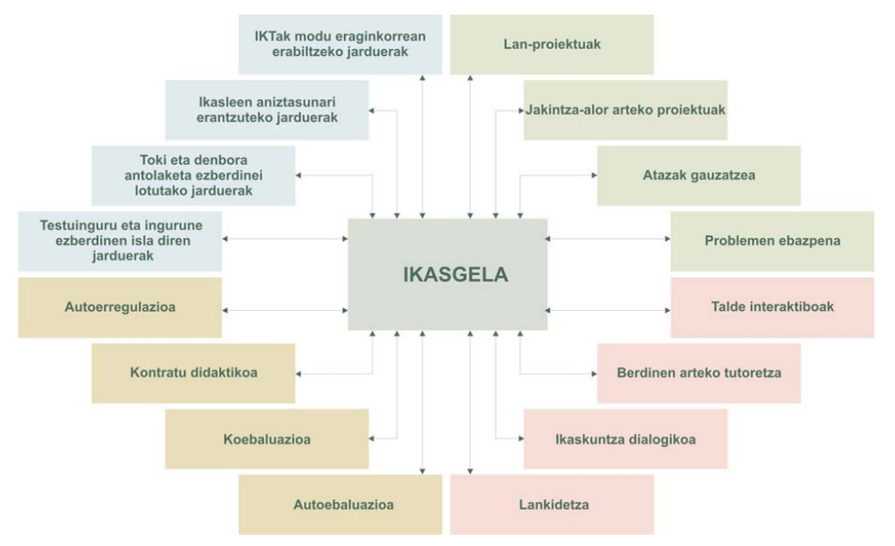

# Ikasleen ikas estrategiak

Hausnarbidea

Segidan baieztapen zerrenda bat duzu, horiek baloratu behar dituzu eta balorazioa zuritzeko prest egon behar duzu.

+ Umeek eta helduek modu berean ikasten dute. 
+ Umeak helduak baino askoz hobeak dira bigarren hizkuntzak ikasten
+ Arrakastarekin lotura handiagoa dute estrategiek eta ikasteko teknikek adinak baino.
+ Helduei iruditzen zaie beste hizkuntza bat ikasten badute, beren kultura galduko dutela.
+ Helduak erabiltzen duen hizkera umearena baino konplikatuagoa da, horregatik zailago egiten zaie beste hizkuntza bat ikastea.
+ Edozeinek ikas dezake bigarren hizkuntza bat.
+ Badira batzuk hizkuntzetarako dohaina dutenak.
+ Frantsesez hitz egin ahal izateko garrantzi handikoa da frantsesdunen kultura ezagutzea.
+ Hizkuntza arrotz bat dakienarentzat errazago da beste bat ikastea.
+ Hizkuntza bat baino gehiago hitz egiten dutenak azkarragoak dira.
+ Hizkuntza batzuk ikasterrazagoak dira beste batzuk baino.
+ Hizkuntza bat ikasten ari zarelarik garrantzitsuena hiztegia duzu.
+ Nire ustez, andaluziarrek ez dute ongi hitz egiten gaztelaniaz.

## Gaitasun estrategikoa(*k*?)

Gaitasun estrategikoa aspalditik lotzen zaio Gaitasun Komunikatiboari, horren azalpen garatua eta gaurkotu xamarra aurki dezakegu HEOCen, xehetasunetan hasi aurretiko sarreran.

> Ikaslearen gaitasun estrategikoaren garapena, autonomia areagotzeko bitartekotzat hartuta, erronka bilakatu da irakaslearen egunerokoan. Izan ere, etenik gabeko ikaskuntzan (*lifelong learning*), ikasestrategien eta komunikazio-estrategien garapena, bere horretan helburu ez bada ere, lagungarri da ikaslearen gainerako gaitasunak indartzeko, hobetzeko eta areagotzeko.
>
> Hiru dimentsiotatik azter daiteke estrategia ikasgelako jardunean: psikologikotik, eragiketa konplexuak burutzeko aurreikuspenak edo planak dira estrategiak; dimentsio didaktikotik, ikasleak modu kontzientean edo ez horren kontzientean aurreikusitako jarduera-modu gisa kontsideratzen dira estrategiak, jarreretan positiboki eragiten dutenak; eta dimentsio tekniko-kulturaletik, informazioa kudeatzeko teknikak dira estrategiak, ikasleak gizarteratze-prozesuan lortu eta
garatuak.
>
> Horrela, helburu jakin bat lortzearren, bat egiten duten ekintza zehatzak dira estrategiak, berariazkoak, komunikazioa hobetzeko eta emaitza optimoa lortzeko, subjektuaren hausnarketa abiaburu hartuz indarrean jartzea eskatzen dutenak. Estrategia erabiltzeko asmoa da, hain zuzen, ezaugarririk aipagarriena: ikasi nahia, beharra sumatzea eta aurrera egiteko erabakia hartzea.
>
> -- Gonzalez de Txabarri et al., 2015:55

### Ikasgelako praktikak oinarrizko gaitasunaren garapenari begira

Eusko Jaurlaritzako Hezkuntza Sailak 2013an Oinarrizko Gaitasunak zer liratekeen azaltzeko argitaratutako dokumentuak irudi bakarrean batzen ditu hainbat garapen lerro.

Horrek hitz egiten digu ikasgelaren antolaera didaktikoaz. Jakina da horren gainean hausnartu eta erabakiak hartu beharra daukaguna, baina txarto genbiltzake gure planteamendu didaktikoak erabakiko bagenitu ikaslearen jarduna aztertu barik, horretarako laburpentzat beste eskema bat eskaintzen da:

Aurreko jardun alor horiek ontzat hartuta geratzen da ikastunaren erabaki bideen azterketa egitea, erabaki horietan gaitasun estrategikoari begiratu ahal baitzaio.

Nola egiten dute ikastunek hori guztiori?

__Komunikazioa estrategiak__ erabilita:

1. Zerbait saihesteko edo murrizteko estrategiak
2. Zerbait lortzeko edo konpentsatzeko
estrategiak
3. Zerbait atzeratzeko edo denbora irabazteko
estrategiak
4. Automonitoretzeko estrategiak
5. Interakzio-estrategiak

__Ikas estrategiak__ erabilita:

*Zeharkakoak*

6. Estrategia metakognitiboak
7. Estrategia afektiboak
8. Estrategia sozialak

*Zuzenak*

9. Oroimen-estrategiak
10. Estrategia kognitiboak
11. Konpentsatzeko estrategiak

[Hemen](assets/11/ESTRATEGIAK.pdf) duzu azalpen xehetuagoa, Oxford (1990) eta Celce-Murcia (1995)[^Euskaratuta 1998an] lanetatik hartuak.

### Ikasle "ona" zer ote den

1. Ikasle onak **jarrera aktiboa** du ikaskuntzaren aurrean
   + Inplikatu egiten da bere ikaskuntzan
   + Ikasteko aukerak bilatu eta aprobetxatu egiten ditu
   + Lana planifikatu egiten du
   + Hizkuntza erabili egiten du hainbat eratan
2. Ikasle ona ohartzen da xede-hizkuntza **sistema bat** dela, berak aurkitu behar duena:
   + Zentzudun da bere H1-en edo dakien beste hizkuntza baten aurrean, eta konparazioak egiten ditu;
   + Xede-hizkuntza analizatzen du eta ondorioak ateratzen ditu;
   + Badaki aurrez ezagutzen duena eta elementu berriak elkarri lotzen.

3. Ikasle onak ezagutzen du **hizkuntza komunikatzeko tresna** dela:
   + Hizkuntza berezko egoeran erabiltzeko aukerak bilatzen ditu
   + Komunikazio-ekintzen esanahia eta xedea bilatzen saiatzen da
   + Enuntziatuen esanahia asmatzeko (edo inferitzeko) testuingurua, egoera eta keinuak baliatzen ditu.
   + Oreka-estrategiak erabiltzen ditu: parafrasea, keinuak, beste hizkuntza batetik hartutako hitzak.
4. Ikasle onak kontuan hartzen du H2 ikastearen **alderdi afektiboa**:
   + Tolerantzi eta irekitasun-jarrera du xede-hizkuntzaren aurrean
   + Eta baita bere solaskideen alderako enpatia ere.
   + Ziurtasunik eza, zalantza, frustrazio edo galduta ibiltzeko sentipena onartzen ditu.
   + Ez dio beldurrik barregarri geratzeari
5. Ikasle ona bere **performantziari adi-adi** egongo zaio:
   + Kezkatzen da hizkuntz kodeaz, sentibera da horren erabilera onarekiko
   + Informazioa jasotzen du berezko solaskideengandik, horiek imitatzen saiatzen da.
   + Bere burua zuzentzen du
   + Bere performantzia neurtu egiten du

Beraz... hi nolako hizkuntza-ikastuna haiz?

---

## Eskola praktika: *Ikasle onarentzat aholkuak eta ikas estrategiak*

Egizu ikasle onaren dekalogoa. Horretarako erabil ezazu orain arte ikusitako testuak eta bibliografia. Dekalogo horrek honako eskema honi erantzun behar dio:

+ Estrategiaren izena
+ Azalpena
+ Hobetzeko iradokizunak edo estrategiaren arrazoiak

**Adibidez**

>  **X. estrategia**: *Ez izan hutsegiteei beldurrik*
> • Normala da hutsegiteak egitea. Baliagarri izango dituzu okerrak zeure ikaskuntza hobetzeko erabiliz gero.
> • Iradokizunak:
> • Hitz egiteko ez egon zain den a zuzen esateko gauza izan arte edo irakurtzeko dena ulertu ahal izan arte.
> Arriskatu! Praktikatu!
> • Saiatu "errorea" eta "hutsegitea" bereizten
> • Saiatu zeure okerren jatorria aurkitzen
> • Ziurtatu irakaslearen zuzenketak zer esan nahi duen.
> • Saiatu zeure okerren garrantzi erlatiboa neurtzen .

## Gaiko erreferentziak, dokumentuak eta bibliografia

Celce-Murcia, M., Dornyei, Z., & Thurrell, S. (1995). Communicative Competence: A Pedagogically Motivated Model with Content Specifications. *Issues in Applied Linguistics*, 6(*2*). http://escholarship.org/uc/item/2928w4zj

Eusko Jaurlaritza, Berritzegune nagusia, & Hezkuntza Saila. (2008). *Oinarrizko Gaitasunak EAEko Hezkuntza Sisteman*. Hezkuntza, Unibertsitate eta Ikerketa Saila.

Eusko Jaurlaritza & Hezkuntza Hizkuntza Politika eta Kultura Saila. (2013). *Oinarrizko Gaitasunak. Lehen Hezkuntza*. http://nagusia.berritzeguneak.net/gaitasun/docs/competencias/komp_lh_eu.pdf

Gonzalez de Txabarri, J. J., Elosegi, L., Agirre, H., Larramendi Muxika, A., Maiz Aginaga, A., & Gonzalez deTxabarri, L. M. (2015). *Helduen Euskalduntzearen Oinarrizko Curriculuma (HEOC): A1, a2, B1, B2, C1, C2 (HABE, Arg.)*. HABE.

Oxford, R. L. (1990). *Language Learning Strategies: What Every Teacher Should Know* (1. arg.). Heinle ELT. http://gen.lib.rus.ec/book/index.php?md5=D35AD86CE0610D7EC0AD25197FB3BBE4

### Baliabide batzuk

- [H2 ikasteko gaitasuna_Perales Fitxategia](assets/11/21_H2 ikasteko gaitasuna_Perales_hizpide 2002.pdf)
- [A Ikas estrategiak eta gaitasun orokorrak CYR Fitxategia](../assets/11/A Ikas estrategiak eta gaitasun orokorrak CYR.pdf)
- [B Ikasteko estilo eta estrategiak NUNAN Fitxategia](assets/11/B Ikasteko estilo eta estrategiak NUNAN.pdf)
- [ESTRATEGIAK Fitxategia](assets/11/ESTRATEGIAK.pdf)
- [ESTRATEGIAK 2 Fitxategia](assets/11/HEOK 2015 Estrategiak.pdf)
- [Hizkuntzari buruzko usteak WILLIS Fitxategia](assets/11/Hizkuntzari buruzko usteak WILLIS.pdf)
- [Nola egin sintesi bat Fitxategia](assets/11/Nola egin sintesi bat.pdf)
