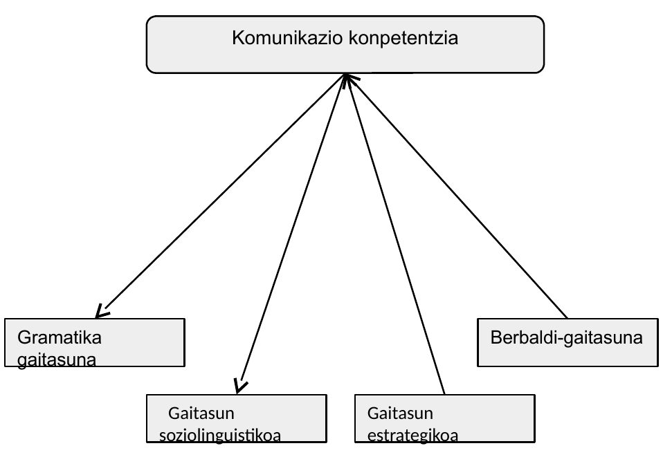
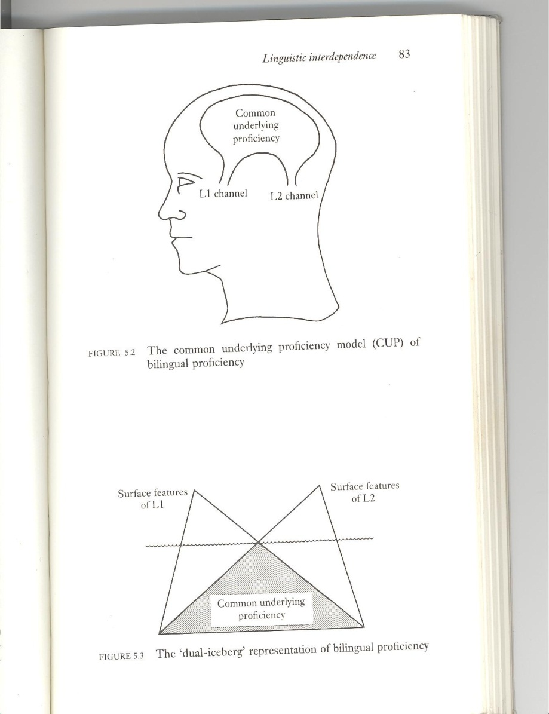

--- 
title: "Hizkuntzen Didaktikako Ikuspegi Berriak (4. urtea, minorra) V:`r Sys.Date()`"
author: 
  name: "Irakaslea: Juan Abasolo"
  affiliation: UPV/EHU
  # email: juan.abasolo@ehu.eus
date: "2020/2021"
site: bookdown::bookdown_site
output: bookdown::gitbook
documentclass: book
# bibliography: [book.bib, packages.bib]
biblio-style: apalike
link-citations: yes
description: "Hizkuntzaren Didaktika ikasgaiko apunteak dira hauek. Ikasgaian aurrera egin ahala egokitzen joango dira"
url: 'https://juanabasolo.github.io/HDIB/apunteak/'
cover-image: "assets/azala.png"  # relative to index
github-repo: JuanAbasolo/HDIB
favicon: "assets/azala.png"
---

# Aurretikoak {-}

Ikasgaiaren gida ofiziala [hemen](https://www.ehu.eus/eu/lehen-hezkuntzako-gradua-bizkaia/kreditu-eta-irakasgaiak?p_redirect=consultaAsignatura&p_cod_proceso=egr&p_anyo_acad=20190&p_ciclo=X&p_curso=4&p_cod_asignatura=27574) duzu.

## Gaiak eta denboralizazioa, proposamena {-}

1) Aurkezpena, taldeak eta abar [*](../diapoak/0-Aurkezpena-21.pdf)
2) Hezkuntzaren lau pilareetatik oinarrizko konpetentzietara [*](../diapoak/01-diapo.html)
3) Euskal Herriko Hezkuntza sisteman, elebitasunetik eleaniztasunera
4) Hizkuntzen kudeatzea eskolan
5) Hizkuntzen trataera bateratua
6) CLIL/HEBI/AICLE
7) **Aurkezpenak**
8) Metodologien bilakaera (M)
9) Sekuentzia didaktikoak
10) IKTak
11) Interferentziak eta erroreak
12) Ikasleen ikas estrategiak (M)
13) Hizkuntzen portfolio europarra
14) **Portfolioak**
15) **Azterketak**

## Kontaktua, tutoretzak eta abar {-}

Emaila  
     : **juan** [dot] **abasolo** [at] **ehu** [dot] **eus**
     
Telegram  
    : [at]JuanAbasolo

Bulegoa  
    : 3S40B
    
Telefonoa  
    : (+34) 94 601 **7567**
    
Tutoretzak  
    : http://labur.eus/JAbasolo-tutoretzak


<!--chapter:end:index.Rmd-->

# Hezkuntzaren lau zutabeak

[](../diapoak/01-Diapo.html)

Galdera batzuk egin eta galdera horien erantzunen bitartez saiatuko gara aurrera egiten gaian:

## Galdera batzuk

Hezkuntzaren lau pilareak esaten dugunean zertaz ari gara?  
Nondik dator ideia hori?  
Zein dira lau pilare horiek?  
Zeri egiten diote erreferentzia?  
Hezkuntzaren zer kontzepzio edo ideia dakarte?  
Zer jarreratatik aldentzen dira?  
Zer dute berrikuntza? 

**Oinarrizko konpetentziez**

Zer da konpetentzia?  
Definizioren bat eman dezakegu?  
Konparatu definizio batzuk  
Konpetentzia lortzea eta gai bateko edukiak ikastea gauza bera da?  
Zer dira oinarrizko konpetentziak?   
Zein dira oinarrizko konpetentziak Europan? Espainian? EAEn? Konpetentzia horiek nonahi berdinak dira? Nork erabakitzen ditu?  
Nork lortzekoak dira konpetentziak? Nork lortu behar dituzte konpetentziak? Norentzat dira? Zergatik?  
Zein dira konpetentzia garrantzitsuenak?  
Konpetentziek zer dakarte berri, lehengo kontzepzio batzuen aldean?  
Hezkuntzaren munduan ari garenok, non aurki dezakegu informazioa eskolan landu behar ditugun konpetentzia horiei buruz? Zer dokumentutan? Zer erakundek izanen du honen berri?  

#### Hizkuntza-komunikaziorako konpetentziaz:

Zer da? Zertarako da? Zer landu behar da konpetentzia hori lantzeko? Zer hizkuntzaren bidez gauzatzen da konpetentzia hori EAEn? Zer mailataraino garatu behar da konpetentzia hori hizkuntza bakoitzean? Konpetentzia hori osorik hartu behar da nahitaez edo baditu azpi-osagaiak? Non bila dezakegu informazioa kontu horretaz? 

Konpetentzia dena kolpetik lortzen da edo baditu mailak? Konpetentzia behin betikoa da? Zer mailatan betetzen da konpetentzia? Egin konparazio bat talde-kideen artean hizkuntza-konpetentziari buruz. Edo gurasoen konpetentziarekin konparatu.

```
Landa-lana edo gogoeta (adibide bat jartzen da hemen, baina beste zerbaitek ere balio dezake, jakina)
Egin azterketa bat nork bere buruari. Egin gogoeta zer mailatan garatua dugun geure hizkuntza-komunikaziorako konpetentzia. Konparatu gure konpetentzia hizkuntza desberdinetan. 
Aurreko hori egiteko, zeri begiratuko diogu gure/besteen konpetentzia ebaluatzeko? Nola ebaluatuko dugu konpetentzia hori? Dena osorik hartuta? Zatika?
```

### Galdera batzuk  gaurko munduaz eta hezkuntza-munduaren erantzunaz

Gaurko mundua eta gure gurasoena edota aiton-amonena: zer alde azpimarratuko genuke?  
Hezkuntzak zertan oinarrituta erantzun nahi dio gaurko munduari? Zeren arabera?  
Zer oinarri teorikoren gainean eraikitzen da erantzun hori?   
Zein dira planteamendu berri honen bilakaerako mugarri garrantzitsu batzuk? (Delors, DeSeCo eta Europako Kontseiluaren oinarrizko gaitasunak)

```
**Ariketa**
Zenbat jende ezagutzen dugu "zuzenean" eta zenbat bestela?
Zenbat lagun dugu kanpoan ikasten edo lanean? 
Zenbat hizkuntza erabiltzen dugu aste batean zehar? 
Gertatu zaigu hirugarren hizkuntza erabili behar izatea? Izan dugu kontaktu zuzenik edo birtualik 3. hizkuntzaren batekin? Zeinekin? Zer dela eta? Zertarako?
4.nik? 5.ik? ...
Ezagutzen dugu kanpotik etorririko jenderik? 
Noraino eramaten gaitu gaur WhatsApp, Instagram, Facebook... erabiltzeak?
Zer dira, ezagutzen ez duen batentzat azalduta?
```

## Gaurko mundua: globalizazioa

Mundua nolakoa dugun? 

**Konplexua**: mugikortasun fisikoa eta soziala; mailak ez –hain- gogorki finkatuak eta bereziak; denak nahasian, espazio berak konpartitzen; azken batean, munduaren dimentsio osoa “ikusten dugu”…

**Aldakorra, borborka**: migrazio mugimenduak, aurrerapen teknologikoak, IKT…

*Globalizatua* (denok denen berri, eraginak nabariago, herri globala, Internet…)

Orain, interakzioa handiagoa mundu mailan:  elkarrekin aztertuko dugu egoera?

Munduaren konplexutasun horretan, gidalerro batzuk: Delors Txostena UNESCOrentzat (1996) 

- Oinarrizko gaitasunak
- Europako Kontseiluak gomendatuak
- EAEn, Espainian, Nafarroan formulatuak
- Hizkuntza-komunikaziorako gaitasuna

> Globalization refers to the increasingly global relationships of culture, people and economic activity. Most often, it refers to economics: the global distribution of the production of goods and services, through reduction of barriers to international trade such as tariffs, export fees, and import quotas. (…)The term can also refer to the transnational circulation of ideas, languages, and popular culture. (Wikipedia)

Globalizazioaren alderdiak
Iturria: Appadurai, 1990; in Block, 2010)

| Dimentsioa            | Zer mugitzen da? | Adibideak                                                    |
| --------------------- | ---------------- | ------------------------------------------------------------ |
| Jende-dimentsioa      | Jendea           | Migrazioak, iheslari politikoak, deserriratuak, turismoa     |
| Teknologikoa          | Teknologia       | Jakintza teknikoa, osagai fisikoak                           |
| Finantzarioa          | Dirua            | Diru-espekulazioa, nazio-funtsen toki-aldatzeak              |
| Hedabideak/Mass media | Informazioa      | Egunkariak, aldizkariak, satelite-bidezko TBa, webguneak, posta elektronikoa… |
| Ideiena               | Ideiak           | Jende-eskubideak, ingurumenaren defentsa, terrorismoari beldurra... |


Zer da globalizazioa? Delors txostena (UNESCO, 1996): Hezkuntza: altxor ezkutua . XXI. mendeko hezkuntzaz 

XXI. mendea tentsio batzuen erdian garatzen da eta haien artean bilatu behar da irtenbidea. Hona zein diren tentsio nabarmen batzuk:

**Mundialaren eta lokalaren arteko tentsioa**: munduko biztanle bihurtzeko prozesua ezari-ezarian egitea bai, baina nork bere erroak eta zainak galdu gabe; hurbileneko erkidegoetatik zabalagoetara igaroz, haietan parte hartuz.  

**Unibertsalaren eta tokikoaren artekoa**: kultura globalizatzen ari da baina ez du dena hartzen. Pertsona bakoitza bakarra da eta bokazioa du bere etorkizuna bilatzeko eta bere barrengo ahalmen guztiak garatzeko. Baina beste aldetik bere tradizioetan eta bere kulturan duen aberastasuna ere zaindu behar da, bestela aberastasun hori behin betiko hondatzeko arriskua baita.  

**Tradizioaren eta modernitatearen artekoa**: egokitu bai, baina bere buruari uko egin gabe; nork bere autonomia eraiki bai baina besteen askatasunarekin eta garapenarekin harreman dialektikoan, aitzinamendu zientifikoaren menpeko bihurtu gabe. Informazioko teknologia berriek dakarten desafioari erantzun egokia aurkitu behar zaio.  

**Epe luzearen eta epe laburraren arteko tentsioa**: joankorra-iheskorra (efimeroa) da nagusi gaur egun, istantekotasuna da goi-goian, irudi eta informazio iheskor asko izateak berehalakoan zentratzera eramaten gaitu, erantzunak berehala nahi ditugu. Baina arazo askok estrategia patxadatsua, adostua eta negoziatua eskatzen dute; esate baterako, hezkuntza politikek.  

**Nahitaezko lehiaren eta aukera-berdintasunaren gaineko kezk**a. Lehiaren presioak ahantzarazten dio buruzagi askori jende bakoitzak aukerak behar dituela garatzeko. Lehia bizigarriak batera gertatu behar du lankidetza indargarriarekin eta lotzeko balio duen elkartasunarekin.  

**Jakintzaren hazkuntza izugarriaren eta jendeak hura asimilatzeko duen gaitasun mugatuaren arteko tentsioa**. Ikas-irakasgaiak hautatu beharko dira, oinarrizko hezkuntza egoki baten funtsezko osagaiak zainduta (irakasteko hobeki bizitzen jakintzaren bidez, esperimentazioaren  bidez eta kultura pertsonal bat osatzearen bidez).   

**Espiritualaren eta materialaren arteko tentsioa**, betikoa dena. Munduak ideialen eta baloreen beharra du.


Gizartean zalantzak sortzen dira, erantzunak behar dituztenak:

+ Nola jardun eraginkorki jendarte konplexu horretan?
+ Holako jendarte batean zer prestakuntza behar du herritar orok?

Testuinguru horretan: Delors txostena (1996) (Nazioarteko Batzordea XXI. menderako Hezkuntzaz) 

+ Hezkuntzari garrantzi handia (“Hezkuntza edo beharrezko utopia”)
+ Toki-erkidegotik mundu-jendartera
+ Jendarte-kohesioa eta partaidetza demokratikoa
+ Heziketa bizi guztian zehar
+ Nazioarteko lankidetza herrixka globalean
+ Pertsonaren hezibidean lau garabide edo ardatz

## Historia apur bat

Gaiari kolpetzeko historian kokatu beharra dago, horrela, aurrez ikusitakoari gaurko markoak nola erantzun nahi dion ulertzen errazagoa izan liteke

### Delors Txostena 

Hezkuntzaren lau zutabeak: http://148.202.105.241/biblioteca/bitstream/20050101/946/1/Los_cuatro_pilares_de_la_educacion.pdf 

ikasten ikastea  
	: lifelong learning; dimentsio anitzeko hezkuntza

egiten ikastea  
	: jakintza aplikatua, jendartean ekiteko

elkarrekin bizitzen ikastea		
	: lankidetzarako eta gatazkak konpontzeko gaitasunak…

izaten jakitea  
	: balioak, jarrerak


```
**ariketa**
Pentsatu hizkuntzak non duen zeregika ardatz horietan, baldin eta badu
```

**Galdera batzuk** gaurko munduaz eta hezkuntza-munduaren erantzunaz:

- Zer da curriculuma gaitasunen arabera antolatzea?
- Zer dira oinarrizko gaitasunak?
- Nola zehaztu dira gaitasun horiek gure inguruan?
- Zer da hizkuntza-komunikaziorako gaitasuna?

- Aipaturiko mundu konplexu horretan jarduteko, nola prestatu jendea? Nola antolatu hezkuntza?
- Mundu konplexu horretan jarduteko oinarrizko gaitasun batzuen jabe izan behar du pertsona orok
- Zenbat eta zein dira oinarrizko gaitasun horiek?

### Konpetentziaren definizio batzuk:

Jakintza, trebetasunak eta jarrerak modu praktikoan integratzeko gaitasuna, arazoak konpontzeko eta egoki erantzuteko hainbat testuinguru eta egoera askotarikoetan. Bestela esan, jakintza teorikoa eta praktikoa integratzea eta aplikatzea testuinguru akademikoz kanpoko egoeratan.

> Europako Hizkuntzen erreferentzia marko bateratuan:  Competences are the sum of knowledge, skills and characteristics that allow a person to perform actions.  (Konpetentziak dira norbanakoaren jakintzen, trebetasunen eta ezaugarrien batura, pertsonari ahalbide ematen diotenak jarduerak gauzatzeko. 
> --(JMren itzulpena) (in http://www.coe.int/t/dg4/linguistic/Source/Framework_EN.pdf)
> 


> Gaitasuna da testuingurura egokitutako ezagutzen, trebetasunen eta jarreren multzo bat 
> 
> -- Europako Parlamentuaren ebazpena (2006)


> Konpetentzia edukitzea da eraginkor aritzea testuinguru jakin batean.
> 
> Konpetentzia da gaitasuna edo trebetasuna zereginak burutzeko edo egoera desberdinei aurre egiteko, modu eraginkorrean, testuinguru jakin batean. Eta horretarako jarrerak, trebetasunak eta jakintzak mugitu behar dira, aldi berean eta elkarrekin erlazionaturik. 
>
> -- Zabalak eta Arnauk (2007)

Konpetentziak “diseinatzeko”, hautatzeko, saio batzuk izan ziren. Horietako bat, DeSeCo izenez ezagutzen dena:

### DeSeCo (Definition and Selection of  Key Competencies):

> What Competencies Do We Need for a Successful Life and a Well-Functioning Society?
> Why are competencies so important today? Globalizazioak eta modernizazioak gero eta mundu desberdinagoa eta konektatuagoa sortzen dute; horrek, adibidez, behartzen gaitu informazio asko kudeatzera, eta horretarako teknologia berrietan prestakuntzaren bat eskatzen du; ekonomiaren hazkundea hura jasateko moduarekin konbinatu behar da. Pertsonak, jendarte konplexu horretan, trebetasun zehatzak baino zerbait gehiago behar du ongi jarduteko. Kohesio soziala eta jasateko moduko garapena larriki lotuak dira jendarte guztiko jende guztiaren konpetentziekin; konpetentziak ulertu behar dira jakintzaren, trebetasunen eta jarrera eta balioen batura gisa.
> -- OECD Education Ministers

Konpetentzien hiru dimentsio edo “kategoria handi”: 

+ Baliabideak interaktiboki erabiltzeko gaitasuna (ad. hizkuntzak, teknologiak)
+ Talde heterogeneoetan hartu-emanean jardutea
+ Nor bere gain ibiltzeko gaitasuna (autonomo jardutea)

DeSeCo txostenak baldintza batzuk ezarri zituen oinarrizko gaitasun/konpetentzia horien definizioan:

a) pertsonarentzat eta jendartearentzat baliozkoak diren emaitzak erdiesten lagundu behar dute.
b) lagundu behar diote pertsonari erantzuten aurrean aurki ditzakeen hainbat testuingurutako eskakizunei.
c) jende ororentzat balio behar dute, ez bakarrik espezialistentzat.

### Europako kontseiluaren proposamena

Europako Kontseiluaren oinarrizko zortzi konpetentziak (key competences): marko honek zortzi konpetentzia definitzen ditu eta deskribatzen du zein diren oinarrizko jakintzak, trebetasunak eta jarrerak haietako bakoitzari lotuak. Oinarrizko konpetentziak hauek dira:

1. komunikazioa ama-hizkuntzan (*communication in the mother tongue*)
1. Komunikazioa atzerriko hizkuntzetan (*communication in foreign languages*)
1. Konpetentzia matematikoa eta oinarrizko konpetentziak zientzian eta teknologian (*mathematical competence and basic competences in science and technology*) 
1. Konpetentzia digitala (*digital competence*)
1. Ikasten ikastea (*learning to learn*) 
1. Jendarteko eta herritar  konpetentziak (*social and civic competences*)
1. Ekinzaletasuna eta ekimena (*sense of initiative and entrepreneurship*)
1. Kultur oharmena eta adierazpena (*cultural awareness and expression*)

Oinarrizko konpetentzia hauek elkarren menpekoak dira eta enfasia egin behar da kasu bakoitzean pentsamendu kritikoan, sormenean, arazo konpontzean, arrisku balioestean, erabakimenean, eta sentimenduen kudeatze eraiki-zalean.


### Oinarrizko konpetentziak handik hona (ariketa)

| Oinarrizko gaitasunen egoera                                 |                                                              |          |      |
| ------------------------------------------------------------ | ------------------------------------------------------------ | -------- | ---- |
| Europako Kontseilua                                          | Espainia                                                     | Nafarroa | EAE  |
| communication in the mother tongue                           | 1. Competencia en comunicación lingüística                   |          |      |
| communication in foreign languages                           | 2. Competencia matemática                                    |          |      |
| mathematical competence and basic competences in science and technology | 3. Competencia en el conocimiento y la interacción con el mundo físico |          |      |
| digital competence                                           | 4. Tratamiento de la información y competencia digital       |          |      |
| learning to learn                                            | 5. Competencia social y ciudadana                            |          |      |
| social and civic competences                                 | 6. Competencia cultural y artística                          |          |      |
| sense of initiative and entrepreneurship                     | 7. Competencia para aprender a aprender;                     |          |      |
| cultural awareness and expression                            | 8. Autonomía e iniciativa personal.                          |          |      |
| http://europa.eu/legislation_summaries/education_training_youth/lifelong_learning/c11090_en.htm | http://www.boe.es/boe/dias/2006/12/08/pdfs/A43053-43102.pdf  |          |      |

Oinarrizko gaitasunetatik bat hizkuntzen bidez gauzatzen da, bai Europako kontseiluan eta bai hemen ere.  
Hemen, izena: Hizkuntza-komunikaziorako gaitasuna/konpetentzia
Oso ideia zabala. Zehaztapena behar du, hura ulertzera hurbiltzeko, eta haren ikas-irakaskuntza antolatzeko
Zein azpigaitasun ditu konpetentzia horrek? Iritzi desberdinak


## Communicative competence... eta familia




### Hizkuntzen Europako Erreferentzi Marko Bateratua

https://www.habe.euskadi.eus/s23-4728/eu/contenidos/informacion/oinarrizko_kontzeptuak/eu_9716/adjuntos/erreferentzi_markoa.pdf

### Zalantzak:

Zer inporta zaigu zer osagai dituen hizkuntza-komunikaziorako gaitasunak?

Eta osagai horietaz gogoeta egiteak zertarako balio digu?

Gure eskolako lanean badu horrek zerikusirik?


Non aurki dezakegu informazioa hizkuntza-komunikaziorako gaitasunaren izaeran sakontzeko?

Zer erakundek izan dezake horren berri?   

Administrazioak, Gobernuen zerbitzu pedagogikoek …

Zer dokumentutan aurki genezake hori?  

Curriculum dekretuetan, Hezkuntza Sail(ar)en web orrietan…


### Zehaztapenak: 

Osagaiak osagai, nola zehaztuko genuke zer den hizkuntza-komunikaziorako gaitasuna?
Hona Oinarrizko Curriculum Diseinutik harturiko azalpena (2010eko curriculuma)

>  4.– Hizkuntza-komunikaziorako gaitasuna.
>
> Gaitasun honen funtsa hizkuntza erabiltzea da, ahozkoa zein idatzizkoa, bai errealitatea adierazi, interpretatu eta hura ulertzeko egindakoa, bai jakintza eraikitzeko eta komunikatzeko egindakoa, bai eta pentsamoldea, emozioak eta jarrerak antolatu eta norberak erregulatzeko egindakoa ere. 
>
> Gaitasun honi dagozkion jakintzek, trebetasunek eta jarrerek bide ematen dute pentsamenduak, emozioak, bizipenak eta iritziak adierazteko, elkarrizketan aritzeko eta iritzi kritikoak eta etikoak osatzeko, ideiak sortzeko, jakintza egituratzeko, diskurtsoari eta norberaren ekintzei eta egitekoei koherentzia eta kohesioa emateko, erabakiak hartzeko eta ahozko nahiz idatzizko entzunaldiez, irakurraldiez nahiz mintzaldiez gozatzeko. Horrek guztiak, gainera, autoestimua eta norberarenganako konfiantza handitzen laguntzen du.
>
> Komunikatzeko eta elkarrizketan aritzeko, harreman eta lotura eraikitzaileak sortu behar dira pertsonekin eta ingurunearekin; orobat, kultura berrietara gerturatzea eskatzen du jarduera horrek, eta, kultura horiek ezagutu ahala, handitu egiten da kultura horiekiko ardura eta errespetua. Nabarmena da, horrenbestez, bizikidetzarako eta gatazkak konpontzeko ahalmenarekin erabat loturik dagoela hizkuntza-komunikaziorako gaitasuna.
>
>  Entzuteko, azalpenak emateko eta elkarrizketan aritzeko gai izanda, hitzezko harreman nagusien jabe egiten gara, era bateko eta besteko komunikazio-egoeretan sortutako ahozko mezuak adierazteko eta ulertzeko gaitasuna eskuratzen dugu, eta komunikazioa testuinguru bakoitzera egokitzeko ahalmena geureganatzen dugu. Hala, komunikazio-egoera bakoitzerako egokiak diren ahozko testuak sortzeko, behar bezala eta eraginkortasunez erabili behar dira hizkuntzakoak diren eta ez diren kodeak eta trebetasunak, eta komunikaziorako harremanek egoera bakoitzean bete beharreko arauak.
>
> Irakurriz eta idatziz, indartu egiten dira informazioa bilatzeko, biltzeko eta prozesatzeko trebetasunak; hala, jarduera horiek lagundu egiten dute askotariko asmo komunikatibo edo sorkuntzakoak dituzten testuak behar bezala ulertzen, sortzen eta erabiltzen. Irakurketak erraztu egiten du idatzizko hizkuntza erabiltzeko kodea interpretatzeko eta ulertzeko prozesua, eta, gainera, plazer-, jakituria-eta fantasia-iturri da, eta beste ingurune, hizkuntza eta kultura batzuk ezagutzeko aukera ematen du. Horrek denak, komunikaziorako gaitasuna mantentzen eta hobetzen laguntzen du. 
>
> Hizkuntza-komunikazioko ekintzetako (elkarrizketa, irakurketa, idazketa, etab.) xedeak eta helburuak hautatzeko eta aplikatzeko trebetasuna zuzenean dago lotuta gaitasun honen alderdi nagusiekin; esaterako, norberaren errepresentazio mentalak egitearekin, errealitatea interpretatu eta ulertzearekin eta norberaren jakintzak eta ekintzak koherentziaz antolatu eta erregulatzearekin
>
> Mezuak ulertzea eta komunikatzen jakitea jakintza praktikoak dira, baina hizkuntzari eta haren erabilera-arauei buruzko ezagutza erreflexiboa eduki behar dute oinarrian, eta horrek berariaz eskatzen du hizkuntza behaketarako eta azterketarako objektutzat hartzen jakitea. Era askotariko gizarte-eta kultura-testuinguruetako komunikazio-egoerei egokiak zaizkien diskurtsoak adierazteko eta interpretatzeko, beharrezkoa da hizkuntza-sistemaren funtzionamendu-arauak eta hizkuntza-interakzio egokiak izateko estrategiak ezagutzea eta behar bezala aplikatzea. 
>
> Gaitasun hori eskuratzeko, hauek ezagutu behar dira: hizkuntzarekin lotutako gizarte-ohiturak, hizkuntzaren kultura-balio eta -alderdiak, eta hizkuntzak testuinguruaren eta komunikazio-asmoaren arabera har ditzakeen aldaerak. Ahalmen hauek ere izan behar dira: beste pertsona batzuen egoeran jartzeko ahalmen enpatikoa; norberarenak ez bezalako iritziak sentikortasunez eta ikuspegi kritikoz irakurtzeko, entzuteko, aztertzeko eta aintzat hartzeko ahalmena; norberaren ideiak eta emozioak funtsean eta formaz egoki adierazteko ahalmena, eta kritika eraikitzaileak onartzeko eta egiteko ahalmena.
>
> Atzerriko hizkuntzen komunikazio-gaitasunari dagozkion jakintza eta formalizazioa –batik bat, idatzizkoa– bestelako maila batean kokatzen dira, eta hizkuntza horietakoren batean komunikatzeko ahalmena izatea eskatzen dute. Hizkuntza horiek jakinda, aberastu egiten dira gizarte-harremanak eta norberak berezkoak ez dituen testuinguruetan mugitzeko ahalmena eskuratzen da. Atzerriko ikasleen atzerri-hizkuntzen kasuan ere, hizkuntza horiei eutsita, bultzatu eta aberastu egiten da hizkuntza anitzeko inguruneen dibertsitatea. Horrekin batera, jokabide horiek eskura jartzen dituzte informazio-, komunikazio-eta ikasketa-iturri ugari eta askotarikoak. 
>
> Laburbilduz, derrigorrezko eskolaldiaren amaieran hizkuntzarako gaitasuna behar bezala eskuratua izateko, ahozko eta idatzizko hizkuntza menderatu behar da era bateko eta besteko testuinguruetan, eta atzerriko, gutxienez, hizkuntza baten erabilera funtzionala izan.

### Hizkuntza-komunikaziorako gaitasunaren beste definizio bat

 

>  Hizkuntza-komunikaziorako gaitasuna hizkuntza erabiltzeko trebetasuna da, hau da, kontzeptuak, sentimenduak, gertakariak eta iritziak ahozko eta idatzizko diskurtsoen bidez adierazi eta interpretatzekoa eta gizarte- zein kultura-ingurune guztietan linguistikoki elkarreragitekoa.
>
>  -- Eusko Jaurlaritza: *Hizkuntza-komunikaziorako Gaitasuna. Bigarren Hezkuntza* 

Definizioak definizio, badira definitutakoa lanketa eremura eramateko orduan adostutako kontzeptu batzuk:

`Dimentsioa -> Azpigaitasunak -> Ebaluazio adierazleak`

Horrela, komunikazio gaitasunean batzuk aztertzen dira segidan


## Komunikazio konpetentzia gaurko ikuskeran

Komunikazio Gaitasunean 5 dimentsio bereizten dira: 

- ahozkoaren ulermena

- idatziaren ulermena
- mintzamena
- idazmena
- ahozko elkarrekintza

Dimentsio bakoitza neurtzeko, ikasketa-emaitza batzuk formulatzen dira (ikus hurrengo diapositibetan)

Ikasketa-emaitza bakoitzean, hiru betetze-maila bereizten dira (ebaluazio diagnostikoan):

- Hasierako maila (A)
- Erdi maila (B)
- Maila aurreratua (C)

### Hizkuntza-komunikaziorako gaitasunaren dimentsioen osagaiak/azpigaitasunak

> Hizkuntza-komunikaziorako konpetentzia bloke handi batzuetan egituratu da, DIMENTSIO deituak. Dimentsio horietako bakoitza AZPIKONPETENTZIA batzuetan zertzen da, eta azpikonpetentzia bakoitzerako ikasleak jakin eta egiten jakin behar duena azaltzen duten EBALUAZIO-ADIERAZLE batzuk xedatu dira.
>
> -- Eusko Jaurlaritza-Hezkuntza Saila-ISEI/IVEI: *Ebaluazio diagnostikoa. Hizkuntza-komunikaziorako konpetentzia. Marko teorikoa*. Vitoria-Gasteiz: EJAZN

#### Dimentsioak

Hizkuntza-komunikaziorako konpetentzia DIMENTSIO hauetan egituratuta dago:. 

+ Ahozkoaren ulermena edo entzumena
+ Idatziaren ulermena edo irakurmena
+ Mintzamena
+ Idazmena
+ Ahozko elkarrekintza

Dimentsio horien azpigaitasunak hemen ikus ditakegu

- 
  DIMENTSIOA: AHOZKOAREN ULERMENA
  - Ahozko testuen zentzu orokorra identifikatzea
  - Ahozko testuen helburua antzematea
  - Ahozko testuetan, proposatutako helburuei begira garrantzia duten informazioak hautatzea
  - Ahozko testuen edukia kritikoki interpretatzea
  - Ahozko testu-mota desberdinak hobeto ulertzeko estrategiak erabiltzea
- DIMENTSIOA: IDATZIAREN ULERMENA
  - Idatzizko testuen zentzu orokorra identifikatzea
  - Idatzizko testuen helburua antzematea
  - Idatzizko testuetan, proposatutako helburuei begira garrantzia duten informazioak hautatzea
  - Idatzizko testuen edukia kritikoki interpretatzea
  - Idatzizko testu-mota desberdinak hobeto ulertzeko estrategiak erabiltzea
- DIMENTSIOA: MINTZAMENA
  - Komunikazio-egoeraren ezaugarriak aintzat hartzea
  - Ekoizpen-prozesua planifikatzea
  - Adierazi beharrekoa egoki eta zuzen adieraztea
  - Kontroleko eta egokitzapeneko estrategiak erabiltzea
- DIMENTSIOA: IDAZMENA
  - Komunikazio-egoeraren ezaugarriak kontuan izatea
  - Ekoizpen-prozesua planifikatzea
  - Adierazi beharrekoa egoki eta zuzen adieraztea
  - Kontroleko eta egokitzapeneko estrategiak erabiltzea
- DIMENTSIOA: AHOZKO ELKARREKINTZA^[beherago garatuago ikus daiteke]
  - Komunikazio-trukeetan modu aktibo eta egokian parte hartzea
  - Arau soziokomunikatiboak errespetatzea
  - Komunikazioari eusteko eta beraren eraginkortasuna areagotzeko estrategiak erabiltzea

#### Agerbideak:

Adierazleak dira dimentsio horien garapenak ustez erakutsi behar duen modua. 

- AHOZKOAREN ULERMENA 

- IDATZIAREN ULERMENA 
- MINTZAMENA: 
  - Ikasketaren emaitzak:
    - Komunikazio-egoeraren ezaugarriak aintzat hartzea 
    - Ekoizpen-prozesua planifikatzea
    - Adierazi beharrekoa egoki eta zuzen adieraztea 
    - Kontroleko eta egokitzapeneko estrategiak erabiltzea 
- IDAZMENA 
- **AHOZKO ELKARREKINTZA**: 
  - **Ikasketaren emaitzak**:
    - **Komunikazio-trukeetan modu aktibo eta egokian parte hartzea** 
      - Komunikazio-egoeraren ezaugarriak kontuan izaten ditu. 
      - Naturaltasunez esku hartzen du eta aktiboki entzuten du. 
      - Informazioa eta azalpenak modu ordenatuan ematen ditu. 
      - Ikuspegi pertsonal bat azaltzen du. 
      - Bere esku-hartzeari buruzko galderei modu egokian erantzuten die. 
      - Besteen esku-hartzeen inguruan iruzkin eta galdera egokiak egiten ditu. 
      - Egoerari begira erregistro egokia erabiltzen du. 
      - Elkarrekintzan zehar hizkuntza-aldaera egokitzen du. 
    - **Arau soziokomunikatiboak errespetatzea** 
      - Hizkuntza-moldeak errespetatzen ditu. 
      - Besteen esku-hartzeak errespetatzen ditu. 
      - Diskriminaziozko esaerak erabiltzea saihesten du. 
      - Hitz egiteko txandak errespetatzen ditu. 
      - Denboraren erabilera kontrolatzen du. 
      - Adei-legea errespetatzen du
    - Komunikazioari eusteko eta haren eraginkortasuna areagotzeko estrategiak erabiltzea

##### Adierazleak eta lortze-mailak:

>  (19) Ikaskuntzarako eta gizarte-harremanetarako (hau da, ikasgelan, ikastetxean eta ingurunean eguneroko bizitzan ohikoak diren) komunikazio-trukeetan modu aktibo eta egokian parte hartzea.

Adierazleak: 

- Naturaltasunez esku hartzen du eta aktiboki entzuten du. 
- Komunikazio-egoeraren ezaugarriak kontuan izaten ditu. 
- Informazioa eta azalpenak modu ordenatu eta egokian ematen ditu.

2. Arau soziokomunikatiboak errespetatzea.
3. Komunikazioari eusteko eta haren eraginkortasuna areagotzeko estrategiak erabiltzea. 


| Hasierako maila                                              | Erdi maila                                                   | Maila aurreratua                                             |
| ------------------------------------------------------------ | ------------------------------------------------------------ | ------------------------------------------------------------ |
| + Komunikazio-trukean arreta zailtasunez mantentzen du.<br> + Bere komunikazio-trukeetan inhibizioa agertzen du.<br> + Lagunduta, komunikazio-egoeraren ezaugarriak kontuan izaten ditu. | + Komunikazio-trukean arreta mantentzen du.  <br> + Naturaltasunez, komunikazio-trukeak hasten eta mantentzen ditu.  <br> + Komunikazio-egoeraren ezaugarriak kontuan izaten ditu.  <br> + Solaskidearen aurrean erantzuna modu nahiko eraginkorrean egokitzen du.<br> + Hizkuntza-aldaera modu nahiko eraginkorrean egokitzen du elkarrekintzara. | + Komunikazio-trukean arreta mantentzen eta esku hartzen du.<br> +  Naturaltasunez eta modu eraginkorrean, komunikazio-trukeak hasten eta mantentzen ditu.<br> +  Komunikazio-egoeraren ezaugarrietara modu eraginkorrean egokitzen da.<br> +  Erregistro egokia erabiltzen du.<br> +  Solaskidearen aurrean erantzuna egokitzen du.<br> +  Hizkuntza-aldaera elkarrekintzara egokitzen du. |

> (20).- Ikasgelan, ikastetxean eta ingurunean eguneroko bizitzan ohikoak diren komunikazio-trukeetan arau soziokomunikatiboak errespetatzea. 

Adierazleak: 

- Hizkuntza-moldeak errespetatzen ditu. 
- Besteen esku-hartzeak errespetatzen ditu. 
- Hitz egiteko txandak errespetatzen ditu. 
- Adei-legea kontuan izaten du. 
- Diskriminaziozko esaerak saihesten ditu.

| Hasierako maila                                              | Erdi maila                                                   | Maila aurreratua                                             |
| ------------------------------------------------------------ | ------------------------------------------------------------ | ------------------------------------------------------------ |
| + Komunikazio-trukean errespetuzko jarrera zailtasunez mantentzen du.<br> +  Komunikazio-trukean ahotsaren tonua eta bolumena zailtasunez kontrolatzen ditu. <br> + Jarrera eta keinuak zailtasunez kontrolatzen ditu.<br> +  Lagunduta, hitz egiteko txandak errespetatzen ditu. | + Komunikazio-trukean errespetuzko jarrera mantentzen du.<br> +  Komunikazio-trukean ahotsaren tonua eta bolumena noizean behin kontrolatzen ditu. <br> +  Jarrera eta keinuak noizean behin kontrolatzen ditu. <br> + Hitz egiteko txandak ia beti errespetatzen ditu. <br> + Noizean behin komunikazio-trukea hasteko eta bukatzeko hizkuntza-formula egokiak erabiltzen ditu.<br> +  Diskriminaziozko esaera batzuk antzematen eta zuzentzen ditu. | + Komunikazio-trukean lankidetza eta errespetuzko jarrera ageri du.<br> +  Komunikazio-trukean ahotsaren tonua eta bolumena kontrolatzen ditu.<br> +  Hitz egiteko txandak errespetatzen ditu.<br> +  Adei-legea errespetatzen du.  Jarrera eta keinuak kontrolatzen ditu.<br> +  Komunikazio-trukea hasteko eta bukatzeko hizkuntza-formula egokiak erabiltzen ditu. <br> + Diskriminaziozko esaerak erabiltzea saihesten du. |

>  (21) Ikasgelan, ikastetxean eta ingurunean eguneroko bizitzan ohikoak diren komunikazio-trukeetan komunikazioari eusteko estrategiak erabiltzea 

**Adierazleak**: 

+ Komunikazioari eusteko konpentsazio-estrategiak erabiltzen ditu.

| Hasierako maila                                              | Erdi maila                                                   | Maila aurreratua                                             |
| ------------------------------------------------------------ | ------------------------------------------------------------ | ------------------------------------------------------------ |
| +Ulermen-arazoak gainditzeko, bere komunikazio-trukeetan galdera soilen bat egiten du.<br> +  Elkarrekintzan zailtasunak gainditzeko, ahozkoak ez diren baliabideak erabiltzen ditu.<br> +  Komunikazio-trukean, bere esku-hartzeak arazoekin txertatzen ditu. | + Ulermen-arazoak gainditzeko, bere komunikazio-trukeetan galdera soilak egiten ditu.<br> +  Elkarrekintzan zailtasunak gainditzeko, ahozko baliabideak eta ahozkoak ez direnak erabiltzen ditu. <br> + Mezuaren edukiari buruzko bere hipotesietakoren bat egiaztatu eta berresteko galdera desegokiak egiten ditu. <br> + Komunikazio-trukean, bere esku-hartzeak modu nahiko eraginkorrean txertatzen ditu. | + Ulermen-arazoak gainditzeko, bere komunikazio-trukeetan galderak egiten ditu. <br> + Elkarrekintzan zailtasunak gainditzeko, ahozko baliabideak eta ahozkoak ez direnak erabiltzen ditu. <br> + Mezuaren edukiari buruzko bere hipotesiak egiaztatu eta berresteko galdera egokiak egiten ditu. <br> + Komunikazio-trukean, bere esku-hartzeak egoki txertatzen ditu. |

Beheko horietatik zein ikusi/aztertu/ulertu ditugu?
-munduaren ezaugarriak: aldakorra, konplexua, elkarrekin lotura handia, IKTak…
-mundu konplexu eta aldakorrari erantzuteko saioa: Delors txostena (tentsioak, hezkuntzaren beharrezko utopia, bizi guztia ikasten, hezkuntzaren lau pilareak)
-bizi guztiko hezkuntza, gaitasun batzuen bidez adierazia: oinarrizko gaitasunak
-oinarrizko gaitasunak zer diren eta nola formulatu diren esparru desberdinetan (Europan, estatuan, …)
-hizkuntza-komunikaziorako konpetentzia, oinarrizko gaitasun bat
-gaitasun horren azpigaitasun batzuk (testuak aztertzeko orduan kontuan hartzeko mailen oinarria)
-gaitasun hori nola formulatzen den EAEko curriculum dekretuan
-gaitasun horiek ebaluatzeko, xehetasun batzuk

## Beste galdera batzuk  Hizkuntza-komunikaziorako gaitasunaz Euskal Herrian

+ Nola edo zertan  gauzatzen da hizkuntza-komunikaziorako gaitasun hori Euskal Herrian? 
  + Eta Valladoliden?
  + Bada alderik?
+ Zenbat hizkuntza ikasi nahi ditugu? 
  + Zenbaterainoko mailan?
+ Zenbat hizkuntza ditugu ikasgeletan? 
  + Zer egin behar dugu haiekin? 
+ Zer espero da eskolak eginen duela komunikazio-gaitasun aski den dinako bat erdiesteko? 
  + Norantz doa hezkuntza sistema? 
  + Zer ekimen dira abian?
+ Zer dira hizkuntz aniztasuna eta eleaniztasuna?


<!--chapter:end:01-lauzutabeak.Rmd-->

# Elebitasunetik eleaniztasunera hezkuntzan

[](../diapoak/02-HDIBelebiDiapo.html)

Honako azterguneak jorratuko dira gehienbat:

+ Euskal Herriko Hezkuntza sisteman, elebitasunetik eleaniztasunera: gaur egungo egoera berriaren ezaugarriak eta norabideak. 
+ Eleaniztasuna eskolan: hiru/lau hizkuntza helburu (hezkuntza marko hirueleduna/ikastolen proiektua)
+ Geletan hainbat hizkuntza (hizkuntza gehiago jendartean)
+ Eskolan zer egin eta zergatik, hizkuntzak kudeatzeko: ikastetxearen hizkuntza proiektua.

Gaiari kolpetzeko, zalantza batzuri argitzeko bidea estauko diegu:

- Elebakartasunetik eleaniztasunera: zer iradokitzen dizu horrek EHn gaur egun?
- Jendartea aldatzen ari bide da hizkuntza-kontuetan. Zertan nabaritzen da hori eskoletan? (konparatu beste belaunaldi batzuetako eskolarekin)
- Hizkuntzei dagokienez, zer alde dago oraingo eskolen eta lehenagokoen artean? Irakasle batek zer aurkitzen du hizkuntzen kontuan ikasgela "estandar" batean? 
- Gogoeta-gai honetan sakontzeko, pentsatu zeuen (hurbileko) esperientzian: 
  - ikasle bezala txikitan nolako   "panorama" zenuten gelan edo/eta ikastetxean?
  - orain irakasle-gai gisa praktiketan egon zaretenean, zer   "panorama" ikusi dugu? 
  - Gainera, bildu informazioa taldean, zeuen gurasoei eta aitita-amamen denboraz. 
- Zer ondorio ateratzen dugu konparazioa eginez?
- Zer eskatzen zaio EHko eskola-instituzioari gaur egun hizkuntza kontuetan? Zer helburu ezartzen zaizkio? Zeri jarri behar dio arreta, orain dela 20 urte jartzen ez ziona?
- Eskatzen zaiona, zer arrazoiri erantzuteko eskatzen zaio eskolari?
- Zer norabidetan abiatuko gara gaurko egoerari erantzuteko? Norantz joanen gara?
- Zer orientabide ditugu norabide berriak lantzeko?
  - linguistikoak
  - soziolinguistikoak
  - psikolinguistikoak
  - hizkuntzaren didaktikaz

Zalantzon argigarri, gai honetan honako bidea proposatzen da:

1. Azken 50 urte honetako norabidea
2. Gaur egungo egoera
3. Zertan aldatu da gaurko egoera?
4. Zer eskatzen zaio eskolari hizkuntza-kontuetan?
5. Egoerari erantzuteko, alor desberdinetatik ekarpenak  
    + Hizkuntzalaritza
    + Soziolinguistika
    + Psikolinguistika
    + Hizkuntzaren didaktika  
6. Zer ekimen ageri dira Euskal Herrian egoerari erantzuteko?

## Azken 50 urtean <br><small>Elebakartasunetik elebitasunerako bidea.</small>

1965  
    : Hego Euskal Herrian: eskolan gaztelania (ikastolak  orduantxe hasten). Telebista hasita 10 bat urte.
    : Hezkuntza sistemaren helburua, gaztelania  ikas-irakastea (atzerriko hizkuntzari arreta handirik ez)

Irakasle euskaldunak sisteman: 

1976  
  : Baskongadetan,  %5 baino gutxiago (Siadeco-Euskaltzaindia 1979: 171; Zalbide 2010: 115) 

1993  
  : Internet Euskal Herrian hasi, gutxi gora beherakoa (Urberuaga 2001)

1995:  
  : EAEn **aukera** eskolan gaztelania eta euskara parean izateko (+ kontaktu gutxi atzerriko hizkuntzarekin)  
  : NFKn: aukera mugatua gaztelania eta euskara maila berean ikasteko (+ kontaktu gutxi atzerriko hizkuntzarekin)
  : Iparraldean: eskolan gehiena frantsesa, euskara poliki sartzen

**Sistemaren helburua**

Hegoaldean: euskara eta gaztelania  ikas-irakastea (Nafarroan mugatua) (eta atzerriko hizkuntzarekiko arreta handitzen)

Iparraldean: aukera mugatua euskaraz ere ikas-irakasteko (atzerriko hizkuntzarekiko arreta handitzen)

**Irakasle euskaldunak sisteman, EAEn:** 

2006-2007: EAEn "irakasleen ia hiru laurdenak" EGA  edo HE2dunak dira (publikoa eta pribatua)  
    EAEn beste %6k badu HE1 (publikoa eta pribatua) (Zalbide 2010:113)
    Publikoan:   "ehuneko laurogei baino gehiago" (Zalbide 2010: 115)

Zalbide (2010): Euskararen legeak hogeita bost urte. Eskola alorreko bilakaera: balioespen-saioa. Bilbo: Euskaltzaindia

2014  
  : Internet Euskal Herrian hainbat etxetan (ikus datu batzuk Eurostat-en)
  : **EAE**n, eskolan gaztelania eta euskara aukeran, parean (helburu gisa) eta ingelesa gero eta gehiago (askoz ere kontaktu gehiago hizkuntza horrekin, interneten bidez batez ere)
  : **NFK**n, eskolan gaztelania eta euskara aukeran, parean (helburu gisa) lurraldearen zati batean, eta ingelesa gero eta gehiago (askoz ere kontaktu gehiago hizkuntza horrekin, interneten bidez batez ere)
  : **Iparraldean**, eskolan frantsesa eta euskara ikas-irakasteko aukera handitzen ari da (datuak non?   "Euskararen Erakunde Publikoa" delakoan begiratu).

**Sistemaren helburua**

Hegoaldean:  euskara eta gaztelania  ikas-irakastea komunikazio maila onean, eta atzerriko hizkuntza modu   "funtzionalean" (ikus curriculum dekretua)

Iparraldean: frantsesa eta euskara irakastea (eta atzerriko hizkuntza ere bai)

### Zenbakietatik beha

Ikasleak: EAEko matrikula datuak
1982-1983ko datuak gutxi gorabeherakoak dira (iturria: Zalbide 2010)

|              | **1982-1983** | **2000–2001** | **2001–2002** | **2002–2003** | **2003–2004** | **2004–2005** | **2005–2006** | **2006–2007** | **2007–2008** | **2008–2009** | **2009–2010** | **2010–2011**  |
| ------------ | ------------- | ------------- | ------------- | ------------- | ------------- | ------------- | ------------- | ------------- | ------------- | ------------- | ------------- | -------------- |
| **A eredua** | A+X=  %80     | 119.954 (%37) | 114.219 (%36) | 109.945 (%34) | 107.698 (%33) | 103.979 (%32) | 99.862 (%30)  | 95.902 (%28)  | 93.426 (%27)  | 92.569 (%26)  | 93.591 (%25)  | 92.332 (%24.5) |
| **B eredua** | %8            | 67.838 (%21)  | 66.932 (%21)  | 67.205 (%21)  | 67.967 (%21)  | 69.941 (%21)  | 71.284 (%21)  | 72.479 (%21)  | 74.077 (%21)  | 75.274 (%21)  | 75.813 (%21)  | 75.301 (%20)   |
| **D eredua** | %12           | 132.735 (%41) | 136.092 (%43) | 139.849 (%44) | 145.783 (%45) | 154.164 (%47) | 163.054 (%49) | 171.154 (%50) | 179.076 (%51) | 187.543 (%52) | 196.140 (%53) | 205.774 (%55)  |
| **X eredua** |               | 1.950 (%1)    | 1.963 (%1)    | 1.898 (%1)    | 1.882 (%1)    | 1.863 (%1)    | 1.846 (%1)    | 1.900 (%1)    | 1.947 (%1)    | 1.993 (%1)    | 2.013 (%1)    | 2.006 (%0.5)   |

Iturria: EUSTAT; Zalbide 2010

#### Datuak eta ariketak

Gaur eguneraino zuon eskutik iritsiko gara, horretarako segidan ematen diren datuok hiru ariketeren bitartez osatu behar dituzue:

##### Hezkuntza elebiduna Euskadiko Autonomia Erkidegoan (EAEn). {-}

Ereduen onarpena jendartean: matrikulazioaren bilakaera

|              | **2000/2001** | **2002/2003** | **2004/2005** | **2006/2007** | **2008/2009** | **2010/2011** | **2013/2014** | 2019/2020 |
| ------------ | ------------- | ------------- | ------------- | ------------- | ------------- | ------------- | ------------- | --------- |
| **A eredua** | 119.954 (%37) | 109.945 (%34) | 103.979 (%32) | 95.902 (%28)  | 92.569(%26)   | 92.332 (% 25) | **???**       |           |
| **B eredua** | 67.838 (%21)  | 67.205 (%21)  | 69.941 (%21)  | 72.479 (%21)  | 75.274 (%21)  | 75.301 (20%)  | **???**       |           |
| **D eredua** | 132.735 (%41) | 139.849 (%44) | 154.164 (%47) | 171.154 (%50) | 187.543 (%52) | 205.774 (%55) | **???**       |           |
| **X eredua** | 1.950 (%1)    | 1.898 (%1)    | 1.863 (%1)    | 1.900 (%1)    | 1.993 (%1)    | 2.006 (0,5%)  | **???**       |           |

Ikasleen matrikulazioaren bilakaera unibertsitatez besteko irakasmailetan, hezkuntza ereduen arabera (2000-2010-...). Iturria: EUSTAT

```
Ariketa: aurkitu azken hamar urteetako datuak (2013-2014, 2015-2016, 2017-2018, 2018-2019, 2019-2020, ikasturtekoak, adibidez)
```

Ariketa (1) egiteko tokia [hau](https://ethercalc.net/dryssi08679b) da

#### Hezkuntza elebiduna Euskadiko Autonomia Erkidegoan (EAEn). {-}

Joera norantz doan ikusteko, bilatu datuak beheko koadroa osatzeko:

| **2014-2015 ikasturtea.**                      | **Ikasleak guztira** | **A eredua** | **B eredua** | **D eredua** | **X eredua** |
| ---------------------------------------------- | -------------------- | ------------ | ------------ | ------------ | ------------ |
| **Haur Hezkuntza** **(2-6 urte)**              |                      |              |              |              |              |
| **Lehen Hezkuntza** **(6-12 urte)**            |                      |              |              |              |              |
| **Nahitaezko Bigarren Hezkuntza (12-16 urte)** |                      |              |              |              |              |

Nahitaezko hezkuntza mailetako matrikula guztiak, EAEn (2019-2020 ikasturtea)

##### EAEko eskolen hizkuntz ereduen gainetiko azterketa {-}

Zuon taldeko gehienak nongoak diren, inguru horretako lan eskaintzaren azterketa egingo dugu. Horretarako, baskongadetakoak zaretela pentsaturik, hurrengo [web orrian](https://www.euskadi.eus/onarpena-haur-lehen-eta-derrigorrezko-bigarren-hezkuntza/web01-a2hikast/eu/) aurkitu behar duzu "dagokizuen" herrialdeko eskolen sailkapena eta horren azterketa egin behar duzue (joerari erreparatuta, lana ardaztuko dugu zuen titulazioak bideratzen zaituzten etapara begira).

Azterketa labur hori egiteko dokumentua **irakasleari eskatu**.

## Aldaketa

2.1. Faktore soziolinguistikoa: 

Beste itxaropen batzuk: jendearen hizkuntza-oharmena aldatzen? (Guasch, 2007)
Immigrazioa (Afrikatik, Ekialdeko Europatik, Asiatik...): hizkuntza batzuk, ez dominanteak
Bertoko hizkuntza indartu beharra (euskararen biziberritze prozesua)

2.2. Faktore teknologikoa

Ordenagailuaren erabilerak aldatu du idazketa prozesua
mezu idatzi batzuk testuinguruari egokituak dira orain, ahozkora hurbildu dira (SMS,...)
Ikasteko beste modu bat? Errealitatea hurrenez hurren barik, beste modu batean irudikatu?

2.3. Faktore psikolinguistikoa

Bi uste: 
Hizkuntzak erabiltzen ikas-irakatsi behar da; erabileraren bidez ikasten da, interakzioaren bidez
Hiztun eleaniztunaren berezitasunak/ezaugarri bereziak


2. Eleaniztunen ezaugarriak (Guasch, 2007)
  + Hizkuntzari buruzko jakintza handiagoa (hizkuntzen arteko konparazioa, itzulpen gaitasuna, bi kode txandaka erabiltzea...)
  + Hizkuntza batean garaturiko jakintza batzuek hizkuntza guztietarako balio dute (azpiko gaitasun komun bat bakarra: Cummins, 1979)
  + Ikuspegi psikolinguistiko desberdin batzuen arabera: hizkuntza berrietako gaitasunak (jakite berriak) erlazionatuta daude lehengo(ar)ekin (ez dira   "paraleloki" garatzen, lehengoekin loturarik gabe) 
  + Bigarren hizkuntzan ikasiak birkontzeptualizazioa dakar, ez da lehen hizkuntzarako ikasiaren errepikatze hutsa; bigarren hizkuntzan ikasten denak aldatzen du hiztunaren jakintza linguistikoa
  + Eta hortik etortzen da eleaniztunaren ezaugarri bereziena: haren oharmen linguistikoa (linguistic awareness, conciencia lingüística)  eta trebetasun metalinguistikoak: hizkuntza gehiago kudeatu beharrak, arreta handiagoa eskatzen du eta trebetasun handiagoei ematen die bide.

Cook, Vivian (AESLA, 2012):
Elebidunen ezaugarri bereziak agertzen ditu

> ...years suggests that they have unique characteristics, such as the following:
>
> + L2 users think in slightly different ways from monolinguals
> + L2 users use language in different ways from monolinguals
> + L2 users have an increased awareness of language itself compared to monolinguals
> + L2 users have a slightly different knowledge of their first language
> + L2 users have different brain structures from monolinguals. (10-11 or.)
>
> -- Cook, Vivian (2013): *The goals of language teaching in a globalised world* (Plenary Talk at AESLA May 2012). In Egile batzuk (2013): Actes del Congreso de AESLA, Lleida 2012: 9-14. 

###  Labur {-}

+ Eskoletan eta geletan, aniztasun handiagoa: ikasleek hizkuntza gehiago dakarte eskolara (immigrazioa, globalizazioa)
+ Hizkuntzak jakiteaz, ideia berriak jendartean
+ Hizkuntzaren erabilera berriak (teknologia berriak direla eta)
+ Jendartearen itxaropen berriak hizkuntza-prestakuntzaz
+ Eleaniztunen hizkuntza-jakintzei buruzko kontzepzio  berriak

## Egoera berria  

Gelan heterogeneotasun handiagoa, ikasleen ezaugarri desberdinak

Helburuak ikasle guztientzat berdinak: 

+ komunikazio gaitasuna handitzea 
+ hizkuntzaz gogoeta egiteko prozedurak lantzea
+ jarrerak eta balioak

Hizkuntzek erkide dutenari arreta

Ondorioz: curriculumeko hizkuntzak ikuspegi global batetik landu beharra agertzen da, eta hizkuntza-prestakuntzako helburu konpartituak

Koordinazioaren beharra:

Hizkuntzak lantzeko orduan
Beste edukiak lantzeko orduan (hizkuntza ere lantzen da)  

Gelan hizkuntza gehiagoko ikasleak: zer egin hizkuntza horiekin

Helburuetan:

**Euskara**:  hizkuntza ofizialaren tratamendua, gaztelaniaren pare: "autonomiaz eta sormenaz" 

**Gaztelania**: hizkuntza ofizialaren tratamendua: "autonomiaz eta sormenaz"

**Atzerriko hizkuntza** bat (gehienetan ingelesa): "oinarrizko autonomiaz"

**Immigrazioko hizkuntzak** zer? helbururik?

Hizkuntza ez ofizialetan: 

+ Ikas-helburuduna: atzerriko hizkuntza (prestigioduna)
+ Ikas-helburu zehatzik gabeak: immigraziokoak (prestigiorik?)

Elebitasun kengarriko egoera?

Kontuan hartu: hizkuntzen egoerak desberdinak jendartean, prestigioz eta hiztunez, eta horrek ondorioak (zer helburu jartzen den, halako bidea egin behar).

### Eleaniztasuna eta kulturartekotasuna

**Lingua franca delakoen beharra**
Mundu mailan nazioarteko harremanak oso ugari: komunikazio bideak errazago (fisikoki eta birtualki)
Mundua oso elkar-lotua (globalizazioa)
Nazioarteko komunikazioa nola gauzatu?
 Lingua francak behar dira. Zein?
Eleaniztasunaren eta eleaniztunaren kontzeptuak 
(Europako Kontseiluaren ikuspegia: 1+2)

**Europako Erreferentzia Marko Bateratuaren ikuspegia**

#### Zalantza batzuk:

Zenbat hizkuntza *dakigu* gutako bakoitzak?  
Zenbat hizkuntzatan komunikatzen gara? Zenbat hizkuntzatan dugu (nolabaiteko) hizkuntza-komunikaziorako konpetentzia?  
Hizkuntza guztietan maila berean komunikatzen gara?  
Zenbateraino gaude zapuztuak/frustratuak gure "hizkuntzak-ikasteko-ibilbidearekin"? Zergatik ote da?

#### Europako Erreferentzia Marko Bateratuaren arabera

Eleaniztasuna eta komunikazio konpetentzia haztea: 

> Hizkuntza(k) konpetentzia maila handian erabiltzea vs hizkuntza(k) eta orotariko aldaerak komunikatzeko erabiltzea

Ikuspegi aldaketa:   "zatikako" hizkuntza-jakintzak ere balioetsi, baliozkotzat hartu; norberaren hizkuntza-errepertorioa handitu

Konpetentzia hori garatzeko, bizitza guztia; ondorioz, inportantea da hizkuntzak ikasteko jarrera  

Hizkuntzak eta kulturak ugariago gure jendartean  
Jendartean hizkuntza-aniztasuna eta kultura-aniztasuna  
Eskolan ere hizkuntza eta kultura  anitz; hori nola kudeatu?  
Kulturartekotasuna: zer da?  
Zer egin daiteke hezkuntza sisteman? Zer baliabide dugu? Non aurki daiteke informazioa?   
Galdera:  non bilatu ahal dugun informazioa? Besteak beste, hurrengoetan  

+ http://www.hezkuntza.ejgv.euskadi.net/r43-2459/eu/contenidos/informacion/dif8/eu_2083/f8_e.html  
+ http://www.hezkuntza.ejgv.euskadi.net/r43-5473/eu/contenidos/informacion/dif8/eu_2083/documentos_acogida_inmigrantes_e.html

### Zer panorama dugu eta zer egin dezake/egin behar du eskolak?

Egoera berriaren ardatz soziolinguistiko nagusiak eta eskolaren zeregina:

+ Euskararen biziberritze prozesuan eragin (elebitasuna hedatzen)
+ Komunikazio zabaleko hizkuntza jakin nahi da (ingelesa?): hirueletasuna nahi da, eta bide horretan egiten ari diren ahaleginak (Jaurlaritzak eta Ikastolen Elkarteak)
+ Hainbat hizkuntza desberdin, immigrazioaren bidez batez ere. Zer egin horiekin?

Jaurlaritzak dituen zerbitzuen berri jakin: harrera plana, eta bestelako baliabideak komunikazio maila gutxieneko bat lortzeko (jaurlaritzaren web orriak arakatu)

## Ekarpenak

Lau ardatz nagusitako ekarpenak ditu hezkuntza eleanitzaren ikuskerak:

+ Linguistika
+ Soziolinguistika
+ Psikolinguistika
+ Hizkuntzaren didaktika

### Hizkuntzalaritza   "tradizionaletik": 

Hizkuntza bakoitzaren ezaugarriak eta hizkuntzen arteko antz-aldeak.  Zer erkide, zer desberdin, maila guztietan (ikus Europako Erreferentzia Marko Bateratuan, 5. atala):

+ Fonetiko-fonologikoan
+ Morfologikoan
+ Sintaktikoan
+ Lexiko-semantikoan
+ Ortografikoan
+ Ortoepikoan

Ikuspegi   "berriagoetatik":

+ Pragmatika: Hizkuntzaren azterketa testuinguruarekin lotua
+ Diskurtsoaren analisia: hizkuntzazko jardunaren azterketa (ikus Galdera-erantzun batzuk hizkuntzaren didaktikaz)
+ Testu-hizkuntzalaritza: perpausetik gorago; testuaren tasunak, testu-motak, haien ezaugarriak...
  Testu-motak eta erabilesparruak konbinatuta: testu-generoak

### Soziolinguistika

Hizkuntzen egoera eta haien arteko harremanak, kontuan harturik:

+ prestigioa (zer prestigio-maila?)
+ estatusa (ofiziala? Ez ofiziala?)
+ egoera legala (babesik bai? Zenbatekoa? Toki guztietan edo zati batean?)
+ funtzioak  (bizitza   "ofizialekoak" bai? Hau da, irakaskuntza, komunikabideak, administrazioa...? edo bakarrik familian eta lagunartean?)
+ erabilesparruak (ofizialetan bai edo ez? Zer mailatan?)
+ hiztun kopurua (datu orokorrak behar dira, baina eskualdekako datuak ere garrantzitsuak)

Euskararen egoera orokorrari buruz datu asko non aurki daiteke?

Hezkuntza sisteman nolako helburuak ezartzen diren  hizkuntzarentzat, eta nolako egoeran den hizkuntza, halako trataera antolatu beharko da.

### Psikolinguistika

Kontzeptu garrantzitsu batzuk:

+ elebidunaren konpetentzien irudikapena: SUP vs CUP
+ interdependentziaren printzipioa, transferentziaren kontzeptua  
+ atalase mailak eta ondorio kognitiboak 
+ elebitasun gehigarria eta elebitasun kengarria
+ komunikazio arrunta vs komunikazio akademikoa 
+ hizkuntz-oharmena 
+ elebiduna ez da bi pertsona elebakar buru batean
+ eleaniztunaren konpetentzien irudikapena: konpetentzia erkideak eta bestelakoak (Pascual 2006, ...)
+ eleaniztuntasunaren eredu dinamikoa (Herdina eta Jessner 2002)

#### Interdependentziaren printzipioa:


D ereduan ikasita (oso ordu gutxi gaztelaniaz), nola esplika daiteke ikasleak gaztelaniaz gaitasun ona lortzea?

*Interdependentziaren printzipioak* esplika dezake hori, hizkuntza batean lorturiko gaitasunak bestera transferitu baitaitezke, baldintza jakin batzuk gertatuz gero:

> Eskolako jardunak H~x~-n egitea eraginkorra baldin bada H~x~-ko hizkuntza-gaitasuna garatzeko,  gaitasun hori H~y~-ra transferituko da beti ere esposizio egokia gertatzen bada  H~y~-n (eskolan edo ingurumenean) eta  H~y~ ikasteko motibazio egokia baldin bada

Elebiduna ez da bi pertsona elebakarren batura (Grosjean 1989)

Elebidunak ez ditu bere bi hizkuntzak paraleloki   "antolatuak" bere burmuinean

+ Atleten konparazioa: 
  + 100 metroko lasterkaria
  + Altura-jauziko atleta
  + 110 metro-hesiduneko lasterkaria
+ 110 metro-hesiduneko lasterkaria, zer da? 
  + Bigarren  mailako atleta bat 100 metroko lasterketan? 
  + Bigarren mailako atleta bat altura-jauzian?
  + Lehen mailako atleta bat bere espezialitatean? Alegia, 110 metro hesidunetan?

#### Elebitasunak: gehigarria eta kengarria

Elebitasun gehigarrian: hiztuna bigarren hizkuntzarekin kontaktuan hasten denean, bigarren hizkuntzan lortzen duen gaitasuna gehitu egiten zaio lehen hizkuntzan zuenari, eta lehenengo hizkuntza ere garatzen segitzen da. Adibide bat?

Elebitasun kengarrian: bigarren hizkuntzarekin harremanak hastean, hori lehen hizkuntzako konpetentziaren kaltean gertatzen da; lehenengo hizkuntza bazterrera uzten da, ez da lantzen. Adibide bat?

Elebitasun  gehigarrian: ikasleak bigarren hizkuntzan lortzen duen konpetentzia gehitu egiten zaio lehen hizkuntzan zuenari.

Elebitasun kengarrian: bigarren hizkuntzako konpetentzia linguistikoa lehen hizkuntzako konpetentziaren kaltean gertatzen da.

Elebitasun gehigarria gertatzeko, bi hizkuntzek (nolabaiteko) prestigioa izan behar dute.

Elebitasun kengarrian, hizkuntza batek ez du prestigiorik.

#### Emaitza desberdinak

Batzuetan esperientzia elebidunek emaitza onak ematen dituzte, eta beste batzuetan ez. Nola azaldu hori?

Zergatik? Non da diferentzia? 

1. Hizkuntza bakoitzaren prestigioak desberdinak dira
2. Gehiengo-hizkuntzako ikasleek badakite beren hizkuntza ongi balioesten dela
3. Ikasle horiek auto-estimuan ez dute kalterik hartzen eskolan gutxiengoaren hizkuntzan ari direnean
4. Ikasle horiek indargarri sozial asko dituzte euren hizkuntzaren ikasketa ongi bermatzeko, eskolaz kanpo ere.

#### Elebidunen atalase mailak eta ondorio kognitiboak (hipotesia)


Beste arreta gune bat: BICS vs CALP (Cummins)

+ Basic Interpersonal Communication Skills  vs Cognitive/Academic Language Proficiency
+ Komunikazio arrunta vs komunikazio akademikoa (elkarrizketa maila vs maila akademikoa)
+ Eskolako hizkuntza ikaslearen bigarren hizkuntza denean, komunikazio akademikoari arreta jarri beharra; ez da aski komunikazio arrunterako gaitasuna lortua izatea
+ Eskolako hizkera berezia da eta bereziki zaindu eta landu behar da, batez ere bigarren hizkuntzan ari denak ongi uler dezan eta gaitasun hori gara dezan
  + Eduki batzuek ahalegin kognitibo handia eskatzen  dute
  + Komunikazio akademikoan testuinguruak   "gutxiago" laguntzen du

#### Hizkuntz-oharmenaren kontzeptua 

*Metalinguistic awareness, conciencia metalingüística*

+ Ikuspegi eleaniztunetan garrantzia ematen zaio, hizkuntzak ikasteko gaitasuna handitzen duelako
+ Elebidunak gaitasun hori garatuagoa izan ohi du, ohitua delako bi hizkuntza-sistemarekin aritzen
+ Hiztun elebakarrak   "esperientzia linguistikoa" mugatuagoa du

####  Irudikapena

Konpetentzia eleaniztunaren irudikapena: borobil bakoitzaren barrenean sartuak egonen lirateke hizkuntza bakoitzean pertsona batek garatu dituen hizkuntza-gaitasunak. Batzuk, hizkuntza bakoitzean jaso, ikasi eta landu behar dira; beste batzuk, berriz, hizkuntza guztietan (edo) balio diote hiztunari.


Eleaniztunaren konpetentzien irudikapena: gaitasun erkideak eta bestelakoak (Pascual 2006, ...)

Badira hiztunaren gaitasun batzuk hizkuntza guztietarako (edo) balio diotenak (ikus Pascual 2006). Adibidez:

+ Testu-generoei buruzko jakintza: itxura, egitura, funtzioa, baliabide erretorikoak eta hizkera berezitua (gutuna, berria, ipuina, iragarkia, web orria, jarraibide liburua, elaberria, saiakera, mitin politikoa, bertso saioa...). Inguru kultural batean normalean antzekoak izaten dira egitura horiek (desberdintasunak izan badaitezke ere)


Baina beste batzuk, berriz, hizkuntza bakoitzaren berezitasunak dira. Adibidez:

+ Euskaraz GU, gaztelaniaz NOSOTROS
+ Euskaraz NI eta baina gaztelaniaz YO eta MÍ

#### Eredu dinamikoa

Eleaniztuntasunaren eredu dinamikoaren ezaugarriak (Herdina eta Jessner 2002)

+ Ez lineala: hiztunaren gogoan edo burmuinean hizkuntza ez da garatzen modu uniforme eta linealean
+ Hiztunaren hizkuntza-gaitasuna   "behera" etor daiteke, txikiagotu daiteke, landu ezean
+ Egonkortasuna landu egin behar da: gaitasunari eutsi egin behar zaio, ez da berez egoten   "puntu" batean
+ Interdependentzia: hizkuntzek elkarri eragiten diote burmuinean, ez dira autonomoki garatzen
+ Konplexutasuna: gertakari jakin batzuek ez dute emaitza bera eman behar pertsona eleaniztun guztiengan
+ Izaera-aldatzea: hiztun eleaniztunaren sistema psikolinguistikoa aldatu egiten da, eskakizun psikologiko eta sozial berriei erantzutean

#### Eleaniztasunera iristeko bide egokia

```{r echo=FALSE, fig.cap='Eskuratze eleaniztunaren hipotesia'}
library(DiagrammeR)
grViz("digraph flowchart {
      # node definitions with substituted label text
      node [fontname = Helvetica, shape = rectangle]        
      tab1 [label = '@@1']
      tab2 [label = '@@2']
      tab3 [label = '@@3']

      # edge definitions with the node IDs
      tab1 -> tab2 -> tab3
      }

      [1]: 'elebitasun gehigarria'
      [2]: 'abantaila kognitiboak'
      [3]: 'jabekuntza eleanitzaren onurak'
      ")
```


>  La clau, per tant, per a un multiligüisme additiu que proporcione una competència real en les tres llengües a tot l’alumnat, consistirà en una articulaciò de les llengües que done un tractament prioritari i preferencial a la llengua minoritzada, pel que fa al moment d’incorporació, al temps d’ús vehicular i a l´ús social i administratiu en el centre
>
> -- Vicent Pascual Granell, 2006:49


### Hizkuntzaren didaktika

+ Hurbilketa komunikatiboa, ikasketa aktiboa
+ Hizkuntza lanabes gisa, hizkuntzaren erabilera instrumentala
+ Nola ikas-irakasten da hobeto: formari arreta jarrita ala komunikazioari bakarrik erreparatuta? Oreka bilatu beharra
+ Hizkuntzak banatuta eduki behar ditugu eginahal guztian ikasketa prozesu guztian?
+ Zer transferitzen ahal da? Zer ikasi behar da  hizkuntza bakoitzean, hizkuntza bakoitzeko gaitasuna garatzeko?
+ Zenbateraino izan daitezke baliagarriak/kaltegarriak itzulpenak gelan?
+ Noraino baliatu hiztun elebidunaren/eleaniztunaren hizkuntza-oharmena?
+ ...
+ Hizkuntzen trataera bateratua
+ Hizkuntzak eta edukiak batera ikastea

#### Eskolaren zereginaz

##### Ekimenak Euskal Herrian

+ Eusko Jaurlaritza: curriculum dekretua eta Hezkuntza Marko Hirueleduna
+ Nafarroako Gobernua: curriculum dekretua eta bestelako ekimenak (British, TILA, TILD)
+ Iparraldea
+ Ikastolen Elkartearen ekimena: Ikastolen hizkuntza proiektua
+ Ekimen publikoa: 2007-2010ko curriculuma (ikus halaber azken dekretua, 2016) 

Eleaniztasunaz, hainbat aipamen: 

> Egungo euskal gizartean eleaniztasuna eta kultura-aniztasuna existitzen direla onartzea...


> Ikasgelan, ikastetxean eta inguruan hitz egiten diren hainbat hizkuntzatan sortutako testuak irakurtzea eta entzutea, egungo euskal gizartearen eleaniztasun-egoera konplexuaz jabetzeko.


> Elebitasuna oinarri hartuta, ikasle eleanitzak sortzeko xedea erdiesteko, atzerri-hizkuntzen ikaskuntza eta erabilerak finkatzeko neurriak ezarriko dituzte ikastetxeek, eta bermatu egingo dute bete egiten direla bi hizkuntzetarako ezarrita dauden gaitasun-mailak. Ikastetxeek aukera izango dute zenbait ikasgai atzerri-hizkuntza horietan irakasteko, horretarako arautzen diren baldintzak betez

Metodologiaz:

> halaber, aintzat hartuko dute hizkuntzak komunikazio-hizkuntza gisa erabiltzea dela bide egokiena elebitasunaren helburua lortzeko eta jakintza-arlo eta ikasgai bakoitzeko curriculum-edukiak irakasteko

> Hizkuntzak ikas daitezen eta zenbait hizkuntzatan komunikatzeko gaitasuna lor dadin sustatzeko, hezkuntza-sistemak ekintzak bultzatu behar ditu, irakasleen artean metodologia komunikatiboak eta aktiboak zabaltzeko, eta metodologia horien barruan hizkuntzak irakasteko eta ikasteko prozesuak era koordinatuan lantzeko, Hizkuntzen Tratamendu Integratuaren proposamenari jarraituz 
>
> -- Hezkuntza Marko Hirueledunean

Ikastetxeen autonomia maila handitu, eta hizkuntza proiektua (azken honi, 19. artikulua eskainia):
>
> ...adierazitako helburuak lortzeko, ikastetxeek, beren hizkuntza-proiektua aintzat hartuta, beren ezaugarrietara moldatu eta egokituko dute dekretu honek egindako curriculum-planteamendua


##### Ekimen pribatua: adibidez, Ikastolen Elkartea

Eleaniztasunaz  
  : 4 hizkuntza helburu gisa (euskara, gaztelania/frantsesa, ingelesa)

Metodologiaz  
  : ikuspegi komunikatiboa, hizkuntzen trataera bateratua eta HEBI-CLIL

Ikastetxearen Hizkuntza Proiektua  
  : xehetasunak ezartzeko dokumentua

Iturria: Ikastolen hizkuntz proiektua (2009)

#### Metodologia

Hizkuntzak ikas-irakasteko jardunbide  batzuk:

+ Elebitasun gehigarriko testuingurua
+ Hizkuntza-komunikaziorako **konpetentzia** garatzeko 
  Metodologia komunikatiboa eta aktiboa
+ Hizkuntzen trataera bateratua
  CLIL-HEBI

##### Zereginak

Agenteen zereginak, nori zer eskatu, nork zer eskaini, ekimenak denena izan behar baitu: gurasoak, ikasleak, irakasleak, administrazioa

Gurasoen zeregina  
  : laguntza eta interesa, ikasleei motibazioa handitzeko.

Ikasleen zeregina  
  : interesa, motibazioa 

Irakasleen zeregina  
  : hizkuntza-prestakuntza eta prestakuntza metodologiko ona erdiestea

Administrazioaren eta hezkuntzako eragileen zeregina  
  : Irakasleen hizkuntza prestakuntzaz arduratu
  : Irakasleen prestakuntza didaktikoaz arduratu
  : Baliabideak antolatu materialak eskura izateko

## Laburpena

- Euskal Herrian elebakartasunetik elebitasunera bidea egiten ari gara: 1965etik honat
- orain, munduan globalizazioa, IKTak, harremanak ugariago
- ondorioz, gure eskoletan hasierako egoerak eta azken helburuak aldatzen dira 
- azken helburua: denak eleaniztun (elebitasuna gehi gehienetan ingelesa)
- hasierako egoera: hizkuntza eta kultura gehiago geletan (nola kudeatu?)
- eskolaren zereginak egungo egoeraren aurrean:
  - Euskararen biziberritze/normalizazio prozesuan laguntzen segitu
  - Bigarren/hirugarren (eta laugarren) hizkuntza ikas-irakatsi
  - Etorri berrien bestelako hizkuntzei trataera 
- egoerari erantzuteko eta helburuetara heltzeko, diziplinen ekarpenak:
  - hizkuntzalaritzatik: hurbilketa egokiak bilatzea: pragmatika, diskurtsoaren analisia, testu-hizkuntzalaritza
  - soziolinguistikatik: hizkuntzen egoerak eta harremanak
  - psikolinguistika: elebidunaren/eleaniztunaren konpetentzien irudikapena
  - hizkuntzaren didaktika: ikuspegi eta jardunbide egokiak 
- egoerari erantzuteko, ekimen publikoak eta pribatuak: 
  - Hezkuntza Marko Hirueleduna/laueledun proiektua
  - Etorkinen eskolatze egokirako jarduerak eta baliabideak
  
## Bibliografia eta erreferentziak


Guasch, O. (2007): La educación multilingüe: un reto para el profesorado. In *Educación y Cultura*, *19*, 2: 135-147.

Herdina & Jessner (2002):  *A dynamic model of multilingualism*. Clevedon: Multilingual matters

Hezkuntza, Unibertsitate eta Ikerketa Saila (2010): *Haur hezkuntzarako, lehen eta bigarren hezkuntzarako eta batxilergorako dekretu kurrikularrak Euskal Autonomia Erkidegoan*. Vitoria-Gasteiz: EJAZN 

Maia, J. (2015): *Hezkuntza elebiduna Euskal Herrian: 30 urteko ibilaldia*. Euskera, *59* (2):  578-624.

Siadeco-Euskaltzaindia (1979) *Hizkuntza borroka Euskal Herrian*. Bilbo: Euskaltzaindia

Pascual Granell, Vicent  (2006): *El tractament de les llengües en un model  d’educació plurilingüe per al sistema educatiu valencià*. València: Generalitat Valenciana –Conselleria de Cultura, Educació i Esport.

Zalbide (2010): *Euskararen legeak hogeita bost urte. Eskola alorreko bilakaera: balioespen-saioa*. Bilbo: Euskaltzaindia

### Beste {-}

Eusko Jaurlaritzaren eta Nafar Gobernuaren web orriak

http://proyectolinguistico.webnode.es/ 


<!--chapter:end:02-Elebitasunetik.Rmd-->

# Ikastetxean hizkuntzen kudeatzea

[](../Zain/3-gaia_Ikastetxeko-hizkuntzen-kudeatzea.pdf)

Azterguneak

Zer dela-eta kezka hori? 

Zergatik ari da ideia hau orain indartzen? 

Zeri erantzuten dio? 

Zer puntu erabaki behar dira edo zer alderdi hartu behar dira kontuan?

## Landa-lana/gogoeta

Galdera batzuk

+ Eskolako hizkuntzak kudeatzea esaten dugunean, zer datorkigu burura?
+ Zer hizkuntza ditugu eskolan, zer helburu bakoitzarentzat, zer aldaketa dakar horrek…? Horiei erantzun koherentea eman beharra
+ Erantzun koherentea eta globala emateko, zer alderdi zaindu behar dira? Zer galderari erantzun? 

**Eskoletan zer?**

Gaur egun ikastetxe anitzetan hainbat hizkuntza:

Ikas-helburu zehatzekoak: 

+ Euskara
+ Gaztelania
+ Atzerriko hizkuntza (gehienean, ingelesa)

Ikas-helburu zehaztugabekoak:

+ Etorri berrien hizkuntzak

Horien denen kudeatzea modu koherentean gauzatzeko, nola jardun? 

+ Bakoitzari gogoratzen zaiona eginez?
+ Borondatearen gainean arita?
+ Koordinaturik? Elkarrekin pentsatuta?

Hobe tratamendu koherente eta elkarrekin pentsaturikoa egitea, ikastetxeak bere “nortasuna” izan dezan gai honetan, bere testuingurua kontuan hartuta bereziki

Elkarrekiko jardun horren ondorioak, komeni da dokumentu batean jasotzea, koordinazio elementu gisa

**Gelatik eta eskolatik**

Zer egin ikastetxean  ditugun hizkuntzei tratamendu koherentea emateko? 

Aztertu hasierako egoera eta azken helburuak, eta pentsatu bidea; dokumentu batean bildu

Zer hartu behar du barrenean dokumentu horrek?  Zertaz hartu behar dira erabakiak?
	...

Non aurkitzen ahal dugu informazioa horretaz?

+ Zer dio curriculum dekretuak?
+ Non bestetan aurkitzen ahal dugu informazioa? Nondik hasiko gara bilatzen?

## Curriculum dekretutik     2010

2010eko dekretuaren 18. artikulua.- Ikastetxearen Hizkuntza Proiektua

> 1.- Dekretu honen esanetara, hizkuntzen irakaskuntzarekin eta erabilpenarekin lotutako alderdi guztien plangintza egingo duen agiria da hizkuntza-proiektua, ikastetxeek egindakoa, beren hezkuntza esparruan aplikatzeko. Hezkuntza-proiektuan jasotako ikaskuntza prozesuan hizkuntzak nola irakatsiko eta erabiliko diren finkatuko du hizkuntza-proiektuak, eta zehaztu egingo zer-nolako trataera izango duten hizkuntzek curriculum-proiektuan. Agiri horretan jasotako erabakiek eragin zuzena izango dute ikastetxeko beste agiri batzuetan; esaterako, barne-araudian, urteko plangintzan, barne- eta kanpo-harremanak arautuko dituzten printzipioetan, eta abarretan. Izan ere, azken horien bidez gauzatuko dira hizkuntza-proiektuan adostutako printzipioak.

### Ariketa {-} 

Identifikatu ze alde dagoen curriculum dekretutik 2016koa oinarri hartuta

Kokatu dokumentuan eta azaldu zein ebidentzia ikuusten duzun eta zuen ustez zertan oinarritzen diren aldaketok.

## Zer leku du ikastetxearen organigraman?

Hizkuntza proiektua non kokatzen da? 

Hezkuntza proiektuaren barrenean

Zer da hezkuntza proiektua? Dokumentu bat non biltzen diren…

+ heziketa-jardueraren (haien artean hizkuntzen trataeraren) ildo nagusiak: 
+ printzipioak,
+ helburu nagusiak, 
+ oinarri pedagogikoak, 
+ antolaketa-egituraren ardatz nagusiak

Zer da hizkuntza proiektua? Dokumentu bat non biltzen diren…

+ hizkuntzen trataerari buruzko printzipioen garapenak (hizkuntzen ikas-irakaskuntzaz eta erabileraz)
+ Zer harreman du ikastetxearen curriculum proiektuarekin?
  hizkuntza proiektuak pisu nabaria du, zuzenki eragiten dio curriculum proiektuari; zergatik?
  + Hizkuntzak berak eduki garrantzitsua direlako 
  + Hizkuntza(k) tresna nagusia d(ir)elako zernahi ikas-irakasteko

### Ikastoletakoari so


Adibidez: 

> Ikastolak hezkuntzarekiko eta hizkuntzekiko dituen xedea eta ikuspegiak Hezkuntza Proiektuan jasotzen direnez gero, Hizkuntz Proiektuan hartuko diren erabaki guztiak baldintzatzen ditu. Beraz, Hezkuntza Proiektua izango da edozein hizkuntz proiekturen iturburua
>
> -- EHIK, 2009: 129

### Ikastolen elkartearen oinarrizko ideia batzuk:

+ Euskalduna eta euskal kulturaren eragile
+ Eleaniztuna, euskara ardatz dela
+ Jendartean integratua
+ Hezkuntza komunitate osoaren partaidetza aktiboa
+ Berritzailea, I+G

Konparatu ingelesezko/alemanezko irakaskuntza eskaintzen duen hezkuntza-erkidego batekin [ARIKETA]

#### Kanpoko batekoa

Beste heziketa-erkidego baten hezkuntza proiektuaren zati bat (SGES):

> El Colegio pretende formar e inculcar la trascendencia de la vida humana, fomentando los valores cristianos en concordancia con el magisterio de la Iglesia Católica pero dentro del respeto a la libertad de cultos. 
>
> Procuramos que cada alumno desarrolle el máximo de sus capacidades intelectuales, insistiendo de forma especial en el desarrollo de virtudes humanas como la sinceridad, la laboriosidad, la solidaridad y el respeto por uno mismo y para con los demás y que en definitiva contribuyan a la convivencia pacífica y tolerante. 
>
> -- SGES

## Hizkuntzak kudeatzeko, ikastetxearen hizkuntza proiektua

Zer da ikastetxearen hizkuntz proiektua?

> En definitiva, el proyecto lingüístico no es otra cosa que el conjunto de acuerdos que la comunidad escolar debe adoptar para hacer posible un trabajo coherente
>
> --Ruiz Bikandi, 1997:6

Adibide bat, ikastolen hizkuntza proiektua:

>ikastolan lantzen diren hizkuntzen ikaskuntza-irakaskuntzari eta erabilerari dagozkien alderdiak biltzen dituen eta haien trataerari koherentzia ematen dion egitasmoa
>
>-- EHIK, 2009:45

Beraz, 

Egitasmoa da; zertarako?:
	Koherentzia emateko; 
	zeri?:
	Hizkuntzen ikaskuntza-irakaskuntzari eta erabilerari dagozkien alderdiei

**Zer esan nahi du horrek zehatzago?**
**Esaten den hori egiteko nondik hasi?**
**Laguntza eske, adituetara joan gaitezke**

## Hizkuntzen trataera ikastetxean: osagaiak. 

Zer lortu nahi den, eta nola lortu nahi den, hizkuntzei dagokienez.

+ Hizkuntzak: euskara, gaztelania/frantsesa, ingelesa/frantsesa, immigrazio hizkuntzak…
+ Inguru soziolinguistiko desberdinak
+ Irakasleak, ikasleak, familiak, inguruko taldeak eta instituzioak (ezaugarriak)
+ Eskolaren jardunbide askotarikoak (esku-hartze eremuak): 
  + Barne komunikazioa nola gauzatu
  + Kanpo-komunikazioa nola
  + Gela barruko jarduerak
  + Gelaz kanpokoak
  + ...

### Galdera batzuk, erantzuteko 

Aitzindari izan zen Cassany (1994) bere planteamentuetan. Hark identifikatu zituen hainbat erabaki eta interesgune, horien errealitatearen araberako planteamentuak egin behar direla nabarmendu zuen.

#### Ikastetxea: {-}

+ Zer hizkuntza(k) erabiliko d(ir)a eskolan komunikaziorako?
+ Zer hizkuntza(k) irakaskuntzarako?
+ Bigarren/hirugarren hizkuntza noiz sartu?
+ Curriculumaren diseinua zehaztu
+ Nola ebaluatu komunikazio konpetentzia?
+ Hizkuntzek elkarrekin erlaziorik?
+ Ikasleen ezaugarri soziolinguistiko desberdinei nola erantzun

#### Ikasleak eta familiak:  {-}

+ …
+ Normalizazioaren alde?
+ …

#### Irakasleak {-}

+ …
+ Normalizazioaren aurreko jarrera?
+ …

#### Auzoa/Herria/Ingurua {-}

+ Hizkuntza bakoitzaren presentzia maila?
+ Immigrazioaren eragina?
+ Inguruarekiko harremana zenbatekoa?

#### Beste {-}

+ Zer testuinguru soziolinguistikotan ari gara gure jardunbidea definitzen?
+ Zer  hizkuntza hartuko ditugu kontuan? Atzerriko hizkuntza, zein? Immigraziokoak bai?
+ Elebitasun gehigarriko testuingurua dugu? Zer hizkuntzatan? Ezer egin dezakegu ildo horretan?
+ Zer  helburu dugu hizkuntza bakoitzarentzat?  Zer maila lortu nahi da bakoitzean?
+ Hizkuntza guztientzat helburu berdinak edo desberdinak? Zergatik?
+ Atzerriko hizkuntza nola landuko dugu? Beste hizkuntzetatik bereizita? Zergatik?
+ Zer eginen dugu etorri berrien hizkuntzekin? Jaramonik ere ez? Nolabaiteko arreta?
+ Zer irakaslek dute hizkuntza lantzeko ardura? 
+ Koordinaziorik egin behar dugu edo ez? Noren artean? Zergatik?
+ Zer lotura izanen dugu elkarrekin hizkuntzaz arduratzen garenok ziklo eta maila desberdinetan?
+ Zer arreta jarri behar diogu hizkuntzari beste alorretan ari garenean? Zergatik?
+ Zer ikuspegitatik landuko ditugu hizkuntzak?  Gramatikan eta ariketa idatzietan oinarrituta?
+ Testu-hizkuntzalaritzaren ikuspuntutik ariko gara? Beste ikuspuntu batetik?
+ Hizkuntzalaritzako terminologia bera erabiliko dugu hizkuntza guztietan?
+ Nola ulertzen dugu hizkuntzen ikas-irakaskuntza? Gramatika kontrolatzea? Konpetentzia garatzea? 
+ Nola ikasten da hizkuntza? Gramatika ikasiz eta ariketak eginez? 
+ Zer eta nola ebaluatuko dugu ikaslearen maila hizkuntza-komunikaziorako konpetentzian?
+ Idatziari ala ahozkoari emanen diogu garrantzi handiena? Ahozkoa eskolan landuko dugu edo hori ikasle bakoitzaren ardura da?
+ Hizkuntza guztiak ikuspegi metodologiko berarekin landuko ditugu?
+ Hizkuntzen trataera bateratuan ariko gara? Zergatik? Noiz? Zer hizkuntzarekin?
+ Sartuko ditugu ikas-eduki batzuk atzerriko hizkuntzaren batean? Zergatik? Noiz? Ikasgai oso batean edo zatika? Zergatik? Alde eta kontrako arrazoiak agertu.

### Esparru batzuetan hartu beharreko erabaki batzuk {-}

+ Hizkuntza bakoitzari zenbat denbora eman eskolako lanetan?  Denei berdin?
+ Zergatik denbora hori eman bakoitzari? Zer lortu nahi dugu? Zer pisu du hizkuntza bakoitzak inguru soziolinguistikoan?
+ Zer hizkuntzatan irakurketa-idazketak? 
+ Bigarren hizkuntza noiz sartu?
+ Atzerriko hizkuntza noiz sartu? Zergatik?
+ Euskararen kasuan zer hizkuntz eredu? Euskalkia bai? Zergatik?  Zer ezaugarrirekin? Non zein?
+ Nola banatu curriculumeko edukiak hizkuntzen artean?
+ Zer ikas-irakatsi hizkuntza bakoitzean? Gai batzuk osorik? Gai batzuen zatiak? Proiektu eleanitzekoak?
+ Jantokian zer hizkuntza erabiliko dugu? Eta irakasleen artean? Eta inguruko erakunde eta elkarteekin? Administrazioarekin?
+ …
+ Badugu baliabiderik helburuak lortzeko? Deus ere egin dezakegu baliabideak lortzeko?

### Aditu batzuen iritziak


## Ikastetxearen hezkuntza proiektuan

Ikastetxearen helburuak hizkuntza kontuetan

+ Haiek lortzeko behar diren pertsonak eta baliabideak (ikastetxearenak eta administrazioarenak)
+ Hizkuntzen irakaskuntzarekin eta erabilerarekin erlazionaturiko irizpide psikopedagogikoak eta metodologikoak

Ikasleen egoera beren H1aren arabera

+ Talde mistoak / hizkuntzaka bereziak
+ Noiz, noiz arte eta zergatik

Hizkuntza(k) eta haien erabilera, puntu hauetan:

+ Ikastetxearen kudeatzean, administrazioarekiko harremanetan
+ Kideen eta kidegoen arteko harremanak: irakasle-irakasle, irakasle-ikasle, irakasle-familia, ikasle-ikasle ...
+ Eskolaz kanpoko jarduerak eta osagarriak (udalekuak, irteerak,...)
+ Beste eskolako “ohikoak”: ikasturte amaierako jaia, sari banatzeak…

## Ikastetxearen Curriculum Proiektuan

### Ziklo eta etapen artean

Ikastetxearen ezaugarriak zehaztu:

+ 1H eta 2H, % zenbat bakoitza?
+ Irakurketa-idazketak zein hizkuntzatan? (Haur Hezkuntza eta Lehen Hezkuntzako 1. zikloa)
+ Irizpide metodologikoak finkatzea, mailaka

### Alorren artean

Alorren arteko lankidetza, hizkuntzei buruz

Irakasle guztien zeregina hizkuntzaren irakaskuntzan

Alor guztietan aritzeko oinarrizko irizpideak ahozko hizkuntzaren garapenaz, eta ziklo bakoitzeko irakurketa-idazketez

Alor bat baino (edo ziklo bat baino) gehiago inplikatuak diren jarduerak, hizkuntza garatzeko balio dutenak:

+ Asanbladak, batzarrak
+ Eskola irratia, ikusentzunezkoak
+ Liburutegia, eskola-aldizkariak
+ Diziplinarteko proiektuak
+ Besterik

Ageriko emaitza duten gelako jardunak

+ Antzerkiak edo ikasturte amaierako jaiak
+ Eskolen arteko ikasle-trukeak…

### Hizkuntzen alorreko erabakiak

Hizkuntzen arteko koordinazioa

+ Irizpide metodologiko erkideak
+ Hizkuntza bakoitzak zer programa-zati hartzen duen bere gain

## Ikastetxearen Hizkuntza Proiektua


### IHizP kontuan hartu beharreko puntu batzuk 

Zati honen oinarritzat Serrak eta Vilak (2009) idatzitako

Egoera berria: hizkuntza gehiago geletan, 3 hizkuntza helburu, xehetasun eta ñabardura gehiago.

Orain arteko ereduak, murritz.

Egoera berriari erantzuteko, hainbateko askatasuna ikastetxe bakoitzari.

Ikastetxe bakoitzak bere egoerari, bere premiei  erantzun.

Eredu orokorra ikastetxe bakoitzak bere errealitateari egokitu.

#### Kontuan hartu beharrekoak {-}

1. Hizkuntzaren irakaskuntzaren ikuspegi instrumentala
2. Eskola- eta familia-egitasmo bat
3. Hizkuntza bakoitza sartzeko unea eta bakoitzak curriculumean izan behar duen presentzia
4. Hizkuntzen sarrera eta tratamendua programan zehar
5. Eskolatze-aldian hizkuntzek izan behar duten aurreramendua eta proportzionaltasuna
6. Atzerriko hizkuntzaren sarrera eta tratamendua
7. Ikasgelako hizkuntza-tipologia, programaren giltzetako bat

#### Hizkuntzaren irakaskuntzaren ikuspegi instrumentala {-}

Hizkuntza ikasteko modurik eraginkorrena, hizkuntza hori erabiltzea (kasu honetan, eskolako zereginetan)

Hasieratik hasi hizkuntza hori erabiltzen; esanahiaren negoziazioari garrantzi handia.

Planteamendu hauek onartu behar dira {-}

+ Hizkuntzen arteko transferentzia egiteko aukera   hizkuntza guztiak berdin tratatu
+ Hizkuntza-trebetasunak arlo guztietatik landu beharra  irakasleen artean adostasun handia behar da
+ Eskolako hizkuntzen eta ikasleen hizkuntza guztien arteko transferentziei bide ematea; hizkuntza guztiak onartu eta baloratu (jarduera  mailan ere bai, ez bakarrik hitzez)

#### Eskola- eta familia egitasmo bat {-}

+ Ahal balitz, denentzako programa bat bakarra,  oharturik eta onarturik hizkuntza- eta kultura-aniztasuna (jendarte kohesioari begira)?
+ Programaren ikuspegi globala eskaini  gurasoei (ohartzeko programa luzea dela eta tarteko helmugak tarteko direla).

#### Hizkuntza bakoitza sartzeko unea eta curriculumean izan behar duten presentzia {-}

+ Garbi zein izanen den eskola-hizkuntza
+ Noiz sartu hizkuntza bakoitza
+ Zenbateko esposizio-denbora eta intentsitatea (kontuan harturik errealitate makrosoziala eta inguru soziolinguistikoa: hizkuntza bakoitza jendartean zenbat erabiltzen den, non…)

#### Hizkuntzen sarrera eta tratamendua programan zehar {-}

+ Hizkuntza bakoitzak bere egoera: gaztelania gehiago jendartean euskara baino
+ Baina gaztelania ere landu behar da, alde guztietan, maila formalean
+ Eta zenbait tokitan, gaztelania bereziki landu ere bai

#### Eskolatze-aldian hizkuntzek izan behar duten aurreramendua eta proportzionaltasuna {-}

Hezkuntza maila bakoitzeko curriculumean hizkuntza bakoitzaren presentzia eta zeregina

Curriculumeko arlo bakoitzari hizkuntza bat esleitu, modu “finkoan”? 

+ Onurak: irakasleei, jarraipide zehatzak;  irakasle gaituak errazago erdietsiko dira
+ Kalteak: hizkuntza bakoitza eduki batzuetan “espezializatzea”; hizkuntza bakoitza gauza baterako egokia dela pentsaraztea

Malguago jokatu? Hau da, arlo bakoitzean ehuneko hainbeste hizkuntza batean eta beste bat beste batean? 

+ Onurak: hizkuntzetan ikaste paraleloak egiteko ahalbidea/arriskua txikitu;  hizkuntza batean ikasitakoak gero beste batean beste egoera batean berriz modu desberdinean agertzeko aukera
+ Arazoak:  irakasleen prestakuntza (denek dena emateko gauza dira, hiru hizkuntzetan?)

Dena dela: hizkuntza guztiek begirunea berdin jaso behar dute; denek izan behar dute gauza interesgarriak ikas-irakasteko; motibazioak garrantzi handia

#### Atzerriko hizkuntzaren sarrera eta tratamendua {-}

Maiz, atzerriko hizkuntza i(ra)kasgaia besterik ez, ez i(ra)kasbide

Eztabaidatua, eta gehiago sistema elebidunetan, non ikasleek bigarren hizkuntza bat ari diren ikasten eskolan (ordu kopurua finkoa da, eta  bati ematean beste bati kendu egiten zaio)

Lehenago sartuz gero, hobeto? Hartarako arrazoiak: 

1. Ordu gehiago, eta beraz emaitza hobeak; 
2. Zenbatez gazteago ikaslea eta hainbat errazago ikasten du

Serrak eta Vilak, ordea, uste dute hobe dela zentratzea eztabaida ea nola sartzen den atzerriko hizkuntza eta ez noiz sartzen den.

Inportantea:  atzerriko hizkuntza zer egiteko sartu? Ikasleentzat zentzua izan dezatela jarduerek (ez egitura sintaktiko batzuk menderatzea edo hiztegia ugaritzea bakarrik; gelan egin ohi diren jarduerekin planteatu behar da: horrela, zentzua aurkituko dio ikasleak, eta motibazioa eta jarrera hobeturik, emaitza hobeak espero daitezke).

Funtsean:  hizkuntzen sarrerak, presentziak, intentsitateak, sekuentziazioak eta tratamenduak planteamendu bakar bati erantzun behar diote: ikasleen hizkuntza-garapenari lagunduko dion planteamenduari.

#### Ikasgelako hizkuntza-tipologia, programaren giltzetako bat {-}

Ikasle guztiek ezaugarri berak balituzte, ederki.

Baina anitzetan ez da hala, ikasle-tipo desberdinak izaten baitira: batzuek badakite eskolako hizkuntza, beste batzuek ez. 

Orduan, irakasleak nori arreta jarri? Nori mintzatu? Horrek dakar: nola mintzatu?

Begiratu, taldeak nola eratzen diren, hasieran eta geroago ere.

Talde homogeneoen abantailak: 

+ errazagoa hizkuntza dagoen puntutik garatzea; 
+ esanahia hobeto negozia daiteke; 
+ irakasleak ez du bere hizkuntza desberdin erabili behar, pertsona bakoitzaren ezaugarriei “egokitzeko”

Talde mistoak eratuta:

+ Irakasleak erne egon behar  du, talde aurreratuenen mailan eta erritmoan ez aritzeko beti
+ Arreta handia  hizkuntza ez dakitenei
+ Ulermena kontu handiz zaindu
+ Parte hartzea ziurtatu, inor bakartuta utzi gabe

Beti ere, nolanahi, aukera eman esanahia negoziatzeko
Harremanak/interakzioak  ziurtatu eskolako hizkuntza 1H dutenen eta 2H dutenen artean

> **Edozein proiektu egiten dela ere, aldika-aldika berrikusi eta ebaluatu behar da, eta modu dinamikoan doitu, behar diren aldaketak eginez.**

## Gogoeta

Zer ikusi dugu? Zertaz egin dugu gogoeta?

1. ikastetxean zer hizkuntza ditugun
2. ikastetxeko hizkuntzei/pertsonei nolako trataera emanen diegun
3. ikastetxearen markoan definitu behar litzateke hori dena, modu koordinatuan, jakinean eta adostuan
4. zer osagai hartu beharko liratekeen kontuan
5. aditu batzuen iritziak aztertu ditugu
6. ohartu gara garrantzitsua dela ikastetxeko hizkuntza guztiez gogoeta egitea eta guztiei tratamendu koherentea ematea

Honaino iritsita egin dezagun gogoeta, ezagutzen dugun egoera batean aplikatzeko:

1. Ikastetxe baten edo batzuen egoera aztertu: zer testuinguru, zer hizkuntza, zer pertsona, zer jarrera, zer baliabide…
2. Goian eginiko galderen arabera, zer bide egin daitekeen aztertu, zer arazo izan daitezkeen aurreikusi
3. Zer plantea dezakegu? Zer proposatu? Zergatik hori eta ez beste zerbait? Zer baliabide dugu?

**Funtsean: hizkuntza guztiak nola tratatuko ditugun zehaztu beharko genuke**

## Bibliografia eta erreferentziak (3. kap)

Egile batzuk (1997). Monografia: *El proyecto lingüístico de centro*. In Textos, 13, 1997ko uztaila.  
Sierra, J. M.& Vila. I. (2009): "...". In Ruiz Bikandi, U. (2009): *Bigarren hizkuntzaren didaktika Haur eta Lehen Hezkuntzan*. Bilbo: EHUAZN  
http://centros.educacion.navarra.es/eibz/baliabideak/eleaniztasuna/index2.htm  
EHIK (2009): Ikastolen hizkuntz proiektua. Zamudio: EHIK  
http://proyectolinguistico.webnode.es/  
http://www.xtec.cat/lic/intro/documenta/guia_elaboracio_PLC.pdf  

<!--chapter:end:03-Ikastetxean_hizkuntzen_kudeatzea.Rmd-->

# Hizkuntzen trataera bateratua

[](../diapoak/4-gaia-HTB.pdf)

**Galderak**, gaian erantzuna aurkitu behar diegu:

- Zer da hizkuntzen trataera bateratua?
- Zertarako da? Zer helburu du?
- Zer hizkuntzari eragiten die ikuspegi honek?
- Zergatik aipatzen da orain kontzeptu hori? Zerk eraginda indartu da orain?
- Zer oinarriren gainean eraikitzen da ikuspegi edo jardunbide hori?

Antolatzeko galdera sorta honek gogoetarako balio behar du:

- Zer hizkuntza-egoera aurkitzen dugu gure jendartean gaur egun? Zer testuinguru dugu?
- Zer nahi du jendarteak hizkuntzen alorrean?
- Zer nahi dugu eskolak egitea hizkuntzen alorrean? Zer hizkuntz helburu ezartzen zaizkio eskolari gaur egun?
- Nola egin dezakegu hori? Nola erdietsiko ditugu helburu horiek?
- Zer oinarri ditugu horretarako? Nondik atera ditzakegu informazioa eta jarduteko irizpideak?
	-hizkuntzalaritza 
	-soziolinguistika
	-psikolinguistika
	-hizkuntzen didaktika
- Zer onura ateratzea espero dugu?

## Eskolaren egoeraren analisia

Hizkuntza-helburuak, hiru/lau hizkuntzatan (eskola-aldi guztia kontuan hartuta)

Aniztasuna:  Hori izan da lehenengo zatia. Laster bigarrrena.


+ 3 (edo lau) hizkuntza: zein helburu ezarri bakoitzarentzat?
	* dialektoak (euskararen kasuan) nola tratatu?
	* immigrazio hizkuntzak nola tratatu?

Egoera berria, joera berriak: 

+ Hizkuntzen Trataera Bateratua 
+ Hizkuntza eta Edukiak Batera Ikastea

### Aniztasuna

3 (edo lau) hizkuntza: zein helburu ezarri bakoitzarentzat? (neurri batean desberdinak)

+ dialektoak (euskararen kasuan) nola tratatu?  
	Euskalkia lantzea, gehigarri bat? Luxu bat?
	
Inguru euskalkidunean: 

+ Euskalkia lantzea, belaunaldien arteko transmisioa indartzeko  (etxeko eta eskolako hizkuntza)
+ Euskalkia lantzea, euskara hobeki ikasteko (etxekoa, kalekoa, eskolakoa: elkarren osagarri)
+ Euskalkia lantzea, komunikazio maila "finagoak" lortzeko (erregistroak)

Immigrazio hizkuntzak nola tratatu?

+	Arreta jarri? Jaramonik ez? 
+	adibidez: zer da "harrera plana"?

### Jardunbide bat: Hizkuntzen trataera bateratua

Aniztasun  handiagoa, helburuak ere gehiago; nola jardun eskolan, emaitzak hobetzen saiatzeko?

> Hizkuntzen Trataera Bateratuaren helburua da programazio bakar bat egitea ikastetxe batean ikas-irakasten diren hizkuntzentzat, haientzat denentzat helburu eta metodologia berak izanik, ebaluazio irizpide konpartituak izanik eta ikas-edukiak, berriz, hizkuntza guztien artean banatuak, eta hala ikasleek errentagarritasuna atera diezaioten beren hizkuntza-ikaskuntzei eta ahalik eta gehiena gara dezaten beren komunikazio konpetentzia eleaniztuna
> --Teresa Ruiz (2010: 165), (JMren itzulpena)
> 

Beraz:

**Programazio bakarra** ikastetxean ikas-irakasten diren hizkuntza guztientzat (euskara-gaztelania-ingelesa-frantsesa)

**Helburu bera**: ez nahitaez gaitasun maila bera, baizik eta komunikazio konpetentzia garatzea, hizkuntza-trebetasunak eskuratzea

**Metodologia bera**: ez dadila hizkuntza bat ikasi gramatikako ariketen bidez eta bestea ikuspegi komunikatiboaren bitartez

**Ebaluatzeko** orduan, **norabide berean** jardunez (ez batean gramatikako jakintzak galdetu eta bestean mintzatzeko gaitasuna, adibidez)

**Edukiak** denen artean **banatuak**: transferentziaren kontzeptua baliatuta (kontzeptu batzuk hizkuntza batean ikasita bestean ez dira berriz ere ikasi behar) 

### Ariketatxua {-}

Egin zerrenda bat, zein diren elementu erkideok (transferigarriak)

## Oinarriak

Aniztasun  handiagoa, helburuak ere gehiago; nola jardun eskolan, emaitzak hobetzen saiatzeko? 

Jardunbide bat: **Hizkuntzen trataera bateratua**

Eta horri bidea emateko ezagutza eremu hauetan oinarritu behar da:

- Hizkuntzalaritza 
- Soziolinguistika
- Psikolinguistika
- Hizkuntzen didaktika


### Hizkuntzalaritza

Korronte desberdinak daude eta eskolarako zein litzatekeen eraginkorrena ebatsi behar da. 

**Ikuspegi pragmatikoa**: hizkuntza nola erabiltzen den. Adibideak:

> Itxiko duzu leiho hori?
> 

> egongo zara isilik?
> 

> Esadazu bidea Leioara joateko!
> 

> mesedez, Leioara joateko bidea...?
> 

> mesedez, esango didazu Leioara joateko bidea nondik den?
> 

> mesedez, esango  zenidake zer bide hartu beharko nukeen Leioara joateko?
> 

> mesedez, esan  zeniezadake zer bide hartu beharko nukeen Leioara joateko?
 
**Diskurtso- eta testu-hizkuntzalaritza**: eskolako lana antolatzeko ikuspegia (curriculuma)

+ Testu-motak
+ Erabilesparruak  
  Testu-motak X erabilesparrua = testu-generoak  
  
  Testuaren ezaugarriak (perpausetik "gorago" joateko modua):  
  + zuzentasuna, 
  + egokitasuna, 
  + koherentzia, 
  + Kohesioa


Testu-hizkuntzalaritzan abiatzeko oinarrizko sinesmenaz:

> Any native speaker of a language will in principle be able to make a distinction between a poem and a hand-book of mathematics, between an article in the newspaper and a questionnaire. This implies that he has the initial ability to differentiate the universe of texts and to recognize different types of texts. We shall claim [...] that this fundamental ability is part of linguistic competence. We shall argue at the same time that this competence must be a textual competence. 
> 
> -- Adam (1992)


> Edozein jatorrizko hiztun printzipioz on izanen da desberdintzeko zer den poema bat eta zer matematikako esku-liburu bat, zer artikulu bat egunkarian eta zer galdetegi bat. Horrek inplikatzen du hiztunak baduela oinarrizko abildadea bereizteko testuen unibertsoa eta ezagutzeko testu-mota desberdinak. Guk erranen dugu [...] funtsezko abildade hori hizkuntza-konpetentziaren zati dela. Orobat erranen dugu konpetentzia hori testu-konpetentzia bat bide dela. 
> 
> --JMren itzulpena
> 

### Soziolinguistika

**Gogoratu**  oinarrizko ezaugarriok:
+ **Hizkuntz ukipena**, gaztelania eta euskara ofizialak dira EAEn: ikas-helburu ber-berak bientzat.
+ Hasierako **egoera** desorekatua da, **diglosikoa**: 
Zeinek behar du laguntza gehiago edo handiagoa? 
+ **Elebitasuna funtzionala izateko**, gehigarria izan behar luke, baina zalantza eta eztabaidagune da nola lortu behar den elebitasun gehigarriko testuingurua.
+ **Globalizazioak** azaltzen du gure gaurko munduaren ezaugarri nagusia: 
	+ lingua franca bat(zu)en beharra dagoen aztertzen da. Ingelesa?
	+ Mundu mailako desberdintasunak, immigrazioa: hizkuntza gehiago jendartean, eta beraz, eskolan ere bai.

### Hizkuntz helburuak

Prozesua antolatzeko erreferentzia: eskola-aldi guztia

Euskara eta gaztelania  
  : hizkuntza ofizialak EAEn eta Nafarroako zati batean (orain aldabidean)  
  : helburua, komunikazio gaitasun maila bat (bi hizkuntzetan ber-bera)

Frantsesa  
  : Iparraldean hizkuntza nagusia izateaz gain, nazioarteko komunikaziorako hizkuntza ere bada.  
  : Helburua, komunikazio gaitasun maila bat (desberdina Hegoaldean eta Iparraldean)


Ingelesa  
  : nazioarteko komunikaziorako.  
  : helburua, komunikazio gaitasun maila bat (EAEn, hizkuntza ofizialetan baino apalagoa)
  
### Didaktika

Hizkuntzak nola landu behar diren: **hizkuntz(ar)en bidez gauzak egitea**, jendartean jardutea, konpetentziak garatzea hizkuntzaren ikuspegi instrumentala lantzea

Eskolan jardutea: (oinarrizko) konpetentziak garatzea eskolako edukiak ikastea –matematika, natur zientziak, gizarte zientziak, hizkuntzak, artea, ..-, jardueretan trebatzea, balioak jasotzea

Hizkuntzak **komunikazio-helburua**rekin erabiltzea eskolan. Komunikazioan oinarrituriko ikuspegia, ikasleen ekinaren bidez. Hizkuntzak erabiliz ikasten dira (ikaslearen aktibotasuna)

### Psikolinguistika

Elebidunaren/eleaniztunaren burmuinaz

+ Hizkuntzen trataera bateratuan kontuan hartzeko batzuk: 
	* Nola irudika ditzakegu hizkuntza-gaitasunak eleaniztunaren burmuinean?
	* Ikasle batek hizkuntza batean ikasita, eskolan hizkuntza bat erabilita, zabal ote dezake beste hizkuntza batean duen konpetentzia?
	* Hizkuntza batean gaitasuna garatzeko, nahitaez hizkuntza horretan ari behar da eskolan?  
	  *Adibidez*: gaztelaniazko gaitasun komunikatiboa hobetzeko nahitaez gaztelaniaz ari behar da eskolan?  
	  *Bestela esanda*: eskolan euskara lantzen dugunean ez dugu gaztelaniazko konpetentzia lantzen?  
	  *Eta alderantziz*: gaztelania lantzen dugunean ezin dugu aurrera egin euskarazko komunikazio-gaitasunean?  
	  Hizkuntza bateko komunikazio-gaitasunaren garapena "gelditu" egiten da beste hizkuntza bat erabiltzen/lantzen dugunean?  
	  *Edo bestela, galdera osotara aldatuta*: gaztelanian eta euskaran komunikazio-gaitasun ona eta berdina lortzeko, bi hizkuntzei denbora bera eskaini behar zaie eskolan?


Galderak (erantzuna aurkitu beharrak):

Psikolinguistika: elebidunaren burmuinaz

Nola ditugu hizkuntzak burmuinean elebidunok? Bada burmuinean harremanik "hizkuntzetan ditugun konpetentzien artean"? 

Hizkuntza batean ikas daiteke eta ikasirikoa bestean baliatu, erabili? Edo hizkuntza bakoitzean ikasi behar da dena, hasieratik amaiera arte? (eta beraz, esposizio kontua da guztien gainetik den faktore nagusia edo bakarra?)

Elebidun batek bi hizkuntzetako gaitasunak buruan elkarretatik guztiz banatuta edukitzen ditu? Hala eduki behar ditu?

Nola irudika dezakegu elebidunaren/eleaniztunaren burmuina? Nola haren hizkuntza-komunikaziorako gaitasunak bi hizkuntzetan?

Zer da hizkuntza-komunikaziorako konpetentziaren elementuak transferitzea? Zer da transferentzia?

Zer transferi dezake hiztun elebidunak dakien hizkuntza batetik bestera? 

Elebidunak/eleaniztunak ba al du gaitasunik balio dionik komunikatzeko berak dakizkien hizkuntza guztietan?  Edo gaitasunak "hizkuntzaka" antolatuak dira? Hau da: gaitasun hauek euskaraz, beste horiek gaztelaniaz, beste haiek ingelesez, elkarretatik bereiziak eta aparte?

Zer gaitasunek balio diote elebidunari/eleaniztunari, dakizkien hizkuntza guztietan?

Zeri esaten zaio Azpiko Gaitasun Erkidea (Common Underlying Proficiency/Competencia Subyacente Común)?

Zer kontzepturen "kontra" eraikitzen da azken hori? Zer uste "eraisten" du kontzeptu horrek?

Grosjean (1989): "Elebiduna ez da bi elebakar pertsona baten barruan"

#### SUP vs CUP: Separate Underlying Proficiency vs Commom Underlying Proficiency.


#### Common underlying proficiency and linguistic interdependence principle.




#### Eleanitzaren konpetentzien irudikapena


## Hizkuntzen Trataera Bateratua

Ikuspegi elebakarra: Hizkuntza bakoitza "bere aldetik" garatu behar da, elkarri ahalik eta eraginik txikiena egin diezaiotela.

Ikuspegi eleaniztuna (indartzen): hizkuntza-konpetentzia batzuek beste hizkuntzetan aurreratzeko ere balio dute, hau da, konpetentziaren elementu batzuk "bakarrak" dira, hiztunaren hizkuntza guztietarako balio dute.

Cummins: "azpiko konpetentzia bakarra" vs "azpiko konpetentzia bana" (CUP vs SUP)

Hizkuntza bakoitzaren berezitasunak landu behar dira, baina pertsona elebiduna ez da bi pertsona elebakarren batura

:**?**  
	: Hiztun elebidunak edo bigarren hizkuntza ikasten ari denak hizkuntzen arteko konparazioak egitea kaltegarria da?
	
### Azterka: Azpiko konpetentzia bakarra

Cummins: "Azpiko konpetentzia bakarra"

Zer gaitasunek balio diote elebidunari/eleaniztunari hizkuntza bat baino gehiagotan?

Galdera batzuk, gogoeta arrazoitua egiteko:

Udaletxe batean aurkezten den administrazio-eskari idatzi batek zer osagai "estruktural" izanen ditu gaztelaniaz?

Irakasle eskola honetako idazkaritzan aurkezten den eskari batek zer oinarrizko osagai izanen ditu gaztelaniaz?
Eskari mota berak zer egitura-osagai izango ditu euskaraz?

Gure aitite-amamek bazekiten eskari bat egiten udaletxean idatziz? Bazekiten zer osagai "estruktural" izaten dituzten  horrelako idatziek?

Denok dakigu zer den bertsolaritza. Zer da errima? Gaztelaniaz egin daiteke bertsorik? Gaztelaniaz errimarik bada? Errimaren kontzeptua zer hizkuntzatan ikasi behar du hiztunak eskolan? Zer irakaslek esplikatu behar dio ikasleari zer den errima?

Adibide-galdera batzuk,  pentsatzeko:
Pertsona batek gaitasun handia baldin badu hizkuntza batean udaletxean eskari ofizial bat idatziz egiteko, izan ote daiteke oso txarra eskari mota bera egiteko beste hizkuntza batean? Esan arrazoiak.
Pertsona bat eztabaidan edo debatean ona baldin bada hizkuntza batean, beste batean txar-txarra izan daiteke? Arrazoitu erantzuna.  
Pertsona horrek bi hizkuntzatan debateetarako gaitasun maila berdina izateko, zer ikasi behar du? Arrazonamenduak egiten, argudioak bilatzen, konparazioak egiten hizkuntza bakoitzean ikasi behar du?
Nik ideiarik ez badut egunkarian iritzi artikulu bat nola egin hizkuntza batean, beste batean ona izan naiteke lan horretan? Arrazoitu erantzuna.

#### Jo dezagun egoera hau: {-}

90 urteko amona xahar batek gaitasun handia du euskaraz ñabardura anitzekin eta jario handiarekin eta hizkuntzaren arauak ederki betean hitz egiteko, bere lanbideari eta inguruari buruz, bere bizitzako kontuei buruz. Hizkuntza ederki erabiltzen duela esan daiteke. Beraz, nola uler daiteke hain hiztun onak ez jakitea eskari bat idatziz aurkezten udaletxean? 

Edo beste alde batetik ikusita: Euskara kaxkarragoa, motelagoa, traketsagoa egiten duen abokatu batek, izan ote dezake gaitasun handiagoa eskari bat "modu egokian" aurkezteko? 

Abokatu horrek nola ikasi du eskariak idatziz egiteaz dakiena? Eskariak euskaraz egiteko ikastaro bat egin du? Egin gogoeta eta arrazoitu erantzuna.

### Gaitasunez

Hizkuntza eraginkortasunez erabiltzeko orduan, hainbat "gaitasun" baliatzen ditugu.
Gaitasun batzuk hizkuntza bakoitzean ikasi behar dira (hizkuntza horren ezaugarri "bereziki linguistikoak", agerikoak).

Beste gaitasun batzuk ere badira jokoan, eta ez dira hizkuntza bakoitzerako bereiz ikasten.

Gaitasun horiek "hizkuntzen artekoak" izan daitezke...

- - - 

Orduan, zein dira hizkuntza bakoitzean ikasi beharrekoak eta zein "hizkuntzen artekotzat" jo daitezkeenak? 

Garrantzitsua da horiek desberdintzea, eskolako lana horren arabera antolatzeko...

### Adibideren bat (Pascual-Granell, V. 2006)

#### Hizkuntz arteko konpetentzia erkideak  

1. **Kontzeptu-jakintza**. Hitzek esan nahi dutena: "demokrazia", "ekonomia", legebiltzarra/parlamento, ... kontzeptua behin ikasirik aski da.  
	**Kontuz kontzeptuak desberdin banatzen direnean** hizkuntza bakoitzean:  
		+ neba+anaia=  hermano;  
		+ ahizpa+arreba=hermana.  
		+ Koloreak: lur gorria, gaileta gorrituak. 
	Batzuetan, birkontzeptualizazioa gerta daiteke.  
2. **Munduaren ezagutza**. Hemen sartzen ditu jakintza metalinguistikoak, gramatikako terminoak, testu-hizkuntzalaritzaz eta (hizkuntzari buruzko pentsamendua garatzekoak)
3. **Oharmen metalinguistikoa**: hizkuntza tratatzen denean ez komunikatzeko, irudikatzeko edo jarduera arautzeko, baizik eta objektu gisa behatzeko eta analizatzeko, munduko beste edozein elementu bezala. Bidea ematen du arrazionalki aztertzeko kode linguistiko bakoitzaren egiturak eta ezaugarriak (hitzak zenbatzea, esaldi bat zuzena den edo ez,  testu bat zatitan jartzea, hutsak detektatzea...)
4. **Kontestu-euskarririk gabeko hizkuntza-erabilera** (edo "idazteko hizkera"): erreferentzia egiten zaienean testuinguruan ez diren objektuei edo objektu abstraktuei, edo mintzaideek konpartitzen ez duten informazioa agertzen denean. Horrelakoetan hizkuntza-baliabideak arreta handiagoarekin bereizi edo aztertu behar dira (lexiko bereziagoa, ahoskera garbiagoa, sintaxi estandarragoa), testuinguruak ez baitu laguntzen. Eskolan bereziki baliatzen den hizkera.
5. **Testu-generoei buruzko jakintza**: itxura, egitura, funtzioa, baliabide erretorikoak eta hizkera berezitua (gutuna, berria, ipuina, iragarkia, web orria, jarraibide liburua, elaberria, saiakera, mitin politikoa, bertso saioa...). Inguru kultural batean normalean antzekoak izaten dira egitura horiek (desberdintasunak izan badaitezke ere).
6. **Trebetasun kognitiboak**: identifikatu/ezagutu, erlazionatu, sailkatu, loturak ezarri, konparatu, hurrenez hurren jarri, gogoratu, arazoak konpondu, ... edo analizatu, sintetizatu, ebaluatu...
7. **Irakur-estrategiak**: testuaren edukiaz hipotesiak egitea eta egiaztatzea; munduari buruzko jakintza baliatzea testuaren esanahia eraikitzeko; labur-biltzea eta antolatzea edukirik garrantzitsuena; testuaren edukiaz eta formaz ebaluazioak eta epaiak egitea, egilearen asmoak edo nork bere asmoak ebaluatu eta epaitzea...
8. **Idatz-estrategiak**:  kontuan hartzea mezuaren edukia baina baita komunikazio-asmoak, hartzailearekiko harremana, etc.  Trebetasun batzuk behar dira hartarako: testua testuinguratzea, planifikatzea, testuratzea, ebaluatzea, berrikusi eta zuzentzea...
9. **Trebetasun kognitibo-linguistikoak**: jakintza arloetako ezagutzak eskuratzeko, ekoizteko eta transmititzeko baliatzen direnak: argudiatzea, definitzea, demostratzea, deskribatzea, azaltzea, justifikatzea, laburtzea...
10. **Informazioa prozesatzeko estrategiak**: informazioa aurkitzea, organizatzea, elaboratzea eta komunikatzea; eta ikasteko eta intelektualki lan egiteko teknikak (azpimarratzea, laburpenak egitea, fitxak egitea, eskemak, koadro laburgarriak, notak hartzea, memorizazioa eta edukiak berrikustea...)
11. **Hizkuntza eta kultura bakoitzari buruzko irudikapenak**: haien egoeraz, haien balio funtzionalaz, haien prestigioaz ... (motibazioarekin lotua).

Ezaugarri erkidea dute trebetasun eta jakite guzti horiek, erkideak dira-eta. Ez dira hizkuntza bakoitzean independenteki garatu behar, garapen bakar eta bateratua dute-eta. 

Hor dugu hizkuntza-hezkuntza bateratuaren oinarri koherenterako oinarria, hizkuntza bakoitzean garatu beharreko gaitasun eta ezagutzei ez-ikusi egin gabe.


## Hizkuntzen berezitasunak 


Horiek bakarka landu eta ikasten dira

Hainbat jakintza, prozedura eta jarrera hizkuntza batean edo bestean  jaso daitezke, baina hizkuntzak desberdinak dira eta desberdintasun horiek banaka ikasi behar dira.
Milaka adibideren artean: 

|  | eus | esp |
|--|-----|-----|
|Azentua non?| 7 | 7|
| | 8 | 8 |
| | ...dugu.. | ...hemos... |
|Ahozkera | *hartza* | *Danacol funtziona*  |
|Lexikoa  | ama, amatxu | madre, mamá, mami |
| Izenordainak | *Ni* | *Yo* |
| Gramatika	| 1.pers | 1. pers|
| Soziolinguistika | Nori *hi*, nori *zu* | Nori *tú*, nori *usted* |
| e | ta | bar |


## Administrazioa

### Administrazioaren jarduna

Hizkuntzen trataera bateratuaz zer dio curriculum dekretuak? (2010ekoak)

> **Lehen Hezkuntzako ikasleak, hein batean, eleanitzak direnez, hizkuntza-irakasleak beharturik daude, planteatutako hezkuntza-helburuei eutsita, beren irakaskuntza-metodoak aztertzera eta egokitzera, eta, batik bat, hizkuntzak era integratuan lantzera.** Hizkuntzak era integratuan irakastea, **ebidentzia hauen ondorioa** da: batetik, ikasle elebidunak edo eleanitzak etengabe **eskura ditu hainbat hizkuntza** eta haien bidez ikasitakoa, eta hori guztia bere jakintzaren eta emozioen parte da.  
> **Bestalde**, hizkuntzak ikastea **transferigarria** da, eta hiztunen inguruan hizkuntza bat baino gehiago daude aldi berean. **Beraz, hizkuntza bakoitzaren ezaugarri propioak landu behar dira batetik, eta, bestetik, batera landu hizkuntza guztiek dituzten alderdi komunak; betiere, hizkuntza bakoitza ongi erabiltzen saiatuz**. 
> 
> Baina **hizkuntzak irakastearen ardura ez dagokie hizkuntzen irakasleei soilik**: eskola osoa dago inplikatua prozesu horretan. Beraz, **arlo guztietako irakasleek lagundu behar dute talde-lan horretan**, eta bide hori jorratuz bermatu ikasleak gai direla zentzuz ulertzeko eta taxuz adierazteko jakintzaren edozein arlo. Halaber, ahal dela elkarrizketaren bidez eraikiko da jakintza, eta garatuko dira ezagutza eta hizkuntza-trebetasun nagusiak. 
> 
> -- Hezkuntza, Unibertsitate eta Ikerketa Saila. 2010

Ikus, halaber: http://www.navarra.es/home_eu/Actualidad/BON/Boletines/2010/37/Anuncio-15/

Eta 2016ko dekretuak zer dio? **Aurkitu eta 2010ekoarekin konparatu**

### Administrazioaren jarrera

Berritzegune Nagusiaren orrian: Orientabide didaktikoak. Euskara eta Literatura (Bigarren Hezkuntza) 

> Bestalde, Oinarrizko Hezkuntzaren beste helburu nagusietako bat ikasle eleanitzak lortzea da. Horrek hizkuntza-irakasleak Hizkuntzen Trataera Bateratua planteatzera behartzen ditu. Izan ere, hizkuntzak modu bateratuan irakastea arrazoi hauen ondorio da: batetik, hiztun elebidunak edo eleanitzak dakizkien hizkuntzen bidez hornitzen ditu ezagutzak eta emozioak; bestetik, hizkuntza ikaskuntzak transferitu egiten dira, eta, hirugarrenik, hainbat hizkuntza egon ohi dira aldi berean hiztunek parte hartzen duten hizkuntzaren erabilera-eremuetan. Egiaztapen horien arabera, beraz, hizkuntza bakoitzak dituen ezaugarri bereziak landu behar dira, eta bateragarriak eta transferigarriak direnak hizkuntza guztien artean banatu.
> 
> Hizkuntzen curriculum bateratua planteatzeak hizkuntzak ikasteari eta irakasteari lotutako printzipio hauek onartzea dakar:
> 
> + Erabilera: hizkuntzak gizartean erabiliz ikasten dira, eta komunikazio-premia pragmatikoek bideratzen eta laguntzen dute kodea behar bezala ikasten.
> + Ikuspegi komunikatiboa: askotariko komunikazio-trukeetan, ikasleen parte-hartze eraginkorra ahalbidetuko duen komunikazio-gune pribilegiatua izan behar du ikasgelak.
> + Hizkuntzekiko eta hiztunekiko jarrera baikorra: hizkuntzek gizarte-harremanetan eta norbanakoaren emozioen garapenean duten garrantzia aintzat hartu behar da.
> + Inklusioa: ikasle guztiei hizkuntza-gaitasun eleanitza garatzeko aukera eman behar zaie, jatorrizko hizkuntza edozein dutela ere.
> 
> Hartara, behar-beharrezkoa da, alde batetik, ikasleentzat esanguratsuak diren eta helburu zehatza duten komunikazio-proiektuak proposatzea, ikaskuntza-prozesua gauzatzeko, eta, bestetik, horri lotutako ikuspegi metodologikoa –ikuspegi komunikatiboa-ezartzea eta indartzea. Ikuspegi horren arabera, testua da oinarrizko komunikazio-unitatea –testuak hainbat tipo eta generotan sailkatzen dira–, eta ikaskuntza helburu komunikatibo zehatz bat lortzera bideratutako sekuentzia didaktikoen bidez egituratzen da Sekuentzietan, jakite hutsa baino garrantzitsuagoa da egiten jakitea. Ikuspegi hori garatzen da orientabide didaktiko hauetan.
> 
> Hizkuntzen curriculuma: http://www.hezkuntza.ejgv.euskadi.net/r43-2459/eu/contenidos/informacion/dif10_curriculum_berria/eu_5495/adjuntos/curriculum_2010/basica_refundido_2010/1_04_lmh_e.pdf
> 
> 

Honen osagarri, ikus zer dioen 2016ko dekretuak eta konparatu 2010ekoarekin.


## Eskolan zer den Hizkuntzen Trataera Bateratu hori


Teresa Ruiz (2010: 165):

> Hizkuntzen Trataera Bateratuaren helburua da programazio bakar bat egitea ikastetxe batean ikas-irakasten diren hizkuntzentzat, haientzat denentzat helburu eta metodologia berak izanik, ebaluazio irizpide konpartituak izanik eta ikas-edukiak, berriz, hizkuntza guztien artean banatuak, eta hala ikasleek errentagarritasuna atera diezaioten beren hizkuntza-ikaskuntzei eta ahalik eta gehiena gara dezaten beren komunikazio konpetentzia eleaniztuna
> 
> -- Ruiz, Teresa (2010) (JMren itzulpena)
> 

Beraz:

**Programazio bakar bat** ikastetxean ikas-irakasten diren hizkuntza guztientzat (euskara-gaztelania-ingelesa-frantsesa)

**Helburu bera**: ez nahitaez gaitasun maila bera, baizik eta komunikazio konpetentzia garatzea, hizkuntza-trebetasunak eskuratzea

**Metodologia bera**: ez dadila hizkuntza bat ikasi gramatikako ariketen bidez eta bestea ikuspegi komunikatiboaren bitartez

**Ebaluatzeko** orduan, **norabide berean** jardunez (ez batean gramatikako jakintzak galdetu eta bestean mintzatzeko gaitasuna, adibidez) 

**Edukiak denen artean banatuak**: transferentziaren kontzeptua baliatuta (kontzeptu batzuk hizkuntza batean ikasita bestean ez dira berriz ere ikasi behar) 

  

### Irakasleen artean koordinazio mailak:

Lehen maila: esan beste irakasleari zer egingo dudan nik nire gelan:  

- edukiak zein izanen diren nire emanaldietan 
- terminologia bateratu
	
Bigarren maila: hizkuntza guztietako irakasleek programazioa elkarrekin egin eta adostu 

- helburuak, 
- edukiak, 
- metodoak, 
- prozedurak

Bai hizkuntzak ikas-irakasteko eta bai ebaluatzeko ere

### Orientabide edo norabide batzuk, kontuan izatekoak {-}

Hizkuntzak erabiliaz ikasten dira: ikuspegi komunikatiboa (hizkuntza, harekin gauzak egiteko)

Eskolan zer egiten da? 

Eskolako zereginak: matematika, harremanak, hizkuntzak, natur zientziak, gatazkak, lankidetza, jarrerak, balioak, jendarte zientziak, artea... (azken batean curriculum arloak eta konpetentziak)

Jakintzak eraiki behar dira arlo bakoitzean, eta hori hizkuntz(ar)en bidez egiten da neurri handi batean

Jakintzak  jasotzeko/eraikitzeko, zenbat  hizkuntza ditugu eskolan? Hizkuntza bakoitzaren bidez zer eraikitze-lanetan ariko gara? Hizkuntza bakoitzaren bidez zer ikasiko dugu?

## Zergatik hizkuntzen trataera bateratua?

Eskolan hizkuntza batzuk ditugu, eta hiztunentzat denetan gisa bertsuko ikas-helburuak: hizkuntza-komunikaziorako gaitasuna garatzea denetan, maila batean edo bestean

Beraz, komeni da metodologia bera hizkuntza guztietarako. 

Zein?  
Komunikazioan oinarritua, ez gramatika ikastean edo esan-jakintza jasotzean/"irenstean"

Eskolako denbora mugatua:  
ongi probestu beharra (irakasleen artean komunikaziorik ez bada, errepikatzeko edota kontradikzioetan erortzeko arriskua...)

Komunikazio konpetentzia bat bakarra dugu, eta  erabiltzen ditugun hizkuntza guztien bidez agertzen dugu; guztien artean gure hizkuntz errepertorioa garatzen dugu.

Gaitasunaren osagai batzuek hizkuntza "guztietarako" balio dute:    
transferitzen ahal dira.

Jakintza batzuk, prozedura batzuk, jarrera batzuk hizkuntza batetik bestera transferi daitezke; beraz, haien ikasketa bana dezakegu eskolako hizkuntza guztien artean  

Helburu handiagoak:    
nola antolatu lana denbora berean helburu handiagoak lortzeko?  

Beste hurbilketa metodologiko batzuk probatuta  

Oinarri teoriko egoki batzuen gainean (CUP, transferentzia...)


## Erreferentziak

Adam, Jean-Michel (1992)* Les textes: types et prototypes. Récit, description, argumentation, explication et dialogue*. Lausanne: Éditions Nathan

Hezkuntza, Unibertsitate eta Ikerketa Saila. (2010). *Haur hezkuntzarako, lehen eta bigarren hezkuntzarako eta batxilergorako dekretu currikularrak Euskal Autonomia Erkidegoan*. Vitoria-Gasteiz: EJAZN

Pascual Granell, Vicent  (2006). *El tractament de les llengües en un model  d’educació plurilingüe per al sistema educatiu valencià.* València: Generalitat Valenciana –Conselleria de Cultura, Educació i Esport.

Teresa Ruiz (2010):  "El tractament integrat de les llengües. Construir una programació conjunta". In Guasch, O. (koord.) 2010. *El  tractament integrat de les llengües*. Barcelona: Graó.

<!--chapter:end:04-HizkuntzenTrataera-bateratua.Rmd-->

# HEBI-CLIL-AICLE

[](../diapoak/5-gaia-CLIL.pdf)


Hizkuntzak eta Edukiak Batera Ikastea - Content and Language Integrated Learning - Aprendizaje Integrado de Contenido y Lenguas Extranjeras

Gaian sakontzeko erabiliko ditugun galdera motorrak:

+ Zer da HEBI?
+ Zer du berezirik?
+ Zer oinarri ditu?
+ Bada eskola-materialik?

## Nondik nora?

Kontu batzuk horrelako planteamendu pedagogikoaren oinarrian ditugu:

+ Mundu globalizatua, mugikortasun handia harremanak oso ugari hizkuntzak garrantzi handia
+ Europako Kontseiluak eleaniztasunaren aldeko jarrera: 1+2
+ EHn testuinguru soziolinguistikoa: bi hizkuntza ofizialak gehi (mundu mailako) lingua franca(k?)
+ Eskolaren emaitzak hobetu nahi
+ Planteamendu berriak atzerriko hizkuntzan hobeto jarduteko:
  + Hizkuntzen trataera bateratua
  + CLIL/HEBI/AICLE

Hizkuntza eta Edukiak Batera Ikastea (CLIL: Content and Language Integrated Learning).

Europan indartzen da 1990eko hamarrurtekoan (http://www.clilcompendium.com/miles.htm)

Euskal Herrian, murgiltze programetan badugu eskarmentua  
​	Murgiltze programa: HEBIren aldaera bat?

Orain, 3 hizkuntzarekin ideia bera garatu

Hizkuntza eta Edukiak Batera Ikastea (CLIL: Content and Language Integrated Learning).

## Zer egiten da? 

"Beste" hizkuntza erabili (zerbait) ikasteko, eta (zerbait) ikasi "beste" hizkuntza erabiltzeko 

> The main principle in CLIL: use language to learn and learn to use language. 

Hizkuntza eta edukiak batera ikastea. Biei jartzen zaie arreta. Bietan helburuak lortu nahi dira. Edukiei garrantzi handia.

Helburu linguistikoa da ikasleak maila hobetzea hizkuntza-komunikaziorako gaitasunean

Beste helburua da curriculumeko bestelako edukiak ikastea (konpetentziak garatzea)

### Oinarriko ideia batzuk:

#### CLIL compedium

iturria: <http://www.clilcompendium.com/brief.htm>)

+ Umeak eta gazteak oso onak izaten dira hizkuntzak ikasten hizkuntza horiek etxean erabiltzen direnean, eta horrengatik pentsatu ohi da txikitan ikasten direla errazenik eta hobekienik hizkuntzak
+ Adin handiagokoek gehienean hizkuntza-eskoletan ikasten dituzte hizkuntzak
+ Hizkuntza-ikasketan arrakasta izaten da jendeak irakaskuntza jasotzen duenean egiazko bizitzako egoerak baliatuta hizkuntza ikasteko
+ Hizkuntza erabiltzea egiazko komunikatu-beharrak asetzeko (eskolan, eskolako lanak egiteko)
+ Hizkuntza jasotzeko gaitasun handia esplikatzeko arrazoi bat da ikaste-inguruaren naturaltasuna
+ CLILek (HEBIk) eskaini nahi du ahalik eta egoerarik naturalena, ikasleen motibazioa handitzeko eta hizkuntzak ikastearen aurrean jarrera positiboak indartzeko

#### Coyle (2010):

+ Garrantzia handia ematen zaio irakaslearen jarrera ohartuari. Irakasleak berak egin eta probatu behar du hurbiltze modu hau.
+ CLIL ez da hizkuntza eta edukiak batera jartzea, besterik gabe: bi alderdiak zaindu behar dira. Bietan helburuak ezarri behar dira. Bien aitzinamendua programatu behar da.
+ CLIL ez da "beste hizkuntza batean ikastea", besterik gabe; beste hizkuntza batean ikaste oro ez da CLIL planteamendu bat.
+ Adibidez, atzerriko unibertsitate batean eskolak hartzea, berez CLIL da?
+ Hizkuntza-helburuak eta beste edukien helburuak zaindu behar dira. 
+ CLIL beste hurbiltze modu bat da, gauzak egiteko beste ikuspegi bat. 
+ CLIL ezartzeko, ez da modu bakar bat. Testuinguruak desberdinak dira eta bakoitzaren ezaugarriak analizatu behar dira. CLIL malgua da, testuinguru desberdinetan egokitu daiteke. (Coyle, 2010)

##### "4C markoa":  Content, Communication, Cognition, Culture

+ Edukia (content): eduki berrietan progresioa: jakintzetan, trebetasunetan, ulerkuntzan (ez bakarrik esan-edukietan, jakintza soilean)
+ Komunikazioa (communication): Interakzioa, aitzinamendua hizkuntzaren erabileran eta ikasketan. Learning to use language and using language to learn. 
  + Hizkuntza erabili egiteari garrantzi handia (eta ez horrenbeste gramatikaren araberako antolamendua)
+ Kognizioa (cognition): Goi-mailako gaitasunak lantzeko ideia: arazoak ebaztea, desafioak onartzea eta haietaz gogoeta egitea. 
  + "Desafio" giroa, zailtasunak gainditzeko gogoa
  + Ez da irakasleak ikasleari jakintza transmititzea eta bai ikasleak bere jakintza eraikitzea
+ Kultura (culture): beste kultura batekin harremana
  + Beste hizkuntza batean ikastean besteak ulertzeko gaitasuna lantzen da, nazioartekotasunaz ohartzeko ona
  + Egiazko materiala erabiltzean, besteen kulturaz ohartzen gara, eta ondorioz geure burua ere hobeki ezagutzen dugu
  + Ingurugiroan, hizkuntza-aniztasuna eta kultura-aniztasuna. (Coyle 2010: 53 eta hurr.)

Content, Communication, Cognition, Culture - Edukia, komunikazioa, kognizioa, kultura: laurak lotuta

**Edukiak** "tiratzen du" lehenbiziko (besteetan ere aurrera egiteko).

Hizkuntza-gaitasunean hobera egin behar da, "**eskatu**" egin behar da, ez egoteko beti lehengo tokian

HEBIn batera bildu behar dira edukiak eta hizkuntza **kognizio** mailan eta kultura mailan

HEBIn arretaz zaindu behar dira aitzinamenduak lau ataletan: edukia, komunikazioa, kognizioa, kultura

#### Langé, Gisella 2001

##### Definizioa eta

+ Hizkuntza bera ez beste eduki bat irakastea beste "atzerriko" hizkuntza baten bidez. 
+ Oreka bilatzen da edukien eta hizkuntzaren ikastearen artean.
+ Hizkuntzaz besteko edukiak 2Hren bidez garatzen dira eta 2H garatzen da edukia lantzearen bidez.
+ HEBI hainbat modutan egin daiteke: urte batez gai bat edo gehiago irakats daiteke horrela, ikasgai bat edo gehiago, moduluren bat, proiekturen bat, ikasturtearen zati bat...

##### Kontuan hartzeko ideia batzuk 

+ Esposizioaren zenbatekoa
+ Esposizioaren nolakoa, kalitatea
+ Ikasteko motibazioa

###### Esposizioaren zenbatekoa

+ Bigarren (edo "beste") hizkuntza bat ikasteko faktore oinarrizko bat da esposizioa. 
+ Ikasleek hizketa espontaneoarekin, "naturalarekin" harremana izan behar lukete.
+ Hobe testuinguru interaktibo batean baldin bada, non informazio asko jaso daitekeen beste hizkuntzaren estrukturaz eta funtzionamenduaz. Ikasleak horrelakoetan hipotesiak ere egiten ditu, ikasten ari den hizkuntzaz.
+ Ikasteko prozesua luzea izan ohi da. Ikasleak hizkuntzaren jakite "okerrak" izanen ditu hizkuntza horren alderdi ugariak beretu arte. HEBIk aukera ematen du esposizio denbora handitzeko.

###### Esposizioaren nolakoa, kalitatea

+ HEBIk, esposizio denbora gehiago ez ezik, kalitate handiagoko esposizioa eskaintzen du. 
+ HEBIko eskoletan oso kontuan hartzen da interakzioa, estilo hori da nagusi. Ikasleek aukera ona behar dute irakaslearekin eta ikaskideekin harremana izateko. Horrela ikasleek praktikatzen dute dakitena eta "behartuta" daude beren hizkuntza baliabideak "handitzera", edukia ikasteak dakartzan eskakizunei aurre egiteko.
+ Gainera, atzerriko hizkuntza (edo "gainerako" hizkuntza, "beste hizkuntza") erabiltzen denez eduki ez linguistikoak jasotzeko, horrek eskatzen du sakonagoko prozesamendua, eta azkenean hizkuntzaren "ikaste hobetua" lortzen da. 
+ HEBIan sarritan arazoak konpondu behar izaten dira hizkuntza erabilita. Ikasleak erabiltzen duelarik ikasten ari den hizkuntza bat zertarako-eta hizkuntza bera ez den beste ikasgai baten edukia ulertzeko eta ikasteko, beste kognizio prozesu batzuk abiatzen dira 2Hn (lehen hizkuntzaren ikastean gertatzen den gauza bera).

##### Ikasteko motibazioa

+ HEBIk bilatzen du motibazio intrinsekoa, barne-motibazioa
+ Ikaslea ari da hizkuntza erabiltzen zeregin interesgarri eta esanguratsuetan
+ Hau da: HEBIk aukera anitz eskaintzen ditu *zeharbidezko hizkuntz ikasketa*^[Zeharbidezko hizkuntz ikasketa, bidenabarreko hizkuntz ikasketa, ikasketa intzidentala = incidental learning.<br>  Ikus zer esan nahi duen termino horrek, beste dokumentu batean ("Incidental learning dela eta")] gertatzeko
  + Ikaslearen arreta beste zerbaiti begira dagoenean, orduan gertatzen da ikasketa sakona, eta luze irauten duena
  + Positiboki osatzen du berariazko hizkuntza ikasketa (ohiko hizkuntz eskola emanaldietan gertatu ohi dena)

##### Zer diziplinatan, ikasgaitan?

###### Hausnarbiderako

+ Edozein gai irakats daiteke atzerriko hizkuntzaren bidez, baina gaiek ezaugarri desberdinak dituzte
+ Batzuetan hizkuntzak berak pisu handia du: historia, filosofia, politika...
+ Beste batzuetan berbaz besteko komunikazioak pisu handiagoa izan dezake (material grafikoak, ikustekoak...): heziketa fisikoa, geografia, ...
  + Mapa baten laguntzarekin erraz landu daitezke honelako esapideak: "Rome is the capital city of Italy" edo "The capital of Italy is Rome".
  + Heziketa fisikoko irakasleak erakuts ditzake zuzenean mugimendu modu batzuk eta haiei dagozkien aditzak irakatsi: running, jumping, turning round, climbing. 
+ Kontu handiarekin sartu behar dira ikasgai berriak: testuinguruaren esanguratsutasunari arreta jarri behar zaio eta zuzen ulertzen dela bermatzen saiatu (ikasi-behar berria ongi aurkeztu, haren ulertze zuzena bermatzeko).

###### Denetarako hizkuntza eta berariazkoa

+ Ikasgai guztiek badute orotariko hizkuntzaren oinarriaren beharra eskolako ohiko jardunetarako.
+ Giza-zientzien eta ikasgai zientifiko eta teknikoen artean desberdindu daiteke?
+ Giza-zientzietako hizkuntza, oro har, hizkuntza arruntetik "hurbilago" dago (egunkarietan, komunikabideetan entzun daiteke, elkarrizketetan...). **Ados?**
+ Hizkuntza tekniko-zientifikoan, berriz, alor horretan besterik entzuten ez diren hitz asko ageri da, eta egitura sintaktiko bereziagoak ere bai

**Alderatu historiako eta kimikako hiztegiak. Nazioarteko hitz asko?** 

###### Zer hizkuntzatan egin HEBI

Erabakitzeko litezkeen irizpide batzuk:

+ Hurbiltasun geografikoa, antolamendu politikoa, ...: frantsesa, espainola...
+ Behar ote dugu lingua franca bat gure harremanetarako gaitasuna zabaltzeko? Zein? Ingelesa? Txinera? Gaztelania? Frantsesa? 
+ Europako Kontseiluak zer dio? 1+2 planteamendua gomendatzen du (ez bakarrik ingelesa)

Hizkuntzen arteko antz-aldeak:

+ Euskararen kasuan, aski desberdina da inguruko hizkuntza guztietatik
Gaztelaniak eta frantsesak badituzte antzak
+ Alemanak?

**Euskal Herrian zeren arabera erabakitzen da?**

###### Ikasleei begira

+ HEBIk ez du izan nahi hezkuntza elitista; edozein ikaslek har dezake onura HEBItik
+ Ikasleek eta gurasoek libreki hautatuta, hobe
+ Ikastetxe bakoitzak erabaki nola osatu taldeak, nola hautatu ikasleak, zer hizkuntz (eta bestelako) eskakizun ezarri sartzeko

Ikasleentzako onurak:

+ Motibazioa hazi ohi da, eduki interesgarriagoak eta autentikoagoak baliatu ohi direlako (*benetako materialaren* aurreko esposizioa)
+ Interakzio handiagoak eta lankidetzarako joerak auto-konfiantza eta auto-estimua zabaltzen du; ikasle independenteagoak eta lana antolatzeko gaitasunak gehiago garatzeko bidea
+ Hizkuntza gehigarrian esposizio denbora handiagoak hizkuntza-konpetentzia sendotzen du
+ Ikasteko baldintza aldekoagoak izanik, HEBIk laguntzen du **ikasten ikasteko** gaitasuna garatzen
+ Edukiak eta hizkuntza bateratzean, eta ikasleak ari direlarik akademikoki eta kognitiboki eskakizun handiagokoak diren jardunetan, HEBIk bizitu egiten ditu sormenezko pentsamendu prozesuak; aukera hobeak izaten dira konstruktibismoaren eta ikasketa kooperatiboa bezalako orientabideak modu autentikoagoan integratzeko eta aplikatzeko
+ HEBIk aukera eman nahi du komunikazioa hobetzeko pertsonen eta kulturen artean. Hizkuntza gehigarriarekin izaten den kontaktuak eta haren ikasketan jasotzen den ikuspegiak laguntzen du garatzen komunikazio konpetentzia beste hizkuntza batean, eta gainera hizkuntzak ikasteko eta irakasteko beste ikuspegi bat eskaintzen du


###### Irakasleei begira

Biziki gomendaturiko ezaugarriak HEBIko irakasle izateko^[ea zer iduritzen zaizkigun]

+ Ongi erabiltzea hizkuntza gehigarria, beste hizkuntza.
+ Ikasleen lehen hizkuntza jakitea ere onuragarria da (irakasleek igar lezake non izan daitezkeen ikasteko eragozpenak).
+ HEBIko irakasleak aditua izan beharko luke edukiaren jakintza-alorrean eta gainera jakintza beharko luke *beste* hizkuntza bat ikastean parte diren osagai kognitibo, soziokultural eta psikologikoez.
+ On litzateke HEBIko irakasleak  lan-taldean aritzeko gaitasunak garatzea (eduki-irakasleen eta hizkuntza-adituen arteko lankidetza). Lankidetza-giro on batek hagitz handitu eginen du ikaslearen ikastea. 
+ HEBIko irakasleak prest egon behar luke ikasgelan ikerketan aritzeko. Garrantzi handikoak dira, orobat, luzera begirako konpromisoa, edukian eta hizkuntzan prestakuntza bikoitza, edo behinik behin, interesa eta trebetasuna edukia eta hizkuntza bateratzeko, eta halaber metodologia interaktiboak baliatzeko gaitasuna.

Onurak irakasleentzat:

+ Elkarrekin lan eginez, eduki-irakasleek eta hizkuntza-irakasleek konpartitu dezakete beren norbanako-jakintza eta eraiki dezakete elkar-jakintza.
+ Garapen profesionala izateko aukerarik?

### Eta Euskal Herrian? Hezkuntza Marko Hirueleduna

Euskal Herriaren desafioa: 3. (edota 4.) hizkuntza ikas-irakastea ikuspegi honetatik

1996an hasi

2003: Hezkuntza marko hirueleduna (HMH)

Gaur egun: hainbat ikastetxe proiektuan sartuak (esperimentazioan)

> ### 3.CLIL/EHII metodologia (Content and Language Integrated Learning / Edukien eta Hizkuntzen Ikaskuntza Integratua) 
> 
>
> Hezkuntza Marko Hirueledunaren saiakuntza-proposamenaren helburua da Euskadiko ikasleek hizkuntza-komunikazioko gaitasuna nabarmen hobetzea curriculumeko hizkuntza guztietan, oro har. Horretarako, hizkuntzak curriculum-edukien bidez irakastea sustatzen du, komunikazio-metodologia batean oinarrituta, eta alde batera uzten du hizkuntza jakingai gisa ikastearen kontzeptu tradizional eta gramatikala; izan ere, kontzeptu tradizional horrek ikasteko proposatzen dituen jarduerak askotan testuinguru irreal eta ez oso garrantzitsuetakoak izaten dira. 
> 
> CLIL (Content and Language Integrated Learning) metodologia-ikuspegi bat da, eta curriculum-edukiak eta hizkuntzak era bateratuan irakatsi behar direla hartzen du onarritzat. Irakasteko hizkuntza ikaslearen H1ekin bat ez datorren testuinguru guztietan aplikatzen da ikuspegi hori. Metodologiaren ezaugarri nagusia da edukiaren eta hizkuntzaren ikuspegi duala gehitzen duela, eta bi alderdiak batera lantzen dituela; curriculum-edukiari edo hizkuntzari emango zaio garrantzia, jarritako helburuaren edo proposatutako zereginaren arabera.
> 
> Gaur egungo gizarte-aldaketek atzerriko hizkuntzak jakitea eta era eraginkorrean erabiltzea eskatzen dute; hizkuntza horiek ikasteko erarik eraginkorrena zein den hausnartzera bultzatu gaitu horrek. Alde horretatik, ikusi dugu hizkuntzak irakasteko metodologia aldatu beharra dagoela: bilakaera bat egon da, eta nagusiki formala eta estrukturala zen irakaskuntzatik ikaskuntzaren helburu nagusitzat hizkuntza erabiltzea duen irakaskuntzara pasatu gara. Irakaskuntza berri horrek garrantzi handiagoa ematen dio hizkuntza-erabileren komunikazio-funtzioari, hizkuntza-unitateen formari baino. XXI. mendeko ikasleek hizkuntzak erabiltzeko gai izan behar dute. Gainera, hizkuntzak irakasteko eta ikasteko prozesuak lantzen dituzten zientzietan egon diren aurrerapenek egiaztatu dute eraginkorragoa dela eginez ikastea (learn by doing) eta hizkuntza aldi berean ikastea eta erabiltzea (learn as you use and use as you learn). Horregatik, honako hau da CLIL ikuspegiaren goiburua: erabili hizkuntza ikasteko, eta ikasi hizkuntza erabiltzen (use language to learn and learn to use language).
> 
> Hainbat ikerketak ondorioztatu dute CLIL ikuspegiak hizkuntza-komunikazioan gaitasun egokia eskuratzeko eta garatzeko balio izateaz gain, hizkuntzak irakastearekin eta ikastearekin lotutako beste alderdi batzuk ere sustatzen dituela. Hona hemen azpimarragarrienak
> 
> + Beste kultura batzuk ezagutzea eta errespetatzea. 
> + Eleaniztasunarekiko eta hizkuntzak ikastearekiko jarrera positiboa eta interesa piztea. 
> + Ikaslearentzako garrantzitsuak diren testuinguruetan erabiltzea hizkuntza. 
> + Trebetasun kognitiboak eta hizkuntza-trebetasunak gehiago garatzea. 
> + Hainbat estrategia didaktiko erabiltzea hizkuntzak irakasteko eta ikasteko. 
> + Ikasleak motibazioa eta bere buruan konfiantza izatea hizkuntza nahiz ikasgaia ikasteko. 
> 
> Beraz, CLIL ikuspegiak metodologia eguneratzeko aukera ematen die bai hizkuntza-irakasleei bai curriculumeko beste arlo batzuetako irakasleei. Izan ere, CLILen, irakaskuntzako profesional guztiak hizkuntza-irakasleak dira; batzuek hizkuntzak irakasten dituzte, eta besteek edukiak, baina guztiek metodologia integratzaile bat aplikatzen dute, eta metodologia horrek bermatzen du hizkuntza-helburuak, curriculum-arloetako edukiak eta trebetasun kognitiboak lotuta eta bat eginda egongo direla irakasteko eta ikasteko prozesuan.
> 


#### Eleaniztasunaren oinarri teorikoak

+ Eleaniztunak hizkuntza-errepertorioa handitzen du, hiru hizkuntzatan
+ Besteen kulturak errepetatzeko joera handitzen da
+ Denak izan gaitezke eleaniztun
+ Maila desberdinetan garatzen ditugu gaitasunak, beharrizanen arabera
+ Eleaniztunak gaitasun berezia garatzen du, ez da elebakar batzuen batura
+ Kulturaniztasunaren osagaia

#### CLIL planteamenduaren arabera:

+ Denbora gehiago ematen da atzerriko hizkuntzaren eraginpean (esposizio handiagoa)
+ Hizkuntza bat beste edukiak ikasteko tresna gisa hartzen bada, beste gaitasun-alderdi batzuk aktibatzen dira
+ Eleaniztasunak kontzientzia metalinguistikoa (hizkuntz-oharmena) areagotzen du
+ Baldintzak egokiak badira, elebitasunak ahalmen kognitiboa handitzen du
+ Azpian dagoen gaitasun erkidea dela eta, errazagoa da bestelako hizkuntza-errepertorioak gehitzea
+ Ikasteko zereginekiko jarrera positiboak indartzen dira


#### Abantailak

+ Beste kultura batzuk ezagutzen dira eta haiek errespetatzeko joera indartzen da
+ Eleaniztasunarekiko jarrera positiboa eta interesa garatzen da
+ Ikaslearentzat garrantzitsuak diren testuinguruetan erabiltzen da ikasgai den beste hizkuntza
+ Trebetasun kognitiboak eta hizkuntza-trebetasunak gehiago garatzen dira
+ Hainbat estrategia erabiltzen dira hizkuntzak ikasteko eta irakasteko (ikasteko gaitasuna handituz)
+ Ikaslearen konfiantza hazten da bai hizkuntzarekiko eta bai ikas-edukiarekiko


#### Ikas-materialak:

Eusko Jaurlaritza:

+ INEBI: http://nagusia.berritzeguneak.net/hizkuntzak/inebi-1-1.php
+ BHINEBI: http://nagusia.berritzeguneak.net/hizkuntzak/bhinebi-2.php

Andaluziako Gobernua:  

+ http://www.juntadeandalucia.es/educacion/descargasrecursos/aicle/html/pdf/004.pdf
+ http://www.juntadeandalucia.es/educacion/webportal/web/aicle/contenidos/

#### CLILeko oinarrizko hiztegiko batzuk

Hizkuntza gehigarria (Additional Language)  
	: Gero eta gehiago erabiltzen da beste hitz batzuen ordez (atzerriko hizkuntza, bigarren hizkuntza, gutxiengo-hizkuntza), lehen hizkuntza ez den beste edozein hizkuntzari erreferentzia egiteko.
	
Ingurune elebiduna (Bilingual Environment)  
	: Bi hizkuntza erabiltzen diren ingurunea
	
Esposizioa (Exposure)  
	: Ikasle batek urte akademiko batean jasotzen duen HEBI-CLIL esperientziaren proportzioa
	
Apala/Txikia (Low)  
	: eskola-denboraren %5-15  (teaching time)
	
Tartekoa (Medium)  
	: eskola-denboraren  %15-50 
	 
Handia (High)  
	: eskola-denboraren  % 50 baino gehiago (Euskal Herriko D eredu batzuk)
	
Atzerriko hizkuntza (Foreign Language)  
	: Normalean ingurune sozialean erabili ohi ez den hizkuntza bat.

Murgiltze metodoa (Immersion Method)  
	: HEBI-CLIL modu bat, bigarren hizkuntza batean esposizio handia izan ohi duena (ikasleen lehen hizkuntza gaztelania duen D eredu asko)
	
Jakintza eta ulerkuntza kulturartekoa/Kulturartekotasuna (Intercultural Knowledge & Understanding)  
	: Nork bere kultura ulertzea beste kultura batzuekin harremanetan
	
Hizkuntza-oharmena (Language Awareness)  
	: Hizkuntzen arteko antz-aldeez ohartzeko erraztasuna, sentsibilitatea

Gehiengo-hizkuntza (Majority Language)  
	: Inguruneko jendartean erabiltzen den hizkuntza handiena, indartsuena. 

Gutxiengo-hizkuntza (Minority Language)  
	: Inguruneko jendartean gutxiengoak erabiltzen duen hizkuntza

Ingurune elebakarra (Monolingual Environment)  
	: Ingurune bat non hizkuntza bat bakarra erabili ohi den nagusiki

Ama-hizkuntza (Mother Tongue)  
	: Gehienean, ume batek ikasten eta erabiltzen duen lehen hizkuntzari esaten zaio hala, baina batzuetan umea elebidun osoa da eta beharbada bi hizkuntza (edo gehiago) izan ditzake lehen hizkuntzatzat

Ingurune eleaniztuna/Eleaniztun ingurunea/Eleanitzeko ingurunea (Multilingual Environment)  
	: Ingurune bat non hiru hizkuntza edo gehiago egiazki erabiltzen diren

Jatorrizko hiztuna/hiztun natiboa (Native Speaker)  
	: Helburu-hizkuntza (CLILen landu-gai den hizkuntza) bere lehen hizkuntzatzat duen pertsona

Jarrera eleaniztunak (Plurilingual Attitudes)  
	: Jarrera hori dutenek balioa ematen diote hiru hizkuntza edo gehiago maila batean edo bestean erabiltzeko gaitasunari
	
Bigarren hizkuntza (Second Language)  
	: Termino hori erabiltzen da deskribatzeko hizkuntza bat ingurunean ugari erabiltzen dena eta atzerriko hizkuntzatzat hartzen ez dena

Xede-hizkuntza (Target Language)  
	: HEBI-CLILerako erabiltzen den hizkuntza
	
Trans-languaging  
	: Hizkuntza bat baino gehiago erabiltzen denean HEBI-CLILeko ikasgela-lanetan 

Gehiago jakiteko: http://www.clilcompendium.com/keyt.htm


## Erreferentziak CLIL kontzeptuaren inguruan

Coyle, D. (2010). *C.L.I.L. Content and Language Integrated Learning* (1st Edition). Cambridge University Press.

Hezkuntza, unibertsitate eta Ikerketa saila (2011) *Hezkuntza Marko Hirueledunaren Esperimentazio Prozesua. Dokumentu markoa 2010-2011*. Hemendik hartua: https://www.euskadi.eus/gobierno-vasco/contenidos/informacion/dig_publicaciones_innovacion/es_dig_publ/adjuntos/19_hizkuntzak_500/500013e_Pub_EJ_experimentacion_MET_e.pdf 2020-09-30n

ISEI-IVEI (2016) Marko hirueleanitzako esperimentazio-programa.
https://isei-ivei.hezkuntza.net/eu/met

<!--chapter:end:05-HEBI.Rmd-->

# Ahozko aurkezpena {-}

Hitzaldi bat prestatu, gai banari buruz, eta laburpen bat, diapositibekin, adibidez
Hitzaldien aurkezpenak, zazpigarren astean. Gai baten azalpena, ahoz prestatu, hitzaldi bat emateko, gurasoei edo interesatuei (saiatu behar da koherente eta fidagarri izaten, publikoa konbentzitzeko).

Gidoian bost “aztergune” ematen dira, eta talde bakoitzak bat garatu behar du.

Bertan ageri dira iturri bibliografiko batzuk, lana nondik nora bideratzeko  balio dezaketenak (baina beste batzuk ere erabili behar dira)

Aztergune bakoitzaren garapenean komeni da toki bat uztea landa-lana egiteko edota esperientzia pertsonalak edo gogoetak agertzeko: teoria eta praktika lotzeko tokia izanen litzateke hori ("publikoak", entzuleak ulertuko dituen kontu arruntak izan daitezke: sinesmenak, iritziak, esperientziak...)

Ebaluazioa: kontuan hartuko dira edukia eta adierazpidea (zuzentasuna, egokitasuna, koherentzia, kohesioa). Sinesgarritasuna, konbentzitzeko indarra...

Azken notari dagokionez, lanaren balioa notaren %50 izanen da. 

Edozein zehaztapen edo aldaketa, irakaslearekin adostu behar da.

## Zer egin behar da lanean? {-}

**Informazioa non bildu?** Bilatu eta aurkituriko materialak analizatu (laburpen idatzian informazio iturriak aipatu behar dira, lan akademikoetan bezala; GRALa egiteko balioko dizue).

**Zer da landa-lana edo gogoeta?** Atal bakoitzean saiatu behar da eduki teorikoak bizi errealarekin lotzen, dela esperientzia baten gainean gogoeta eginez, dela eskola-inguru batean landa-lan bat eginez. 

## Gaiak {-}

Talde-lana egiteko azterpuntuak, gidoi gisa (ibilbideko mugarri batzuk)

Gidoia gai guztietan errepikatzen da oinarrian: 

+ Esaldi “gidari” batzuk
+ Aztertzeko materiala
+ Landa-lana/gogoeta.

### Hezkuntzaren lau pilareetatik (Delors txostenetik) oinarrizko konpetentzietara {-}

+ Hezkuntzaren lau pilareak. 
+ Bizi guztiko ikasketa. 
+ Zer eta zein dira oinarrizko konpetentziak? 
+ Zer ezaugarri izan behar dituzte oinarrizko konpetentziek? 
+ Oinarrizko konpetentzia bat: hizkuntza-komunikaziorako konpetentzia. 
+ Zer da konpetentzia hori? 
+ Zer ezaugarri edo osagai ditu? 
+ Konpetentzia hori, Euskal Herriko hizkuntzen markoan nola gauzatzen da? 

**Azter-materiala**:

“Delors txostena” 

Hezkuntza, Unibertsitate eta Ikerketa Saila (2016). *Haur hezkuntzarako, lehen eta bigarren hezkuntzarako eta batxilergorako dekretu kurrikularrak Euskal Autonomia Erkidegoan*. Vitoria-Gasteiz: EJAZN 

Larrea, K.; Maia, J. (2010). *Galdera-erantzun batzuk hizkuntzaren didaktikaz*. UPV-EHU. Argitalpen elektronikoa: In http://testubiltegia.ehu.es/Galde-erantzun-hizkuntz-didaktika

Europako  Kontseilua. *Oinarrizko konpetentziak (key competences)*: http://europa.eu/legislation_summaries/education_training_youth/lifelong_learning/c11090_es.htm (ikusi zein diren oinarrizko konpetentziak eta haien azalpena)

*Hizkuntzen Europako erreferentzia marko Bateratua (hizkuntza-komunikaziorako konpetentziak)* (5. kapituluan gaitasunaren osagaiak ageri dira)

Ruiz Bikandi, Uri (2010). *Bigarren hizkuntzaren didaktika Haur eta Lehen Hezkuntzan.* Bilbo: UPV-EHUAZN (4. kapitulua: 103-132 or.)

Ikasgaiko apunteak

**Landa-lana/gogoeta**: Irakaslearekin berbatu.

###  Euskal Herriko Hezkuntza sisteman, elebitasunetik eleaniztasunera {-}

+ Gaur egungo egoera berriaren ezaugarriak eta norabideak. 
+ Eleaniztasuna eskolan: hiru/lau hizkuntza helburu (hezkuntza marko hirueleduna/ikastolen proiektua)
    + geletan hainbat hizkuntza (hizkuntza gehiago jendartean).
+Eskolan zer egin eta zergatik, hizkuntzak kudeatzeko: ikastetxearen hizkuntza proiektua.

**Azter-materiala**:  
Guasch, O. (2007). La educación multilingüe: un reto para el profesorado. In *Educación y Cultura*, *19*, 2: 135-147.  
Hezkuntza, Unibertsitate eta Ikerketa Saila (2016). *Haur hezkuntzarako, lehen eta bigarren hezkuntzarako eta batxilergorako dekretu kurrikularrak Euskal Autonomia Erkidegoan*. Vitoria-Gasteiz: EJAZN  
Eusko Jaurlaritza-HUIS (2010). *Hezkuntza marko hirueledunaren esperimentazio-prozesua*. Vitoria-Gasteiz. EJAZN.  
Pascual Granell, Vicent  (2006). *El tractament de les llengües en un model  d’educació plurilingüe per al sistema educatiu valencià*. València: Generalitat Valenciana –Conselleria de Cultura, Educació i Esport.  
Eusko Jaurlaritzaren eta Nafar Gobernuaren web orriak (eleaniztasunaz)  
http://proyectolinguistico.webnode.es/  
Ikasgaiko apunteak

**Landa-lana/gogoeta**: Irakaslearekin berbatu.

###  Hizkuntzen kudeatzea eskolan {-}

+ Zer esan nahi dugu horrekin? 
+ Zer dela-eta kezka hori? 
+ Zergatik ari da ideia hau orain indartzen? 
+ Zeri erantzuten dio? 
+ Zer puntu erabaki behar dira edo zer alderdi hartu behar dira kontuan?

**Azter-materiala**:  
Egile batzuk (1997). Monografia: El proyecto lingüístico de centro. In *Textos*, *13*, 1997ko uztaila.  
Sierra, J. M.& Vila. I. (2009). “…”. In Ruiz Bikandi, U. (2009): *Bigarren hizkuntzaren didaktika Haur eta Lehen Hezkuntzan*. Bilbo: EHUAZN  
Ruiz Bikandi, U. (datarik gabe). *Hizkuntzen tratamendu bateraturako hizkuntza proiektua*. In Nafarroako Gobernua (2014). http://centros.educacion.navarra.es/eibz/baliabideak/eleaniztasuna/index2.htm
EHIK (2009).  
Ikastolen hizkuntz proiektua. Zamudio: EHIK  
http://proyectolinguistico.webnode.es/  
http://www.xtec.cat/lic/intro/documenta/guia_elaboracio_PLC.pdf  
Ikasgaiko apunteak

**Landa-lana/gogoeta**: Irakaslearekin berbatu.

###  Hizkuntzen trataera bateratua  {-}

+ Zer da? 
+ Zeri erantzuteko da? 
+ Zer oinarriren gainean eraikia da? 
+ Zer puntu zaindu behar dira? 
+ Ekarpenak: hizkuntzalaritzatik, psikolinguistikatik, soziolinguistikatik.

**Azter-materiala**:  
Hezkuntza, Unibertsitate eta Ikerketa Saila (2010). *Haur hezkuntzarako, lehen eta bigarren hezkuntzarako eta batxilergorako dekretu kurrikularrak Euskal Autonomia Erkidegoan*. Vitoria-Gasteiz: EJAZN  
Eusko Jaurlaritza (2014). http://nagusia.berritzeguneak.net/hizkuntzak/  
Nafarroako Gobernua. In: http://www.educacion.navarra.es/portal/Ikasketen+Gida/Atzerriko+hizkuntzak/Programa+eleanitzak?languageId=6  
Guasch, O. (koord.) (2010). *El tractament integrat de les llengües*. Barcelona: Graó  
Pascual Granell, Vicent  (2006). *El tractament de les llengües en un model  d’educació plurilingüe per al sistema educatiu valencià*. València: Generalitat Valenciana –Conselleria de Cultura, Educació i Esport.  
EHIK (2009). *Ikastolen hizkuntz proiektua*. Zamudio: EHIK  
http://centros.educacion.navarra.es/eibz/baliabideak/eleaniztasuna/index2.htm  
http://proyectolinguistico.webnode.es/ (informazio eta esteka ugari hainbat gaiz)  
Ikasgaiko apunteak

**Landa-lana/gogoeta**: Irakaslearekin berbatu.

###  CLIL/HEBI/AICLE {-}

+ Zer da? 
+ Zer ezaugarri ditu? 
+ Zergatik orain indartzen? 
+ Zer oinarriren gainean eraikitzen da ikuspegi hori? 
+ Zer alderdi hartu behar dira aintzat eta gogoan? 
+ Non izan daitezke arazoak? 

**Azter-materiala**:  
www.clilcompendium.com/brief.htm  
http://ec.europa.eu/languages/documents/studies/clil-at-school-in-europe_en.pdf  (Eurydice-CLIL)  
http://www.isabelperez.com/clil.htm#arti   (esteka anitz)  
http://clil-cd.ecml.at/Portals/24/flashfiles/index3.html  
Eusko Jaurlaritza: http://nagusia.berritzeguneak.net/hizkuntzak/htb-3.php  
Andaluziako Juntaren  materiala:   http://www.juntadeandalucia.es/educacion/nav/contenido.jsp?pag=/Contenidos/OEE/programasinternacionales/AICLE/materiales  
Coyle, Do eta beste (2010). Content and Language Integrated Learning. Cambridge: Cambridge University Press  
Ikastetxearen hizkuntza proiektua eta HEBI, batean: http://proyectolinguistico.webnode.es/cil/clil-aicle/  
Ikasgaiko apunteak

**Landa-lana/gogoeta**: Irakaslearekin berbatu.
    

<!--chapter:end:06-ahozkoAurkezpena.Rmd-->

# Metodologia

[](../diapoak/07-diapoMetodologiak.html)

**Hasierako hausnarketatxoa**

| H1 nola ikasi duzu berbetan eta idazten? | H2 Nola ikasi duzu berbetan eta idazten? | 
|:-|:-|
| . | . |
| . | . |
|.  | . |
| . | . |

## Hainbat kontzeptu

+ Hizkuntza eskuratzea Vs hizkuntza ikastea
+ Bigarren Hizkuntza Vs Atzerriko Hizkuntza

**Metodoen osagaiak (kontzeptual)<br><small>Richard eta Rogers (1986)</small>**

Ikuspuntua  

+ Zer irakatsi? Hizkuntzaren izaerari buruzko oinarri teorikoak
+ Nola irakatsi? Ikasketaren izaerari buruzko oinarri teorikoak

Jardunbidea

+ Erabilitako teknikak
+ Eskola-Praktikak
+ Eskoletan behatutako jokabideak
+ Baliabideak
+ Estrategiak (ikasteko, irakasteko, komunikatzeko)
+ Ikasleen testuingurua eta errealitatea

Diseinua

+ Metodoaren helburu orokorrak eta zehatzak
+ Programaren eredua: edukiak eta antolamendua (syllabusa)
+ Jarduera eta ataza motak
+ Ikaslearen zeregina
+ Irakaslearen zeregina
+ I(ra)kas-materialen funtzioa

## Metodologiaren aldaketaren zergatiak

> F. Castro (1994): Egindako ikerketa guztiak gorabehera eta azaldutako teoria guztiak gorabehera, oraindik inork ez daki zehatz-mehatz nola ikasten den hizkuntza bat 

Metodoak eta planteamenduak arrazoi anitzak eraginda bilakatzen dira:

+ IKUSPUNTUAREN ALDAKETA:
    – Ikaskuntzaren teoriak
    – Hizkuntzaren kontzeptua
    – Didaktikaren alorreko berrikuntzak

+ DISEINUAREN ALDAKETA:
    – Programetan egindako aldaketak
    – Ikasketa plan berriak
    – Orientabide metodologikoak

+ JARDUNBIDEA
    – Ikasleen eta ikastetxearen errealitatea
    – Ikasleen eta irakasleen rolak
    – Politika eta gizartearen eragina

## Metodologien bilakaera hizkuntzen irakaskuntzan

Tarte honetan historian zehar bigarren hizkuntzen irakaskuntzaz izan diren ikuskerak aipatzen dira, gaur eguneko ikuskera komunikatibora zelan iritsi garen hausnartze aldera.

### XV. XVII. mendeen bitartean.

Sasoi horretan Atzerriko Hizkuntzaren bat ikastea latina ikastearen modukoa zen.

+ Gramatika <--> Idazteko ereduak
+ Erretorika <--> Berba egiteko ereduak

**Erabiltzen zirenak**

+ Gramatika
+ Glosarioa
+ Elkarrizketak
+ Irakurgaiak: itzulpenak, katiximak eta ereduak.

**Euskararen irakaskuntzaz**:

Sasoi horretan agertu ziren lehenengo gramatika eta hiztegiak.

### XVIII.a eta XIX.a

_Gramatika itzulpenezko metodoa_

Hizkuntza modernoen irakaskuntza:

Hizkuntza ikastea zen gramatika arauemailearen irakaskuntzaren ondorio.

+ Gramatika arauak dedukzio bidez ikasten ziren
+ Hitzen zerrenda elebidunak buruz ikasten ziren
+ Itzulpenak garrantzia hartzen hasten dira

Latinaren eredu erretorikoa desagertzen hasten da

Historizismoaren eta ideologien pisua areagotzen da

### XIX.aren amaiera

_Metodo zuzena_

+ Ahozko interakzioa
+ Gramatikaren azterketa urri edo hutsa
+ Xede hizkuntzaz edukiak lantzen dira

Hizkuntzaren eta literaturaren irakaskuntza = Hizkuntza arauak era induktiboaz ikastea + Literaturaren irakaskuntza

### XX.aren hasiera

_Metodo zuzena_ + _Gramatika itzulpenezko metodoa_

Tarte honetan hizkuntzalaritzan hauek sortzen dira:

+ Estrukturalismoa (Saussoure, 1916)
+ Konduktismoa (Watson, 1913)
+ Garapen Hurbileko Eremua (Vigotsky, 1931)

Hizkuntza eta literaturaren irakaskuntza = Gramatika arauemailearen irakaskuntza + Historizismoa

### 1950tik aurrera

_Metodo estrukturalista-konduktistak_

Metodologia horien arabera hizkuntza ikastea zatekeen garatu beharreko ohitura multzoa; beraz, ikasleak errepikanen bitartez trebatu behar ziren.

Horretarako hiru eskola nagusi egon ziren:

USA: _Metodo audiolinguala_, mintzaira hizkuntzaren oinarria zelakoan.

Erresuma Batua: _Metodo situazionala_, edukiak egoera jakinetan aurkeztu behar zirela proposatzen zuten

Frantzia: _Ikus-entzunezko metodo estruktural-globala_, Hizkuntza laborategietan landu behar zena

Bitartean, hizkuntzalaritzan hurrengo kontuetan ari ziren:

+ Skinner-ek hizkuntzari buruzko teoria konduktista garatu zuen
+ Chomsky-k gramatika sortzailea formulatu zuen (1957) *hizkuntza-gaitasuna* kontzeptua sortuaz.
+ Piaget-ek konstruktibismoaren inguruko teoriak garatu zituen, garapen kognitiboaren aldiak eta ikasteko zenbait mekanismo identifikatuta (asimilazioa, egokitzapena eta oreka).

Sasoi berean Francoren Espainian honela ari ziren:

Gaztelaniaren eta literaturaren irakaskuntza gramatika arauemailea eta historizismo literarioa baino ez zen.
Eta atzerriko hizkuntzen irakaskuntza gramatika-itzulpenezko eta metodo zuzenen bitartez bideratzen zen.

### 60.etik aurrera:

Psikologia kognitiboa eta gramatika sortzailearen ikuskerak batu ziren, _kode kognitibaren planteamentu_ari atea irekiaz.

Hizkuntza kode bizitzat hartzen zen.

Gramatika, lexikoa eta ahoskeraren garrantzia nabarmendu ziren, arauen inguruko hipotesiak formulatzeko orduan.

Ikasleak hizkuntza eraikitzen duela ulertzen da.

Tarte horretan psikologian eta hizkuntzalaritzan:

+ _Psikologia humanista_ formulatu zuten Maslowk eta Carl Rogersek.
+ Ikuskera konstruktibista are gehiago garatu zen
    + Ikasketa esanguratsua, Ausubelek
    + Aurkikuntzaren bidezko ikasketa (Brunner)
+ Pragmatikaren garapena
+ Soziolinguistikaren garapena

Sasoi berean Francoren Espainian berdin ari ziren, aurrekoaren pausuan.

### 70.etik aurrera:

Kode kognitiboaren bilakaera

Planteamendu humanistaren eskutik, eskolako giro egoki eta lasaian oinarrituta honako planteamenduak:

+ Erantzun Fisiko Osoa
+ Sugestopedia
+ Taldeko Hizkuntza Irakaskuntza
+ Bide isila

Komunikazio Gaitasuna (Hymes, 1971)

Planteamendu nozio-funtzionala lehenengo hurbilketa komunikatiboa izan zen, komunikatzeko beharrizanetan eta gaitasunetan oinarritua.

Bitartean hizkuntzalaritzan eta politikan:

+ Joera berriek identifikatzen dute _testua_ komunikazio unitatetzat. Hortik, Testuaren hizkuntzalaritza, Diskurtsoaren analisia, Interakzioaren soziolinguistika, testu-semiotika
+ Europako Kontseiluak 1976 Atalase Mailaren kontzeptua formulatu zuen.

Eta Espainian... planteamentu estrukturalistak hartu zituzten. 

Gaztelaniaren irakaskuntzan gramatika analisiek eta testu iruzkinek garrantzia hartu zuten.
Atzerriko Hizkuntzen irakaskuntzarako metodo audiolingualean hasi ziren.

### 80. hamarkadaren erditik gora

Planteamendu komunikatiboaren garapena:

+ Egiazko komunikazio egoerak
+ Testua = komunikazio unitatea
+ Egiazko testuan (testu)inguru zehatzetan
+ Elkarlanean: bikoteka, taldeka...
+ Hizkuntzaren _lau_ trebetasunetan trebatu / garapena

Zientzian:

+ Krashen: input ulergarriaren teoria (1985)
+ AEB eta Ingalaterra: Atazetan oinarritutako ikaskuntza (1990)
+ Lankidetzan ikasteko metodologiaren zabalpena
+ Adimen emozionalaren teoria (Goleman, 1997)

Bitartean, espainaldean hezkuntza lege berria eraiki zen, LOGSE (1990)

+ Planteamendu komunikatiboa hizkuntzen alorretan sartzen da

Baina ikastetxe gehienetako errealitatean lege berriak eragin gutxi, gramatika eta historizismoak ziren nagusi hizkuntza-klaseetan. Metodo komunikatiboaren hastapenak metodo estrukturalistekin bat eginda izan ziren.

### XXI. mendean

Europar Kontseiluak argitra eman zuen (2002) Europako Erreferentzi Markoa.

Eleaniztasuna helburutzat hartzen hasi zen eta hizkuntzak irakasteko planateamenduak Europako Erreferentzia Markoaren oinarriak abiapuntutzat hartuta.

+ Hizkuntzan murgiltzea
+ Hizkuntzen trataera batreatua
+ CLIL
+ Ekintzetan oinarritutako planteamendua
+ Atazetan oinarritutako hezkuntza
+ Elkarrekintza (5. trebetasuna, berria markoan)

Gizaldi honen hasieran Komunikazio Gaitasuna hartu zen Oinarrizko Gaitasunetako bat legez. 

Irakasle berriagoen ahalegina eleaniztasunaren planteamenduetara eta atazetan oinarritutako irakaskuntzara egokitzeko ere ikusi ahal izan da.


Larrea & Maia (2010)

## Planteamendu komunikatiboaren sorrera

Gaur nagusitzen den ikuskera planteamendu komunikatiboetan oinarrituta dago, hau da, hizkuntza _zerbait_ izateaz gain, **zerbait**erako den _zerbait_ da

### Metodo tradizionalen kontra

+ Helburuen ardatza eduki lexiko-gramatikalak dira, eta ez komunikazio gaitasuna sustatzea
+ Metodo tradizionalaren eskola eredua:
  + Oinarri deduktiboa: gaiak azaldu ondoren, arauak ikasten dira.
  + Ariketek eta praktikak finkatzen dute arau horien ikasketa
  + Buruz ikastea: itzulpenetatik abiatuta 
+ Ez dago ikasle-irakasleen arteko interakzio komunikatiborik
+ Akatsak ez dira onartzen 
+ Ikaslearen ama-hizkuntzan gauzatzen zen irakaskuntza

### Metodo audiolingualaren kontra

60ko hamarkadaren erdialdean AEBek teoria estrukturalistak baztertzen hasi zen

+ Estrukturalistak teoria behavioristetan edo konduktistetan oinarritu ziren:
  + L2/AH bat ikastea ohitura multzo bat eskuratzea baino ez zen
  + Hizkuntzen egiturak errepikatu behar ziren behin eta berriz, hizkuntzak ikasteko
  + Esaldi isolatu zuzenak baino ez ziren lantzen eta eraikitzen, baino komunikazioa ez zen gauzatzen.

### Programa nozio-funtzionalak

Programaren osagaiak osatzeko elementu hauek kontuan hartuko dira:

1. Irakatsiko diren esanahiak 
2. Esanahiak sustatuko dituzten hizkuntza-formak
3. Ikasleek xede-hizkuntzan komunika daitezen,  edukirik baliagarrienak
4. Hizkuntzaren edukia planifikatuko da igorleak adierazi nahi dituen esanahien arabera

#### WILKINSen programa nozio-funtzionala (1972/1976)

Metodo komunikatiboaren oinarria Europako Kontseiluak egin zuen

Helburua: hiztunen komunikazio gaitasuna garatzea

Galdera honi erantzuten dio: _Zer adierazten / komunikatzen dute hiztunek hizkuntzaren bidez ?_

Gutxieneko jakintzak ezartzen ditu:

+ Kategoria nozionalak:  
  hizkuntzaren bidez adierazitako kontzeptuak (denbora, kantitatea, maiztasuna...)
+ Kategoria funtzionalak:   
  hizkuntzaren bidez egiten dena, hiztunen arteko interakzioak: norbait/zerbait aurkeztea, zerbait eskaintzea, ukatzea, baieztatzea, eskatzea, informatzea, kexatzea...
  
### Atalase maila – Nivel umbral - Threshold Level

+ 1975ean Van Ek-ek sortu zuen L2 ikasteko Programa Nozio-Funtzionalaren 1. bertsioa:  
  Atalase maila – Nivel umbral - Threshold Level
+ 1979an Peter Slagter-ek gaztelaniazko bertsioa egin zuen
+ 1988an Alan King-ek euskarazko bertsioa egin zuen
+ 1990ean Van Ek-ek eta Trim-ek Atalase Mailaren 2. bertsioa egin zuten:
  1. Estrategia diskurtsiboak
  2. Osagarri sozio-kulturalaren definizioa
  3. Komunikazioa konpentsatzeko estrategiak
  4. Ikasteko estrategiak: “ikasten ikastea”
  5. Funtzio bi gehiago:
    a. Diskurtsoaren antolamendua
    b. Komunikazioaren kontrola
    
### Programa nozio-funtzionala

#### adibidea

**10. unitatea**: Informazioa eskatu eta eman

| Perpaus deklaratzailea (aditza+) ahal | Tokia: hemen, hor, han|
|--|--|
| Galde perpausa | Hiria, kalea, enparantza |
| Izenordeak | |
| Galdetzaileak| |

| Funtzioa | Hizkuntza adierazleak |
|:---|:---|
| Helbide bat non den galdetu | - _Mesedez, nola joan naiteke_ ... _kalera_ / ..._-ko metrora_ / ... _hondartzara?_ |
| Helbide batera iristeko jarraibideak eman | _Hartu lehenengo bidegurutzean eskumara_ / _bigarren kalean joan_ ... / _kale berean_ ... |

#### Hastapenak

Komunikazioa        
  : pertsonen arteko komunikazioa errazten duten jarduerek hizkuntzaren ikasketa sustatzen dute

Ataza  
  : Egiazko munduari dagokion ataza bat egiteak ikasketa sustatzen du

Esanguratsua  
  : Hizkuntza esanguratsua eta benetakoa erabili behar dute ikasleek ikasketa gerta dadin

> Ikasketa esanguratsua, egiazko komunikazioan eta atazetan oinarritua

#### Ezaugarriak

1. Eskolako irakaskuntzak badu zerikusirik hizkuntzaren erabilerarekin eta ez hizkuntzaren jakintzarekin
2. Hizkuntzak eguneroko bizimoduaren komunikazio-egoera errealetan erabiltzeko ikasten dira
3. Ikasleak/hiztunak oinarrizko trebetasunak garatu behar ditu: ulermenezkoak (irakurri, entzun) eta adierazkorrak (hitz egin, idatzi)
4. Egoera errealetan hizkuntza erabiltzeak ikasketa eraginkorragoa egiten du
5. Ikaslea da ikaste-prozesuaren ardatza
6. Irakaslea ez da ikasketaren erdigunea, eta toki hori ikasleari utzi behar dio ikasketa autonomoagoa egin dezan
7. Ikaslearen beharrizanak, asmoak eta ikasteko modu anitzak kontuan hartu behar dira, bai eta ikaslearen esperientziak beste hizkuntzen ikasketetan
8. Material irekiak erabili behar dira: helburuen arabera behar dena gehituz, kenduz edo egokituz
9. Oreka bat bilatu behar da zuzentasun gramatikalaren eta komunikazio eraginkorraren artean
10. Dena den, gramatika komunikazioaren zerbitzuan dago (eta ez alderantziz)

#### Programa estrukturala eta komunikatiboaren arteko aldeak

| Estrukturala                                                 | Komunikatiboa                                                |
| ------------------------------------------------------------ | ------------------------------------------------------------ |
| Formari eta egiturei garrantzi handiago ematen die esanahiari baino | Esanahia lehenesten da                                       |
| Egitura jakinetan oinarritutako elkarrizketakburuz ikasten dira | Elkarrizketek komunikazio funtzioak islatzen dituzte         |
| Hizkuntzaren pasarteak testuingururik gabe aurkezten dira    | Elkarrizketen testuingurua abiapuntua da                     |
| Hizkuntza bat ikastea egiturak, hitzak eta soinuak ikastea da | Hizkuntza bat ikastea hizkuntza horretan komunikatzen ikastea da |
| Errepikapenak mota desberdinak teknika nagusiak dira         | Ariketa errepikagarriak noizbehinka erabiltzen dira eta ikasleari lagun diezaiokeen edozein teknika eta baliabide onartzen da |
| Azalpen gramatikalak saihesten dira                          | Azalpen gramatikala onartzen da                              |
| Ikaslearen H1/Ama Hizkuntza galarazita dago                  | Ikaslearen H1/Ama Hizkuntza erabil daiteke justifikatuta badago |
| Itzulpena galarazita dago                                    | Itzulpena onartzen da, justifikatuta badago                  |
| Ahozko hizkuntza lehenesten da; irakurmenaeta idazmenaren kaltetan | Lau trebetasunak lehen egunetik erabiltzen dira              |
| Helburua: Hizkuntza gaitasuna                                | Helburua: Komunikazio gaitasuna (hizkuntzaren sistema modu egoki eta eraginkorrean erabiltzea) |
| Ikas unitateen hurrenkerak hizkuntzaren konplexutasuna du oinarri | Ikas unitateen oinarriak aukeratzen dira ikasleen interesa piztearren : edukiak, funtzioak esanahiak |
| Irakasleak ikasleak kontrolatzen ditu                        | Irakasleak ikasleei laguntzen die: taldeka, binaka...        |
| Hizkuntza "ohitura" bat da eta erroreak zuzendu behar dira   | Saiakuntza/erroreen bidez hizkuntza eraiki daiteke           |
| Ikasleek hizkuntzaren sistemarekin interakzioa dute, beren-beregi prestatutako materialen bidez | Ikasleek euren artean interakzioa dute (hasieratik ikasleen arteko komunikatzeko ahaleginak bultzatzen dira) |

#### Metodo estrukturalistei egindako kritikak

+ Metodo horiek arreta handiagoa jartzen dute forman (hizkuntzaren egituran) hizkuntzaren erabileran baino
+ Konduktismoaren bidetik, hizkuntzak ikastea ohitura linguistiko batzuk hartzea baino ez da
+ Ariketa mekanikoak eginez, egitura gramatikalak eta hiztegia barneratzea nahi dute
+ Metodo situazionalean ere, egoerak ez dira lehenesten egituren aldean
+ Lehengo kritikak metodo hauen erabiltzaileetatik etorri ziren, espero ziren emaitzak lortzen ez zituztelako: eskolan ikasitakoa nekez erabil zezaketen eskolatik kanpoko komunikazio-egoera jakinetan
+ Kontradikzioa: alde batetik, ahozkotasunean egiazko hizkuntza eta egoeraren testuinguruaren garrantzia aldarrikatzen dute; baina beste aldetik, gramatikaren egitura formalek ezinbesteko garrantzia dute, horiek baitira metodo hauen benetako ardatza
+ Erabiltzen diren baliabideen teknikoa baino ez da irakaslea
+ Ikus-entzunezko metodoetatik sortutako hastapen batzuek eragina izan dute AH/H2 irakasteko gaur egungo moduetan

#### Planteamendu komunikatiboari egindako kritikak

+ Eskuliburu batzuk ahozko hizkuntza landu dute batez ere, bestelako komunikazio motak alde batera utzirik

+ Gramatikaren edukiari behar besteko garrantzirik ez dio eman, hizkuntzaren erabilera komunikatiboa baino ez baitute azpimarratzen ("komunikatibitis": hizkuntzaren bertsio okerra eta partziala)
+ Askoren ustez planteamendu hori ezin da erabili hezkuntzaren maila eta adin guztietan
+ Konpetentzia komunikatiboa zail da ebaluatzen
+ Planteamendu hau nekez erabili ahal dute irakasleek, horien 1. hizkuntza ez bada irakasten dutena.
+ Jardunbide eta teknika batzuk metodo  estrukturaletatik (audiolinguala, situazionala) hartu eta erabili dituzte: Oroimenean oinarritutako ikaskuntza gertatu da sarri askotan: ereduak buruz ikasiz edo errepikapenen bidez.
+ Beti ez dute lortu komunikazio erreala eta benetako (fikzioan aritu baitira).
+ Eduki kulturala batzuetan zeharka baino ez dira landu eta ez dira txertatu era egokian

## Eskola praktika

a. **Irakurri Larrea (2007)** testua eta erantzun testuaren izenburuko galderari: _Zein da hizkuntzak irakasteko metodorik onena?_
b. **Erantzun honako galdera hauei**:
  1. Interferentzia egiten du lehen hizkuntzak?
  2. Eta ikasgelan lehen hizkuntza erabiltzea, zer?
  3. BHE lehen hizkuntzaren eskurapena bezalakoa da?
  4. Ez dute zereginik imitazioak eta errepikapenak eskurapenean?
  5. Orduan drillek ez dute ezertan laguntzen?
  6. Ohitura txarrak hartzen al dituzte ikasleek zuzentzen ez bazaie?
  7. Laguntzen al du ikasleei arauak emateak? (nik horrela ikasi nuen)
  8. Orduan, aldatzen du ezer irakasteak edo ez irakasteak?
  9. Gaitzagoak dira hizkuntza batzuk beste batzuk baino?
  10. Zerk bihurtzen ditu egitura batzuk ikasteko erraz eta beste batzuk zail?
  11. Azkenean, ez da dena motibazioa BHEn?
  12. Badauka adinak eraginik hizkuntzaren eskurapenean?
  13. Maila desberdinetako ikasleek ez dituzte behar gauza desberdinak ikasten jarraitzeko?
  14. Eta norbanakoaren ezaugarriak zer? Kontuan hartu beharko nituzke ikasteko estiloak?
  15. Zein da irakasteko eta ikasteko metodorik onena?
c. **Alderatu** zure erantzunak eta Van Pattenak [\*](../assets/Ohiko_galderak_Van_Patten.pdf): "Ohiko galderak Van Patten"


## Lanerako testuak

[1](../apunteak/assets/06/MetodorikOnena.pdf) eta [2](../apunteak/assets/06/Ohiko_galderak_Van_Patten.pdf)

## Erreferentziak

Larrea eta Maia (2010) _Zein da hizkuntzak irakasteko metodorik onena?_ [dokumentua]

Richard eta Rogers (1986)

Van Patten, B. (2007) Ohiko galderak _in_ Van Patten (2007) _INPUTetik OUPOUTera. Bigarren Hizkuntzaren eskurapena: irakasleentzako liburua_ (135-169) Donostia: HABE

<!--chapter:end:07-Metodologiak[sortzen].Rmd-->

